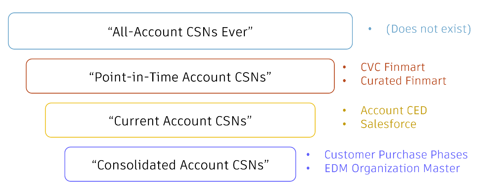
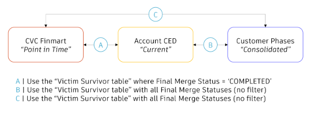
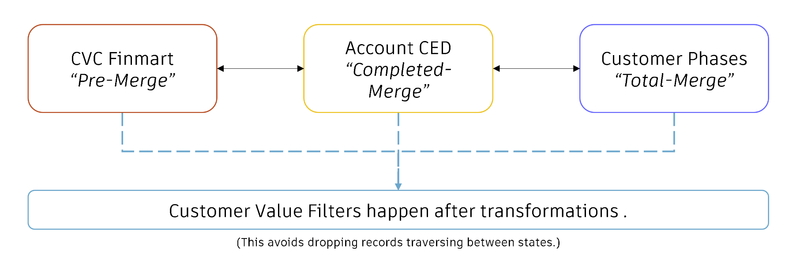
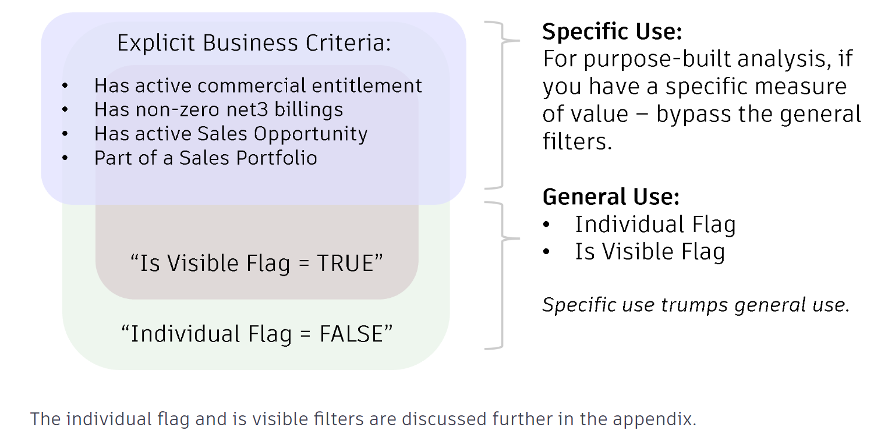

## :material-list-box-outline:{ .red-icon-heading } Introduction

<h3>Objective</h3>

**This document outlines a method to help the analysts community to determine what population of account data to use in projects and reports**. Account data links to many other domains and systems, and is a fundamental piece for nearly all analytics. 

<h3>Purpose</h3>

Sources like `Salesforce`, the `Account CED` and `Finmart` update regularly, but not always at the same time, nor do they reflect the same level of account deduplication. Due to it's fluidity, it can be tricky to navigate across those datasets.

This document is intended to refocus time away from debating the right population of accounts and towards answering questions that drive value for our different stakeholders, in the most appropriate and standardized way.


## :material-format-list-checks:{ .green-icon-heading } Prerequisites

In order to perform the following instructions, you need to have a access to the following tables:

| Schema/Database | View/Table | Basic Filters | Notes reg account population  | 
| --------------- | ---------- | ------------- | ----- |
| BSD_PUBLISH.FINMART_SHARED | [CVC_FINMART](https://autodesk.atlan.com/assets/0a4909f8-3f19-4d9c-b6ea-fd4b3a2e5128/overview)| RECORD_TYPE = 'BILLING' | Point-in-time account population |
| EIO_PUBLISH.CUSTOMER_SHARED | [CUSTOMER_PHASES](https://autodesk.atlan.com/assets/8ce20999-1cf0-42ab-b66d-507a52818401/overview)| | Current account population | 
| ADP_PUBLISH.ACCOUNT_OPTIMIZED | [ACCOUNT_EDP_OPTIMIZED](https://autodesk.atlan.com/assets/39323831-808d-4799-8731-93f571972032/overview) |  | Current Account Population |
| EDM_PUBLISH.EDM_PUBLIC | [VICTIM_SURVIVOR_MAPPING](https://autodesk.atlan.com/assets/f1c8d15f-7038-4cee-92a4-82890b2dd08d/overview) | FINAL_MERGE_STATUS | final_merge_status = 'COMPLETED' maps point-in-time Population to Current Account Population. No filter maps point-in-time Population to Consolidated Account Population.
| ADP_PUBLISH.ACCOUNT_OPTIMIZED | [TRANSACTIONAL_CSN_MAPPING_OPTIMIZED](https://autodesk.atlan.com/assets/c2755a87-0dc4-4059-9366-a65c8bfc0ad5/overview) | |Current account population |
| EDM_PUBLISH.EDM_PUBLIC | [ORGANIZATION_MASTER](https://autodesk.atlan.com/assets/f8312c45-2965-45e6-93d0-8cec1e9c1bba/overview) | | Current account population |


- Request access via [ADP Access Management](https://access.adp.autodesk.com/data-access/snowflake). 
- For more information, please refer to [ADP Access Management User Guide](https://wiki.autodesk.com/pages/viewpage.action?spaceKey=CPDDPS&title=ADP+Access+Management+User+Guide), or contact the team on their slack channel [#adp-access-support](https://autodesk.enterprise.slack.com/archives/C05JFCCB0FK).

## :fontawesome-solid-map-location:{ .purple-icon-heading } Methodology

The following methodology is provided to aid analysts in deciding what account data to use and document transparently the reason for their selection. 100% restitution between datasets is not possible and there is no one answer for what the "right population" of account data is. However, this guidance is intended to help navigate the differences and help analysts make a decision to provide clarity to their stakeholders. It is possible to consistently join imperfect (but still useful) account data and achieve impactful business outcomes.

There are five steps to follow when deciding what account data to use, the last one being optional depending on your analysis needs:

1. **Define business context**
2. **Determine what population of accounts your analysis should reflect**
3. **Determine what type of customer value is required**
4. **Navigate across account population**
5. Apply account filters (if needed)


### 1. Define business context
Before selecting Account data it is imperative to state explicitly the business questions account data needs to be suitably poised to address. By outlining the "real question," a clear framework is established for the selection process that ensures the chosen account data aligns precisely with the information required to derive accurate insights and make informed decisions. Citing business context as the primary driver for data source and filter selection assures relevance and consistency (as best as is achievable) for the stakeholders served. 

Three examples of business context are provided below: 

1. Financial Planning:
 > **What insights can we gather from transactional data to improve our financial forecasting and assess the financial well-being of our organization and customers?** For robust financial planning, account data should encompass transactional details, payment histories, and credit terms.
2. Customer Satisfaction:
> **How can we measure and enhance customer satisfaction based on their interactions, feedback, and past challenges?** When aiming to gauge customer satisfaction levels and enhance overall customer experience, account data should encompass information on customer interactions, feedback, and case history, allowing for a comprehensive understanding of factors influencing customer survey results.
3. Sales Performance:
> **What are the key sales trends and customer segments driving our revenue growth?** In order to assess the effectiveness of sales efforts and identify opportunities for growth, chosen account data should be capable of providing insights into customer purchase behavior, sales trends, and the most profitable customer segments.

Identifying context will determine the account population required to select a data source used and the measure of customer value required to select what filters to exclude irrelevant data. 

### 2. Determine account population
Once the business context is clear, use this information to determine which population of accounts are needed. Account data exists across multiple data sources that exist in various states of account deduplication.  The four types of account populations are listed below: 

<figure markdown>
  { width="600px" }
  <figcaption></figcaption>
</figure>


"All-Accounts Ever" does not exist. It is often asked for, but is rarely what is intended as this type would include customers who have not been with us for decades. More common is to use the "Point-in-Time" population which refers to values managed by the business but not present in customer-facing systems due to being duplicate records, mirroring names and addresses of existing entries. Financial systems like Finmart reflect this state as they retain original accounts listed on transactions to provide historical audit history. Conversely, systems like Salesforce merge records to achieve a streamlined "Current" population. Going even further, the "Consolidated" population, found in datasets like the Organization Master, includes all merges which can be beneficial in scenarios where the highest possible deduplication is desirable. 

Additional considerations and questions about what account population to use are available in clarifications section [FAQ 1](#faq-1)

### 3. Determine customer value

Once account population is decided upon, a measure of customer value should be determined to select which accounts are included in the dataset. There are millions of account available for analysis. Not all are large commercial organizations. Some are individuals. Some are students. There is no singular definition of a customer at Autodesk. The definition of a customer depends on the context of the business question being solved for. What this means is accounts need to be filtered to include only the ones relevant to answer the specific business question asked and exclude others that obscure or distract analysis. 

If the business question being asked includes very specific parameters where specific exclusion filters are available within datasets joinable or included within the account dataset, these are the exclusion filters used for the analysis. These will include filters like: 

- Account has an active commercial entitlement
- Account has an active or expired student entitlement within the last 5 years
- Account is assigned to a non-territory NAG (Named Account Group)

**Customer value filters should be added *after* completing the transformations required to navigate across account populations**. 

!!! note 
    In the absence of specific exclusion criteria, general filters for business-to-business analytics at Autodesk such as `is_visible_in_sfdc` and `site_individual_flag` are detailed in the [step #5. Apply account filters](#5-apply-account-filters) of this document.

### 4. Navigate across account populations 

Once the above three steps are complete, the following guidance is provided to assist in navigating through datasets that must access account data across various account populations and filter results to be relevant to the business question asked. There are three scenario to consider:

- **A | Moving between point-in-time to current account populations**
- **B | Moving between point-in-time to consolidated account populations**
- **C | Moving between current account populations to consolidated account populations**

The tactics employed for each scenario above involve using the EDM Victim Survivor Table. Within this table the Final Merge Status determines which duplicates have been identified and removed by SFDC and Finmart (reflecting the "Current" account population) versus which merges have merely been identified but have not yet been officially removed by source systems (reflecting a "Consolidated" account population.)

The following victim survivor logic is provided for each transition below:

<figure markdown>
  { width="600px" }
  <figcaption></figcaption>
</figure>

#### A | Moving between point-in-time to current account populations
When moving between datasets that use both Point-in-Time and Current account data, use the EDM Victim Survivor table to gather "Victim Account CSNs" not present in the Current population and map them to their appropriate "Surviving Account CSN." In this scenario, account data should defer to the most-merged dataset's data. For example, if blending Finmart and Account CED data, use Finmart's transactional data to create metrics but use the account attributes from the Account CED. This includes the name, named account group and its go-to-market hierarchy linkages (called the Corporate Parent Account CSN or Parent Account CSN). GTM hierarchies already reflect completed merge logic and do not require additional victim/survivor merging of parents.  

This is listed as Scenario A in the visual above.

#### B & C | Moving between point-in-time to consolidated account populations (or current to consolidated populations)
When moving between datasets that have Point-in-Time or Current account population data that must blend with Consolidated account population data, use the EDM Victim Survivor table to gather "Victim Account CSNs," and map them to their appropriate "Surviving Account CSN."  The Consolidated population includes all merges in the victim survivor table  (not just those 'completed' like those in the Current population).

This is listed as Scenarios B & C in the visual above.

!!! note "Note"
    **Consolidated Account Population Survivorship logic for GTM (Go-To-Market) Hierarchies**
    
    If GTM (go-to-market) hierarchies are part of your analysis, the consolidated population requires extra processing to reflect survivorship of both the account and the account's surviving parent within consolidated account population. 

     - For example, if financial data (using CVC Finmart and a point-in-time account population) is connected to customer purchase phase data (using the Consolidated account population), to traverse across these populations the corporate CSN at the point-in-time population will join to the victim survivor table to get its survivor account csn within the consolidated account population. That survivor account will have a parent account. That parent account will have its own survivor account within the consolidated account population. (If you find yourself needing to develop this logic reach out in the [ADP Community slack channel](https://autodesk.slack.com/archives/C0GF2K7Q9) for help.) 

### 5. Apply account filters (if needed)

This step is only applicable in the absence of specific exclusion criteria in [step # 3. Determine customer value](#3-determine-customer-value).

Previously, conventional wisdom was to apply filters before transformations for query optimization and performance reasons. That guidance has changed because practice has shown that placing filters at the end of queries helps to avoid dropping records that may otherwise map. 

<figure markdown>
  { width="600px" }
  <figcaption></figcaption>
</figure>

Common logic like *GTM parenting* and  *victim_survivor_csn* and fields such as `is_visible_in_sfdc` and `site_individual_flag` are not always in agreement and not supported for the consolidated account population. 

In the absence of specific exclusion criteria, the two general filters that are used for business-to-business analytics at Autodesk:

- The `is_visible_in_sfdc` field filters down to accounts that are seen within the Salesforce user interface and filters out inactive accounts without recent SFDC transactions ranging from 5-8 years depending on the entity. This flag primarily focuses on Salesforce based events and may not be suitable for use if financial data is involved. 

- The `site_individual_flag` helps to  determine if an account can be legally sold and what tax rate to apply based on whether it is a business or an individual. This filter is often used as an proxy to  indicate if an account is "small" or "business-to-consumer," although that use case is not its original intent and it is not always accurate for that use case.

Both fields are seen as "good-enough" filters suitable for general use cases, but it is possible neither could be appropriate for use cases where more specific business criteria are defined. For example, if an Account logged $100k in ACV last year for analysis pertaining to customer transaction activity, it makes little difference what its individual flag status or visibility statuses are. Such projects should avoid these filters to avoid the inevitable and time consuming discussions around which accounts are or are not properly classified.

!!! note "Note"
    To avoid dropping records through incomplete join paths, the best practice is to apply filters **at the end after** whatever level of granularity has been calculated and is ready to be reported.
    
    Supplemental information about those two fields is available in the clarifications section [FAQ 2](#faq-2) and [FAQ 3](#faq-3) in this document.

Examples of other specific use cases to define customer value are listed below:

<figure markdown>
  { width="600px" }
  <figcaption></figcaption>
</figure>

## :material-file-code:{ .grey-icon-heading } Sample queries

This document only includes sample queries for the step #4: Navigate across account datasets.

??? abstract "A | POINT-IN-TIME to CURRENT"
    #### Sample query 1
    The purpose of these scripts are to demonstrate how to utilize the victim survivor table to enable movement between various merge states.

    ``` sql linenums="1"  
      -- A | POINT-IN-TIME to CURRENT
        WITH
            v AS (SELECT surviving_account_csn, victim_account_csn
                  FROM edm_publish.edm_public.victim_survivor_mapping
                  WHERE final_merge_status = 'COMPLETED')
          , f AS (SELECT DISTINCT
                    corporate_csn
                  , corporate_parent_account_csn
                  , COALESCE(v.surviving_account_csn ,corporate_csn) AS account_csn
                  FROM bsd_publish.finmart_shared.cvc_finmart f
                  LEFT JOIN v ON v.victim_account_csn = f.corporate_csn
                  )
          , t AS (SELECT account_csn
                      , site_uuid_csn
                  FROM adp_publish.account_optimized.transactional_csn_mapping_optimized)
          , a AS (SELECT t.account_csn
                      , a.corporate_parent_csn_static
                  FROM adp_publish.account_optimized.account_edp_optimized a INNER JOIN t ON t.site_uuid_csn = a.site_uuid_csn)
          , a_map AS (SELECT f.corporate_csn                  AS point_in_time_account_csn
                          , f.corporate_parent_account_csn    AS point_in_time_parent_account_csn
                          , a.account_csn                     AS current_account_csn
                          , a.corporate_parent_csn_static     AS current_parent_account_csn
                      FROM f
                      LEFT JOIN a ON a.account_csn = f.account_csn
                      )
      SELECT
            point_in_time_account_csn             -- point-in-time corporate_csn from CVC Finmart
          ,  point_in_time_parent_account_csn     -- point-in-time corporate_parent_account_csn from CVC Finmart
          ,  current_account_csn                  -- current account_csn from the Account CED
          ,  current_parent_account_csn           -- current corporate_parent_account_csn_static from the Account CED
      FROM a_map
      LIMIT 500
    ```
#### Output table

| POINT_IN_TIME_ACCOUNT_CSN | POINT_IN_TIME_PARENT_ACCOUNT_CSN | CURRENT_ACCOUNT_CSN | CURRENT_PARENT_ACCOUNT_CSN |
| ------------------------- | -------------------------------- | ------------------- | -------------------------- |
| 5070352994 | 5122378283 | 5070352994 | 5122378283 |
| 5156457690 | 5156457690 | 5156457690 | 5156457690 |
| 5120484058 | 5117852229 | 5121390735 | 5117852229 |

??? abstract "B | CURRENT to CONSOLIDATED"
    #### Sample query 2
    The purpose of these scripts are to demonstrate how to utilize the victim survivor table to enable movement between various merge states.

    ``` sql linenums="1"  
    -- B | CURRENT to CONSOLIDATED
    WITH
          v AS (SELECT surviving_account_csn, victim_account_csn
                FROM edm_publish.edm_public.victim_survivor_mapping
                )
        , t AS (SELECT account_csn
                    , site_uuid_csn
                FROM adp_publish.account_optimized.transactional_csn_mapping_optimized)
        , a AS (SELECT t.account_csn                                   AS current_account_csn
                    , COALESCE(v.surviving_account_csn, t.account_csn) AS consolidated_account_csn
                    , a.corporate_parent_csn_static                    AS current_parent_account_csn
                FROM adp_publish.account_optimized.account_edp_optimized a
                    INNER JOIN t ON t.site_uuid_csn = a.site_uuid_csn
                    LEFT JOIN v ON v.victim_account_csn = t.account_csn
                )
      , b_map AS (SELECT    a.current_account_csn
                          , a.consolidated_account_csn
                          , a.current_parent_account_csn
                          , COALESCE(
                                v.surviving_account_csn            -- surviving_parent_account_of_surviving_account_csn
                              , a_surv.current_parent_account_csn  -- parent_account_of_surviving_account_csn
                              , a.consolidated_account_csn         -- surviving_account_csn
                              , a.current_account_csn              -- account_csn
                              )
                              AS consolidated_parent_account_csn
                      FROM a
                      LEFT JOIN a AS a_surv ON a_surv.current_account_csn = a.consolidated_account_csn
                      LEFT JOIN v ON v.victim_account_csn = a_surv.current_parent_account_csn
                      )
    SELECT DISTINCT
          current_account_csn                -- current account_csn from the Account CED
        , current_parent_account_csn         -- current corporate_parent_account_csn_static from the Account CED
        , consolidated_account_csn           -- consolidated account_csn from the Account CED
        , consolidated_parent_account_csn    -- consolidated corporate_parent_account_csn_static from the Account CED
    FROM b_map
    LIMIT 500
    ;
    ```
#### Output table

| CURRENT_ACCOUNT_CSN | CURRENT_PARENT_ACCOUNT_CSN | CONSOLIDATED_ACCOUNT_CSN | CONSOLIDATED_PARENT_ACCOUNT_CSN |
| ------------------- | -------------------------- | ------------------------ | ------------------------------- |
| 5500065653 | 5090017578 | 5500065653 | 5090017578 |
| 5126415996 | 5126415996 | 5126415996 | 5126415996 |
| 5115140651 | 5115140651 | 5115140651 | 5115140651 |

??? abstract "C | POINT-IN-TIME to CONSOLIDATED"
    #### Sample query 3
    The purpose of these scripts are to demonstrate how to utilize the victim survivor table to enable movement between various merge states.

    ``` sql linenums="1"  
    -- C | POINT-IN-TIME to CONSOLIDATED
    WITH
          v_a AS (SELECT surviving_account_csn, victim_account_csn
                FROM edm_publish.edm_public.victim_survivor_mapping
                WHERE final_merge_status = 'COMPLETED')
        , v_b_c AS (SELECT surviving_account_csn, victim_account_csn
            FROM edm_publish.edm_public.victim_survivor_mapping
                )
        , f AS (SELECT DISTINCT
                  corporate_csn
                , corporate_parent_account_csn
                , COALESCE(v_a.surviving_account_csn ,corporate_csn) as current_account_csn
                FROM bsd_publish.finmart_shared.cvc_finmart f
                LEFT JOIN v_a ON v_a.victim_account_csn = f.corporate_csn
                )
        , t AS (SELECT account_csn
                    , site_uuid_csn
                FROM adp_publish.account_optimized.transactional_csn_mapping_optimized)
        , a AS (SELECT t.account_csn                                        AS current_account_csn
                    , COALESCE(v_b_c.surviving_account_csn, t.account_csn)  AS consolidated_account_csn
                    , a.corporate_parent_csn_static                         AS current_parent_account_csn
                FROM adp_publish.account_optimized.account_edp_optimized a
                    INNER JOIN t ON t.site_uuid_csn = a.site_uuid_csn
                    LEFT JOIN v_b_c ON v_b_c.victim_account_csn = t.account_csn
                )
        , a_map AS (SELECT
                          f.corporate_csn                   AS point_in_time_account_csn
                        , f.corporate_parent_account_csn    AS point_in_time_parent_account_csn
                        , a.current_account_csn
                        , a.current_parent_account_csn
                    FROM f
                    LEFT JOIN a ON a.current_account_csn = f.current_account_csn
                    )
      , b_map AS (SELECT    a.current_account_csn
                          , a.consolidated_account_csn
                          , a.current_parent_account_csn
                          , COALESCE(
                                v_b_c.surviving_account_csn        -- surviving_parent_account_of_surviving_account_csn
                              , a_surv.current_parent_account_csn  -- parent_account_of_surviving_account_csn
                              , a.consolidated_account_csn         -- surviving_account_csn
                              , a.current_account_csn              -- account_csn
                              )
                              AS consolidated_parent_account_csn
                      FROM a
                      LEFT JOIN a AS a_surv ON a_surv.current_account_csn = a.consolidated_account_csn
                      LEFT JOIN v_b_c ON v_b_c.victim_account_csn = a_surv.current_parent_account_csn
                      )
      , c_map as
          (
          SELECT
            a.point_in_time_account_csn
          , a.point_in_time_parent_account_csn
          , b.current_account_csn
          , b.current_parent_account_csn
          , b.consolidated_account_csn
          , b.consolidated_parent_account_csn
          FROM a_map a
          LEFT JOIN b_map b ON b.current_account_csn = a.current_account_csn
            )
    SELECT DISTINCT
           point_in_time_account_csn            -- point-in-time corporate_csn from CVC Finmart
        ,  point_in_time_parent_account_csn     -- point-in-time corporate_parent_csn from CVC Finmart
        ,  consolidated_account_csn             -- consolidated account_csn from the Account CED
        ,  consolidated_parent_account_csn      -- consolidated parent_account_csn in the Account CED
    FROM c_map
    LIMIT 500
    ;
    ```    

#### Output table

| POINT_IN_TIME_ACCOUNT_CSN | POINT_IN_TIME_PARENT_ACCOUNT_CSN | CONSOLIDATED_ACCOUNT_CSN | CONSOLIDATED_PARENT_ACCOUNT_CSN |
| ------------------------- | -------------------------------- | ------------------------ | ------------------------------- |
| 5100079767 | 5107901728 | 5100079767 | 5107901728 |
| 5140220695 | 5139722210 | 5139722210 | 5139722210 |
| 5107664475 | 5103494356 | 5107664475 | 5103494356 |

## :material-head-question:{ .grey-icon-heading } Clarifications

### FAQs

??? question "Supplemental discussion: What to consider regarding account population?"
    #### FAQ 1
    There are many sources of account data across Snowflake (and Autodesk as a whole). Their state of deduplication can be expressed in terms of if whether they accept and remove known duplicated account records from their systems. It is important to define a few terms up front to be precise in what each account population represents.

    #### All account CSN ever

    - **Purpose:** This is all account CSNs that have ever been present in ADSK data. However this does not necessarily mean that the account has a transaction. Given this, it is unlikely an analyst requires this data, nor does it exist in a single source.

    - **Questions to consider:** N/A

    #### Point-in-Time Population (BMT & Financial Reporting)

    - **Purpose:** The purpose Business Model Transformation (BMT) and Financial Reporting is to generate consistent and repeatable metrics for unchanging period-over-period reporting.

    - **Questions to consider:** 
          - This may be the **correct** choice if you answer yes to the following:

            - Is my primary use case to reconcile to financial reporting in BMT / Barcelona? 

          - This may be the **incorrect** choice if you answer yes to any of the following:

            - Am I joining to any other data domains (i.e. usage for example)?
            - Is my use case dependent on the recency of data being analyzed?
            - Is this analysis resulting in customer outreach?
            - Is this analysis needed for insights in recent customer behavior?

    #### Current Merge Population (Account CED & SFDC)

    - **Purpose:** The Account CED is a curated view of Autodesk Account data whose purpose is to streamline the data sources, data engineering, and metadata required to link business activity to the people and organizations Autodesk does business with. It is traceable back to upstream primary data sources in Salesforce and EDM schemas.

    - **Questions to consider:** 
          - This may be the **correct** choice if you answer yes to the following:

            - Does my analysis need to reflect accounts present in Salesforce?
            - Do I need to join to other objects in operational data (i.e. opportunities)?
            - Is my analysis dependent on the GTM hierarchies that are currently being used?

          - This may be the **incorrect** choice if you answer yes to any of the following:

            - Is this analysis resulting in customer outreach?
            - Is this analysis needed for insights in recent customer behavior?
            - Is my primary use case to reconcile to financial reporting in BMT / Barcelona? 

    #### Consolidated Merge Population (EDM & Organization Master)

    - **Purpose:** This reflects all potential merges that have been identified and provides the most de-duplicated version of our account data. It is the most useful when analysis is sensitive to mis-categorizing customers as distinct.

    - **Questions to consider:** 
          - This may be the **correct** choice if you answer yes to the following:

            - Is this analysis sensitive to account duplication (different CSNs being created for the same account name and address)?
            - Is this analysis resulting in customer outreach?
            - Is there a risk to the customer being contacted more than once due to duplication?
            - Will the insights from the analysis have an impact on customer experience?

          - This may be the **incorrect** choice if you answer yes to any of the following:

            - Does my analysis need to reflect accounts or GTM hierarchies present in Salesforce?
            - Is my primary use case to reconcile to financial reporting in BMT / Barcelona? 


??? question "Supplemental discussion: should you use the `is_visible_in_sfdc` flag? "
    #### FAQ 2
    - **Does your analysis need to reflect what users see in Salesforce?** If so, use the filter.
    - **Does your analysis already define customer value?** If so, do not use the filter. Use your criteria. Be transparent about the business logic you use and apply it consistently. 

    The purpose of the is visible flag to exclude accounts that are stale and have no value to the users of the Salesforce User interface. It removes of tens of millions of old students and accounts who have never linked to any other entity like an opportunity or an entitlement. Most are old students who own perpetual seats of no longer supported software. While they do not yet meet explicit criteria for deletion, they are “soft-deleted” to declutter and enable normal operation of customer success agents interacting with our active customer base. Generally, the `is_visible_in_sfdc` filter provides reasonable results when there is a desire to follow common filtering practices, and other customer valuation criteria are not well-defined.

    There is no governing standard for assigning customer value at Autodesk. Many tables, systems, and initiatives have attempted to standardize who our current customer base is and which of them should be included in regular analytics. Should we focus only accounts with active commercial entitlements? Which products should be included? What about accounts with active opportunities? What about recently expired customer support cases? The individual flag is popular because it bypasses that complexity and settles for what it literally shown in the Salesforce UI as the standard of what is important. Everything else is “out of sight - out of mind.”

    Unfortunately, the filter is not always reliable. Business rules for the flag are not transparently published. Updates are not regularly scheduled. Flags often seem to be out-of-date. For example, it is common for Accounts with active Reoccurring ACV in Finmart to be marked as not visible. By design, the flag exists to safeguard that the business can use these accounts again in the future if new value is determined.

    Despite potential errors in the thousands, it remains popular due to its simplicity and ability to filter out a significant number of accounts (mostly) accurately by most common measures of valuation. If your project wants to exclude dubious records and there is a desire to stay consistent with common reporting practices, then use the Is Visible flag. If your project has a clear understanding about what "valuable" means and there are concerns about overlooking a small number of potentially significant records, then it is advisable to create your own measure of customer value that aligns with your specific criteria. For example, if your analysis cares if the account has active commercial entitlements or have reoccurring billings of over $10k, use those. If you care about if the accounts registered a support case or a sales opportunity in the last 5 years, use that.  Only use the `is_visible_in_sfdc` filter if other governing criteria for customer value are not defined and/or there is a desire to stay within generally accepted filtering practices.

    **Best practice:** If using the `is_visible_in_sfdc` filter, only apply it during the end reporting stage of your analytics. To assure victim survivor mapping and GTM parenting rollups work consistently, do not use in pre-filters or as part of "with" SQL statements. Failure to do so, may lose data that would have otherwise rollup into a visible parent account.    

    In summary, the `is_visible_in_sfdc` flag is widely used for filtering accounts based on salesforce’s measure of customer value, although it may not always provide accurate results. Given the absence of a standardized measure for customer value, it can provide reasonably fast results for general filtering of stale and dubious records. Nevertheless, for more precise outcomes, explicit and transparent criteria should be developed and documented.

??? question "Supplemental discussion: should you use the `site_individual_flag` flag?"
    #### FAQ 3
    - **Does your analysis exclude business-to-consumer (B2C)?** If so, use the filter. It's the best we have at this moment.
    - **Does your analysis already define customer size?** If so, do not use the filter. Use your criteria.)

    The purpose of the `site_individual_flag` flag is to exclude accounts that represent people instead of the organizations they do business on behalf of. It is most often used a proxy to filter out “small customers” that can distract or overwhelm analytics focusing on larger customers (like Named Accounts) because there are literally millions more of them. Generally, it provides reasonable results when there is a desire to follow common filtering practices, and other customer size criteria are not well-defined.  

    There is no governing standard for customer size at Autodesk. Previous attempts to categorize customers as Very Small Business (VSB), Business-to-Consumer (B2C), or using small/medium/large classifications were not successful because teams could not agree on what criteria to prioritize. Should we focus on revenue, or the quantity of offerings purchased? Which products should be included? Are 3rd party enriched data points like total employees or publicly reported revenue important? How is a customer's size subdivided or aggregated? Do you calculate using legal hierarchies or go-to-market hierarchies?

    The `site_individual_flag` flag is popular because it bypasses the complexity above. 

    Unfortunately, the `site_individual_flag` flag possesses a major flaw in that it does not actually check to see if the "individual" really is a “small customer.” It just looks at the name on the Account and determines if the name appears to be a person. It does not check what they spent or bought. It does not validate with 3rd party vendors if the person is a B2C business. Most of the time individuals only buy 1 seat so the filter often works as a good-enough way to filter out "small customers."  Occasionally though, the person is the purchasing agent for a large company who ordered over $100k or 20+ seats.

    It is under consideration to address this flaw in FY24.

    Despite potential errors in the thousands, it remains popular due to its simplicity and ability to filter out a significant number of accounts (mostly) accurately. If your project requires a customer size exclusion and there is a desire to stay consistent with common reporting practices, then use the Individual Flag. If your project requires a customer size exclusion and there are concerns about overlooking a small number of potentially significant records, then it is advisable to create your own measure of customer size that aligns with your specific criteria. For example, if your project is concerned about parent account csns who purchase more than 5 seats on subscription, then use that as your filter and forgo the flag. Be sure to document the criteria you use transparently and use it consistently.

    **Best practice:** If using the individual flag filter, only apply it during the end reporting stage of your analytics. To assure victim survivor mapping and GTM parenting rollups work consistently, do not use in pre-filters or as part of "with" SQL statements. Failure to do so, may lose data that would have otherwise rollup into a non-individual parent account.    

    In summary, the individual flag is widely used for filtering accounts based on customer size, although it may not always provide accurate results. Given the absence of a standardized measure for customer size, it can provide reasonably fast results for general B2C business filtering. Nevertheless, for more precise outcomes, explicit and transparent criteria should be developed and documented.

??? question "Supplemental discussion: should you use the `victim_survivor_mapping` table?"
    #### FAQ 4
    - **Does your analysis need to remain consistent with common reporting standards?** If so, use the victim survivor table with completed merges.
    - **Does your analysis need to represent the most aggressively deduplicated version available of our account data?** If so, use the victim survivor table with all merges.

    The purpose of the Victim / Survivor table is to identify duplicated accounts and report their acceptance status across SAP and SFDC. Removing duplicates is important because they cause confusion and often compromise insights. There is no governing standard mandating the merging and removal of duplicate records across Autodesk. Each system has been given leeway to adopt deduplication at their own rate and our systems reflect various states of adoption. It is the responsibility of the analyst to merge across sources. The victim / survivor table can be a helpful unifier of account data in these situations. SFDC Account, the Account CED, and the Organization Master merge and remove Accepted merges. CVC Finmart is part of SAP and accepts the validity of merges but has not merged duplicated corporate_csns since 2020 (see Appendix). Rejected merges are only reflected in the Organization Master.

    Use the following guidance when using the Victim / Survivor table for your analysis:

     - If your analytics uses one data source (ex: sfdc only, cvc finmart only) and you want to stay consistent with generally accepted reporting standards, then do not use the victim survivor table. Use the accounts as they appear in your source of truth.

    - If your analytics uses one data source (ex: sfdc only, cvc finmart only) and your analytics needs to reflect the most recent and aggressively duplicated version of our Account data object, then use the victim / survivor table. Include rejected merges.
     - If your analytics uses multiple data sources and you need to stay consistent within generally accepted reporting standards, then use the Victim / Survivor table. Map to surviving account csns for completed merges.
     - If your analytics uses multiple data sources and your analytics needs to reflect the most recent and aggressively duplicated version of our Account data object, then use the victim / survivor table. Include rejected merges.

    Generally, it is not recommended to use rejected merges unless your team can assess the risks and has a strong justification for deviating from the norm. Rejected merges were rejected for reasons. Those reasons may or may not apply to your analysis. It can be tempting to assume that it is always best to use the most aggressively duplicated version of account data but balance the desire to use the latest and with the need to be pragmatic and consistent. Reasons for merge rejections are not always clear. It can be challenging for analytical teams to efficiently determine their suitability. How well do you know the population sample set within your analysis? Do you know why the merges for your sample set were rejected? If the answer is no, consider using a more conservative merge acceptance policy for your analytics. 

    Whatever merges you decide to use, be transparent about the business logic you use and be consistent in your application.

## :material-link:{ .grey-icon-heading } Relevant Links

- [Account CED (wiki)](https://wiki.autodesk.com/display/DR/Account+CED)
- [Business Model Transformation Overview (wiki)](https://wiki.autodesk.com/display/LEAP/Business+Model+Transformation+Overview)

