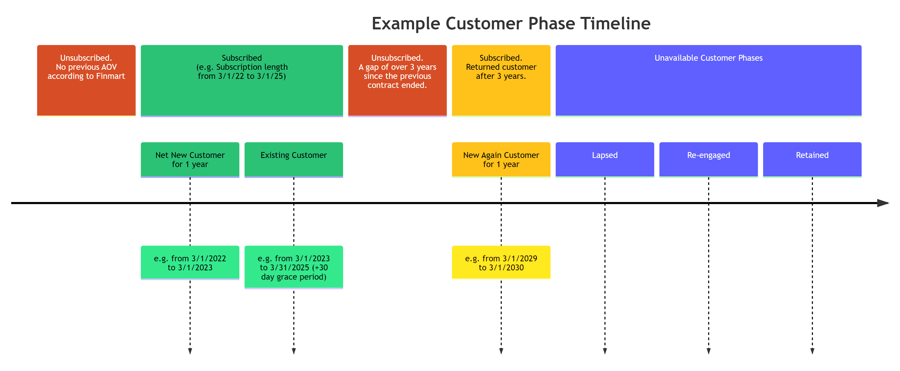
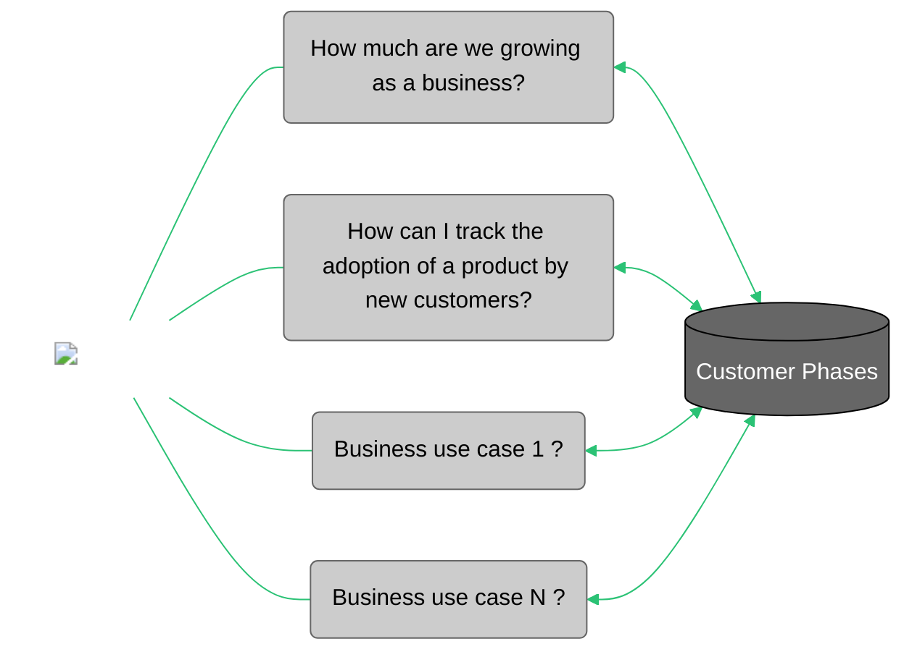

{==

## **Template instructions checklist**

* [x] Read the [Contribute to Customer Analytics Knowledge Network](https://eda-data-docs.autodesk.com/contribution/contribute-to-cakn) document before proceeding with this template.
* [ ] Create your markdown file in the folder`eio_documentation/docs/customer-domain/customer` directory. In case the concept you are writing about is linked closer to another domain, this documentation can be placed within the particular domain folder (i.e. engagement, usage, etc).
* [ ] Copy all the content from this Markdown file (template) and paste it into the new Markdown file that you have created. 
* [ ] **Title**: Replace `Concept template` with the title of your document at the top of the page, between the initial `---` lines in the Markdown file.
* [ ] **Sections overview**: Familiarize yourself with the structure for this template.
      ```
      ├─ Key contacts
      ├─ Introduction
      │   └─ Notes
      ├─ Business cases
      ├─ Background
      │   └─ Workshop (if available)      
      ├─ How to use the data
      │   └─ Dataset details
      │       ├─ Dataset location
      │       ├─ Access
      │       ├─ Data dictionary
      │       ├─ Refresh frequency
      │       └─ Upstream sources                       
      ├─ Sample queries
      │   └─ Applications  
      ├─ Caveats and clarifications
      └─ Related links
      ```
  * [ ] **Key contacts**: Replace `Product Owner:`, and `Subject Matter Expert:` with the roles of the key contacts for this document, and add their name. Then, replace `#` with the link to their Aware URL profile. This content block is located at the top of the right sidebar.
  * [ ] **Introduction**: Summarize the definition and purpose of the concept, writing for a non-technical audience.
      - **Definition**: Write one sentence to explain the objective of this document (the WHAT). Add a diagram or an image to support the definition of the concept. 
      - **Purpose**: Add another sentence, a paragraph and/or a list to explain the purpose of this guide (the WHY), the problem that it helps to solve (the HOW), and its main use case (the WHO and WHEN).
      - **Notes (optional)**: Indicate any dataset and/or metrics that are referred to in this concept, including the link to their CAKN page. Add any extra note, other user cases, and/or  relevant how-to guide in another bullet point. If there aren't any relevant notes, remove this note block entirely.
  * [ ] **Business use cases**: Complete the diagram replacing each `use case` label with an actual use case for this concept. Add between 3 and 5 use cases. Then, summarize in one paragraph a situation where this concept is relevant.
  * [ ] **Background**: Provide any additional definition that is essential for the understanding of the concept. As images explain better that words, add any other relevant visual aid to give a clearer picture of the concept.
      - **Workshop**: Most likely there will be a workshop or brunch & learn recording to support this documentation. All the recordings are saved in [this public SharePoint folder](https://share.autodesk.com/sites/EAX/Shared%20Documents/Forms/AllItems.aspx?csf=1&web=1&e=rd7iVm&cid=435c486d%2Dd540%2D4fae%2Dbf2e%2D03fa226e6df0&RootFolder=%2Fsites%2FEAX%2FShared%20Documents%2FGeneral%2FPublic%2FAdvocacy%2FMS%20Stream%20Folder&FolderCTID=0x012000EBA30B6026DB8B4A9379B81F4F455296). You can then copy the embedded link and use in this documentation.
  * [ ] **How to use the data**: At this point, you can start introducing information to a technical audience.   
      - **Dataset location**: Complete the table.
      - **Access**: Replace only the ADP Access Management link in the first bullet point only. If this dataset is a standalone table, add the link to the specific schema page. Otherwise, link to the main [ADP Access Management page](https://access.adp.autodesk.com/).
      - **Data Dictionary**: Add the link to each table name to its corresponding page on Atlan.
      - **Refresh frequency**: Replace the example with the dataset details.
  * [ ] **Sample queries**: Follow the examples. Each SQL sample query should have a title and include a description. Keep the `### Sample query 1`, the `sql linenums="1"` information as it is in order to enable standardization. Follow the best practices regarding coding standards, and check that the sample queries are not repeated on the dataset document.
      - **Applications**: If the sample query evolves another table, or if it is rather complex, it should be placed as an "Application", or even as a brand new ["how-to-analysis"](https://eda-data-docs.autodesk.com/contribution/cakn-document-templates/how-to-analysis/).
  * [ ] **Caveats & clarifications**: Add the title of each impacted use case and its description. Optionally, each impacted use case can have a collapsible block with an Example/Recommendation, where you can include images if needed. Add Known issues separately where it is indicated, each on a separate bullet point.
  * [ ] **Related links**: Optionally, add links to pages that complement this document. Avoid the repetition of links that have been added in the previous sections. Indicate in parenthesis the platform where it links to, provided it is not the CAKN website (e.g. (wiki)).

  The examples provided in each section below are taken from different documents. For additional examples, refer to the documents created in the `eio_documentation/docs/customer-domain/` directory.

!!! warning
    When you complete your document, remove both this instructions block and the instruction comments between `==` from the rest of the sections in this Markdown file.

!!! note "Publish the document on GitHub for review"
    Use the GitHub Desktop or the Terminal to create a branch, commit your changes, and push the document to GitHub. Follow these guidelines:

    1. Create a branch with the following naming pattern, replacing the Jira-ID and the rest of the words with the details of your task:
      - `jira-2120/cakn/create-name-of-document`.
    2. Add your changes to your branch and commit them. Write a commit message where indicated if you are using GitHub Desktop. If you are using the Terminal, you can write something similar to this example: `git commit -m "Created the (title of your document) document on CAKN"`.
    3. Push your changes and create a Pull Request, adding a screenshot of the document on your local environment in the description under a `## Test Case` section (drag and drop or copy and paste the image file into the GitHub description box).
    4. Add the Technical Writers and Delivery Managers as reviewers.

==}


<!-- Key contacts -->

<div id="conceptual-guide-info-main">
  <ul>
    <li><strong>Product Owner:</strong>
      <a href="#">Name of Product Manager</a>
    </li>
    <li><strong>Subject Matter Expert:</strong>
      <a target="_blank" href="#">Name of SME1</a>,
      <a target="_blank" href="#">Name of SME2</a>
    </li>
    <li class="doc-status"><strong>Status:</strong> <span class="doc-ok">Published</span></li> 
   <!-- <li><strong class="doc-status">Status:</strong> <span class="doc-wip">In Progress</span></li>  -->
  </ul>
</div>


## :material-book:{ .red-icon-heading } Introduction

<h3>Definition</h3>

**Customer Phases is a concept that is used to understand the behaviours of customers in different stages during their process of acquiring an Autodesk license**.

It is represented on a table by categorizing each customer phase into a dimension (GEO, industry, customer size, etcetera) that can then be connected to other tables.

*Customer Phases* is also typically referred to as *Customer Purchase Phases*, and it was also known as *New Customer* in the past.

==Example 1: Create a Mermaid Flowchart diagram, or any visual representation using the following example as a reference.==

<figure markdown>
  { width="1280px" }
  <figcaption></figcaption>
</figure>

<h3>Purpose</h3>

The purpose of Customer Phases is to enable the Enterprise Data & Analytics (EDA) team to develop a segment for customers based on their purchase behaviour of recurring contracts in order to provide insights to the business.

## :material-connection:{ .green-icon-heading } Business use cases



Customer Phases provides clarification not only about the number of new customers that are achieved in a certain period, but also about their subscription status over time. Dividing customers into specific phases since the first time that they adopt an Autodesk product is a key strategy to detect areas of improvement within the business.

## :material-book-search:{ .purple-icon-heading } Background

To start with, the project has two **purchase-phases** available, **Net New** and **New Again**, although there are a few other phases in the pipeline (*Churned*, *Re-engaged*, and *Retained*).

1. **Net New Customer:** In the context of this project, *Net New* customer at Autodesk is a commercial organization with a new recurring revenue transaction that have never had an AOV (Annual Order Value) before according to Finmart. The status of being a New Customer is defined at the level of the Parent Account CSN, and it should also apply to any child accounts. A Customer is considered 'Net New' for a period of 1 year.

2. **New Again Customer:** In the context of this project, it is said that a customer is *New Again* when they start their contract with recurring revenue (AOV) after a gap of over three years since their previous contract ended. The status of being a New Again is defined at the level of the Parent Account CSN, and it should also apply to any child accounts. A Customer is considered *New Again* for a period of one year.

### Workshop

==All the recordings are saved in [this public SharePoint folder](https://share.autodesk.com/sites/EAX/Shared%20Documents/Forms/AllItems.aspx?csf=1&web=1&e=rd7iVm&cid=435c486d%2Dd540%2D4fae%2Dbf2e%2D03fa226e6df0&RootFolder=%2Fsites%2FEAX%2FShared%20Documents%2FGeneral%2FPublic%2FAdvocacy%2FMS%20Stream%20Folder&FolderCTID=0x012000EBA30B6026DB8B4A9379B81F4F455296).==

<div class="iframe-wrapper">
  <iframe src="https://share.autodesk.com/sites/EAX/_layouts/15/embed.aspx?UniqueId=783a4aca-7314-4d09-bccf-2c81dd0e3632&embed=%7B%22ust%22%3Atrue%7D&referrer=StreamWebApp&referrerScenario=EmbedDialog.Create" width="640" height="360" frameborder="0" scrolling="no" allowfullscreen title="customer-phase-workshop.mp4" width="853" height="480" frameborder="0" scrolling="no" allowfullscreen title="Customer Phase Workshop.mp4"></iframe>
</div>

!!! note
    - The term **contract** refers to contracts that are recurring in nature, or in other words have an AOV. As there are over 900+ SKUs (Stock Keeping Unit) that do not have AOVs, such as Fixed consulting, FEE: ACAD OEM ROYALTIES, Fixed fee consulting, Autocad Architecture Royalties, and more, it is possible for a Customer to have positive billings during a time period with no active contract having an AOV. These contracts are not taken into account when counting the *gap* between the new and old contracts.

## :material-database-settings:{ .yellow-icon-heading } How to use the data

The `customer_phases` table is generated at the Surviving Parent CSN + Start Date level. Only Surviving Parent CSNs that are visible in SFDC and non-individuals in the Account CED are included in this table. Customer purchase phases are identified along with the timeline of the phases.

| FINAL_SURVIVING_PARENT_CSN | SETTLEMENT_START_DT | SETTLEMENT_END_DT | PREVIOUS_END_DATE | GAP (DAYS) | GAP(YEARS) | SETTLEMENT_START_DT_RANK | GAP RANK |
| :------------------------- | :------------------ | :---------------- | :---------------- | :--------- | :--------- | :----------------------- | :------- |
| 5100964972                 | 1/7/2016            | 1/6/2017          |                   |            |            | 1                        | 1        |
| 5100964972                 | 2/2/2020            | 2/2/2021          | 1/6/2017          | 1122       | 3.07       | 3                        | 2        |
| 5100964972                 | 4/27/2020           | 9/7/2021          | 1/6/2017          | 1207       | 3.67       | 4                        | 3        |


!!! note
    - The term **Customer** refers to Parent Account CSN (Customer Service Number) mapped to their respective Surviving Account CSN that does recurring revenue generating business with Autodesk. 
    - Note 2

As you can see, the granularity of the table is at the Parent CSN level. We can also see several settlement start and end dates. These dates belongs to the children of the parent CSN. `settlement_start_dt_rank` identifies the minimum date which is later referred to as start date of a Parent CSN, meaning the date on which they started a transaction of recurring nature with Autodesk.

Furthermore, the `gap` column counts the days between end date of pervious contract and start of next contract. If the gap is greater than 3 years then on the day of next contract start date, a customer becomes 'new again'.

If you take a closer look at the table, after the first contract ended, the next contract started on 2/2/2020 and 4/27/2020 (which is over our threshold of 3 years with no active AOV).The earliest start date (2/2/2020) is chosen in such a scenario since all subsequent start date (4/27/2020) in reality started when contract (2/2/2020) is already active.

To summarize, customers are identified as *Net New* when `settlement_start_dt_rank = 1` (i.e., the start date of their first contract with active AOV), or *New Again* when the years gap is greater than 3 from the first contract + the gap rank is equal to 1 (due to no active AOV in the last three years).

All `settlement_end_dt` include 30 days of grace period in this dataset.

### :material-table:  Dataset details

#### Output table

| Schema/Database | Table/View | Notes | 
| --------------- | ---------- | ----------------- | 
| eio_publish.customer_shared | [`customer_phases`](https://autodesk.atlan.com/assets/8ce20999-1cf0-42ab-b66d-507a52818401/overview) |  |

#### Access

- Request access via [ADP Access Management](https://autodesk.atlan.com/assets/8ce20999-1cf0-42ab-b66d-507a52818401/overview). 
- For more information, please refer to [ADP Access Management User Guide](https://wiki.autodesk.com/pages/viewpage.action?spaceKey=CPDDPS&title=ADP+Access+Management+User+Guide), or contact the team on their slack channel [#adp-access-support](https://autodesk.enterprise.slack.com/archives/C05JFCCB0FK).

#### Refresh frequency

- Daily

#### Data dictionary

- [Data Catalog Reference](https://autodesk.atlan.com/assets/8ce20999-1cf0-42ab-b66d-507a52818401/overview)

#### Source Systems

##### Snowflake

| Schema/Database | View/Table | Basic Filters | Notes |
| --------------- | ---------- | ------------- | ----- |
| EDM_PUBLISH.EDM_PUBLIC | VICTIM_SURVIVOR_MAPPING |  |  |
| ADP_WORKSPACES.CUSTOMER_SUCCESS_FINANCE_PRIVATE | SUBS_BILLED_SEATS_FINMART | BILLED_USD_AMT > 0 & NET3_AOV_CC> 0 | We want the first > 0 transaction that lead to recurring revenue & SETTLEMENT_START_DT <= current_date () |
| ADP_PUBLISH.ACCOUNT_OPTIMIZED | ACCOUNT_EDP_OPTIMIZED | IS_VISIBLE_IN_SFDC = TRUE & SITE_INDIVIDUAL_FLAG = FALSE |  |
| schema/database 1 | View/Table 1 | basic filters 1 | Notes 1 | 
| schema/database 2 | View/Table 2 | basic filters 2 | Notes 2 |

### :material-file-code: Use cases with sample queries

==If the sample query requires additional logic or joins with other datasets, consider creating a [how-to-analysis](https://eda-data-docs.autodesk.com/contribution/cakn-document-templates/how-to-analysis/). Alternatively, it can be differentiated from the other sample queries as a "application", which requires more detailed description.==

??? example "Calculate New Customers at the granularity of quarter (FY24-Q1)"

    ###### Application 1
  
    Count how many customers active or acquired through FY24-Q1 (similar logic can be applied to calculate between a custom date range, month or year).

    - **Active new customers:** These are customers who are in the **Net New** or **'New Again'** phase for at least 1 day in a quarter. To calculate this, you need to track the start and end dates of the "New customer" phase for each customer. If a customer's "New customer" phase falls within the quarter and lasts for at least 1 day, they are considered an active new customer for that quarter.

    - **Acquired in quarter:** These are **'Net New'** or **'New Again'** who have their contract start date within the quarter. You need to track the contract start dates for each customer and determine if they fall within the specified quarter.

    | Parent CSN | Customer Phase Start Date | Customer Phase End Date | Target Quarter Start Date | Target Quarter End Date | Active New Customer? | Acquired in Quarter? |
    | ---------- | ------------------------- | ----------------------- | ------------------------- | ----------------------- | -------------------- | -------------------- |
    | 5100964972 | 2023-01-15                | 2024-01-15              | 2023-04-01                | 2023-06-30              | Yes                  | No                   |
    | 9100964973 | 2022-11-01                | 2023-11-01              | 2023-04-01                | 2023-06-30              | Yes                  | No                   |
    | 6100922922 | 2023-05-01                | 2024-05-01              | 2023-04-01                | 2023-06-30              | Yes                  | Yes                  |

    ###### Sample code:

    ``` sql linenums="1"
    WITH raw_data AS
          (SELECT DISTINCT parent_csn,
                          customer_phase_start_date,
                          customer_phase_end_date,
                          customer_phase
          FROM   eio_publish.customer_shared.customer_phases
          WHERE  1=1
          AND customer_phase IN ( 'Net New', 'New Again' )
          )
    --- target customer phase
    ,
      target_quarter AS
          (SELECT *,
                  '2023-02-01' AS target_quarter_start_date ,
                  '2023-04-30' AS target_quarter_end_date
          FROM   raw_data
          )
    SELECT target_quarter.*,
        CASE
          WHEN customer_phase_end_date >= target_quarter_start_date THEN 'TRUE'
          ELSE 'FALSE'
        END AS active_new_customer_flag,
        CASE
          WHEN customer_phase_start_date BETWEEN
                target_quarter_start_date AND target_quarter_end_date THEN 'TRUE'
          ELSE 'FALSE'
        END AS acquired_in_quarter_flag
    FROM   target_quarter
    WHERE  customer_phase_start_date <= target_quarter_end_date;
    ```


??? abstract "1. Find start and end date of a customer phase"
    #### Sample query 1

    ``` sql linenums="1"
    SELECT parent_csn
    , customer_phase
    , customer_phase_start_date
    , customer_phase_end_date
    FROM
    eio_publish.customer_shared.customer_phases
    WHERE customer_phase ='net new'
    ```

??? abstract "2. Find total Net New customer per quarter"
    #### Sample query 2

    ``` sql linenums="1"
    SELECT
    start_fiscal_year_quarter
    ,count(DISTINCT parent_csn)
    FROM
    eio_publish.customer_shared.customer_phases
    GROUP BY start_fiscal_year_quarter
    ```

??? abstract "3. Find details about customer's phase as"
    #### Sample query 3

    ``` sql linenums="1"
    WITH FILTER AS (SELECT
    parent_csn, count(customer_phase)
    GROUP BY parent_csn
    HAVING count(customer_phase) >1)
    SELECT * FROM
    eio_publish.customer_shared.customer_phases
    WHERE parent_csn IN (SELECT parent_csn FROM FILTER)
    ```

??? abstract "Title of query for Step 4"
    #### Sample query 4

    ``` sql linenums="1"  
    Add the SQL code here.
    ```


### :material-table-question: Caveats & clarifications

!!! note "Specifications"

    - **Customer Purchase Phase: Net New.** As Finmart has data 2016 and onwards, the customers identified as 'net new' in 2016, 2017 and 2018 could be an existing customer before 2016.  
    - **Parent-Child Hierarchy.** The accuracy of phases of customers depends heavily on how well the enrichment services can identify the relationships between CSNs. Not only could a customer have been identified as new because of their first transaction, but also because they had never been properly parented.
    - **Clarification 1**
    - **Clarification 2**    

!!! warning "Known issues"

    No known issues.


## :material-link:{ .grey-icon-heading } Relevant Links

- [CAKN Blog: Traversing Account Data (Wiki)](https://wiki.autodesk.com/pages/viewpage.action?spaceKey=EAX&title=CAKN+Blog%3A+Traversing+Account+Data)
