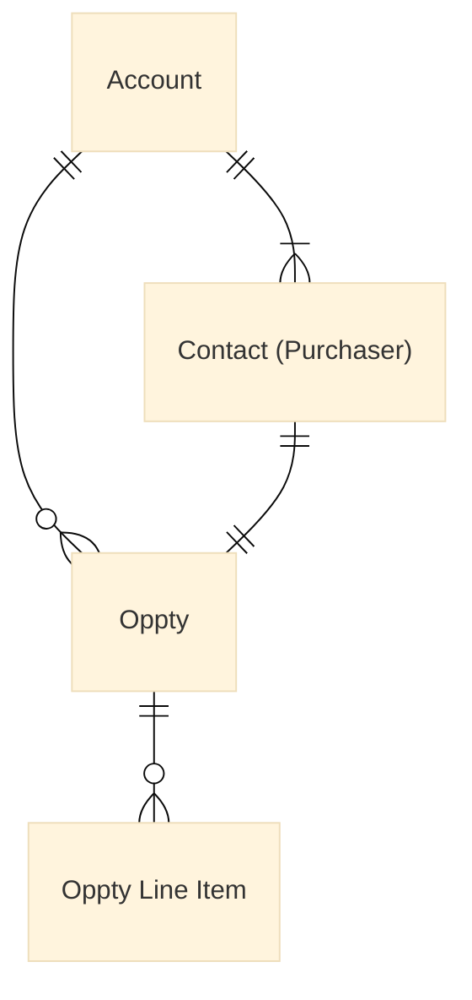

{==

## **Template instructions checklist**

* [x] Read the [Contribute to Customer Analytics Knowledge Network](https://eda-data-docs.autodesk.com/contribution/contribute-to-cakn) document before proceeding with this template.
* [ ] Create your Markdown file in the `eio_documentation/docs/` directory. The name of the file should be the title of the document, written in lowercase and using hyphens to replace spaces. Do not use parentheses or other symbols. For example: `quote-and-quote-line-item-r2-1-2.md`.
* [ ] Copy all the content from the Markdown file of this template and paste it into the new Markdown file that you've created.
* [ ] **Title**: Replace the `Data impact assessment template` with the title of your document at the top of the page, between the initial `---` lines in the Markdown file. For example: `Quote and Quote Line Item (R2.1.2)`
* [ ] **Sections overview**: Familiarize yourself with the structure for this template.
      ```
      ├─ Introduction
      ├─ Background
      ├─ Summary of changes
      ├─ Data structure updates
      │   ├─ Fields added
      │   │   ├─ Table 1 fields added
      │   │   └─ Table 2 fields added
      │   ├─ Fields removed
      │   │   ├─ Table 1 fields removed
      │   │   └─ Table 2 fields removed
      │   └─ Fields with logic changes
      ├─ Open questions
      ├─ Sample queries
      ├─ Impact assessment
      │   ├─ Improvement proposals
      ├─ Conclusion
      └─ References
      ```
  * [ ] **Key contacts**: Add the names of the Subject Matter Experts for this document. Then, replace `#` with the link to their Aware profiles. The content of this block is placed at the top of the right sidebar on CAKN.
  * [ ] **Introduction:** Write a sentence to summarize the goal and of the document and its scope. Then, write another paragraph to explain general details such as the purpose (for example, the type of changes that this document analyzes, and/or an overview of the sections that it includes.). Write this section for a non-technical audience.
  * [ ] **Background:** Provide key information about the context of the data being evaluated and/or the reasons for the assessment. This section should set the stage for understanding the changes discussed in the rest of the document.
      - Optionally, add a mermaid diagram or an image if it clarifies the explanation.
      - Optionally, add H3 headings to add subsections if you need to describe the background in more detail.
  * [ ] **Summary of changes:** List the main changes using a bulleted list, including a brief explanation of each item with any necessary details.
  * [ ] **Data structure updates:** Detail the specific changes made to a table or data dictionary. If there are fields added, removed, or with logic changes, indicate them here following the examples provided in this section below.
      - Fields added.
      - Fields removed.
      - Fields with logic changes.
  * [ ] **Open questions:** Present the unresolved issues that are related to this assessment. Every question should be written in an H4 heading (`####`).
  * [ ] **Sample queries:** Follow the examples. Each SQL sample query should have a title and include a description.
  * [ ] **Impact assessment:** Identify, describe, and evaluate the severity of potential impacts. Propose strategies to mitigate any harmful effects.
      - **Improvement proposals:** Outline any recommendations or suggestions for improvement here.
  * [ ] **Conclusion:** Summarize the findings of the data impact assessment in this final section.
  * [ ] **References**: Add references here, including links.

  The examples provided in each section below are taken from different documents. For additional examples, refer to the documents created in the `eio_documentation/docs/customer-domain/customer/new-transaction-model/nxm-data-impact-assessment` directory.

!!! warning
    When you complete your document, remove both this instructions block and the instruction comments between `==` from the rest of the sections in this Markdown file.

!!! note "Publish the document on GitHub for review"
    Use the GitHub Desktop or the Terminal to create a branch, commit your changes, and push the document to GitHub. Follow these guidelines:

    1. Create a branch with the following naming pattern, replacing the Jira-ID and the rest of the words with the details of your task:
      - `jira-2120/cakn/create-name-of-document`.
    2. Add your changes to your branch and commit them. Write a commit message where indicated if you are using GitHub Desktop. If you are using the Terminal, you can write something similar to this example: `git commit -m "Created the (title of your document) document on CAKN"`.
    3. Push your changes and create a Pull Request, adding a screenshot of the document on your local environment in the description under a `## Test Case` section (drag and drop or copy and paste the image file into the GitHub description box).
    4. Add the Technical Writers and Delivery Managers as reviewers.

==}

<!-- Key Contacts -->

<div id="data-impact-assessment-template-info-main">
  <ul>
    <li><strong>Subject Matter Expert:</strong>
      <a target="_blank" href="#">Name of Subject Matter Expert</a>
    </li>
    <li class="doc-status"><strong>Status:</strong> <span class="doc-ok">Published<span></li>
    <!-- <li><strong class="doc-status">Status:</strong> <span class="doc-wip">In Progress</span>.</li> -->
  </ul>
</div>

## :fontawesome-solid-magnifying-glass-chart: Introduction

This article provides a overview of the changes made to the Salesforce Opportunity table through Apollo's 2.1.2 release and how these changes impact the underlying business.

The article is structured to provide the federated analytical community with a summary of the changes made to the table, and discuss possible uses and outline potential business impacts or tactical challenges for analysts introduced by these changes.


## :material-book-search: Background

Opportunities are potential selling events for new and renewal business. They represent the chance for the enterprise to sell a product or service to an existing or potential customer. Opportunities play an important role in sales pipeline management and prioritization. They are assigned stages to describe their progression from prospect to qualification to solution-building to proposal/negotiation, and finally to closing. The goal of a sales opportunity is to covert the opportunity into a sale, which helps the business grow and generate revenue.

The following conceptual data model is provided to describe Opportunities:

==**Example 1**: Create a Mermaid diagram, using the following example as a reference. See the instructions provided in the code of the diagram in this Markdown file.==



==**Example 2**: Replace the image below:==

<figure markdown>
  { width="600px" }
  <figcaption>Sample image caption</figcaption>
</figure>


## :material-format-list-bulleted: Summary of changes

- **New Offerings:** R2.1.2 Expands the list of offerings that can be quoted by Partner/Solution Provider's via the New Transaction Model.​
- **Payment Terms:** No new payment terms added, but a few invalid ones like Cash in Advance, 60 Days From Month End are removed, more details can be found here​
- **Order Context Details:** Additional details are available for Quote or Order created in the context of standard sale, license compliance, or Make it Right.​
- Change 3
- Change 4


## :material-table-edit: Data structure updates

This section outlines NxM specific column additions to the Opportunity and Opportunity Item tables that are of specific relevance to the November release. Note this is not a comprehensive list. It is specifically new fields to take note of to discuss NxM. 

- Opportunity
- Opportunity Line Item

### Fields added

The following is an abridged data dictionary for the fields added to the opportunity and opportunity line item tables. SFDC fields labels and definitions were derived where possible from the [sfdc data dictionary](https://wiki.autodesk.com/x/yQwVKw). Where definitions were not available or incomplete, a "proposed business definition." was created. Their statuses were listed next to their definitions. Primary source notes were included as well. 

#### NxM Specific Opportunity fields added

??? info "NxM relevant Opportunity fields added to `bsd_publish.sfdc_shared.opportunity`:"

    Fields that are in *staging `bsd_publish_int.sfdc_shared.opportunity`*, but are not in *production `bsd_publish.sfdc_shared.opportunity*:

    | Index | SFDC field label | SFDC API name | Data type | Values | Proposed business definition <br> (Note these are not official definitions) | Acceptance status | Primary source description/notes |
    | --- | --- | --- | --- | --- | --- | --- | --- |
    | 1 | Opportunity key | OPPORTUNITY_KEY__C | varchar | `SUBSCRIPTION=5501888321=5501670233=4000566345=3-Year=2023=8` | Opportunity key for Subscription Opportunities.  Provides a summary of the equivalent csns for objects joined with by sfdc id. <br> 1. Renewal Type <br> 2. Account CSN on the Service Contract. (Derivable from accountid on the opportunity.) <br> 3. Reseller account csn on the contract line item. (Derivable from partner_account__c on the opportunity.) <br> 4. Purchaser on contract line item. (Derivable from primary_customer_id on the Opportunity.) <br> 5. Term (Annual or 3-Year) <br> 6. Close Date Year & Month | Proposed | Does not appear in [R2.1.2 list](https://wiki.autodesk.com/display/DBP/Opportunity+Data+Model+for+R2.1.2), but it is new in stage table. <br> Logic: <br> `ContractLineItem.ServiceContract.Account.Account_Csn__c + '-' + ContractLineItem.Reseller_Account__r.Account_Csn__c + '-' + ContractLineItem.Purchaser__r.Contact_Csn__c + '-' + ContractLineItem.Actual_End_Date__c` |
    | 2 |  |  |  |  |  |  |  |

#### Table 2 fields added

??? info "NxM relevant Opportunity fields added to bsd_publish.sfdc_shared.opportunity:"

    Fields that are in *staging `bsd_publish_int.sfdc_shared.opportunitylineitem`*, but are not in *production `bsd_publish.sfdc_shared.opportunitylineitem`*:

    | Index | SFDC field label | SFDC API name | Data type | Values | Proposed business definition <br> (Note these are not official definitions) | Acceptance status | Primary source description/notes |
    | --- | --- | --- | --- | --- | --- | --- | --- |
    | 1 | Auto Renew Formula | AUTO_RENEW_FORMULA__C | varchar | ON, OFF |  |  |  |
    | 2 |  |  |  |  |  |  |  |

### Fields removed

No fields were removed from `cvc_finmart` for R2.1.2.

### Fields with logic changes

??? info "Fields with logic changes"

    | Index | Column name | Data type | Values | Description | Notes | Logic change |
    | ----- | ----------- | --------- | ------ | ----------- | ----- | ------------ |
    | 1 | CC_FBM_SF_SUBS_SEATS_BILLED | NUMBER |  |  |  | Not defined on the page yet (likely no impact to end users) |
    | 2 | CC_FBM_STD_SEATS | NUMBER |  |  |  | Not defined on the page yet (likely no impact to end users) |
    | 3 | |  |  |  |  |  |


## :material-head-question: Open Questions

??? question "Questions as of September 21, 2023"

    ### Questions as of Sep 21, 2023

    #### 1. What's the correct wiki reference? We've been using the subscription data model page, but it doesn't include all the columns that are in BSD_PUBLISH_INT in snowflake staging

    9/26 - No additional wiki references. There's an additional ODM architecture that we may be able to reference on the subscription data model: [Subscription Data Model](https://wiki.autodesk.com/display/BMP/Subscription+Data+Model).

    #### 2. Will all fields in the BSD_PUBLISH_INT table be included after 2.1.2? Is there a mapping for which will be used or definitions for ones not in the subscription data model?

    9/26 - All fields showing up currently should be finalized. We can follow up with the engineering team to get column level definitions for things not included on the other wiki pages.

    #### 3. Question 3

    Question 3 details.


## :material-file-code: Sample queries

This section has sample queries covering a variety of use cases with the NXM contract and contract line item updates.

### Linking an NXM contract/CLI to the prior subscription's agreements (and vice versa)

??? abstract "Linking Prior CLI to NXM CLI"

    This query uses migrated_subscription__c to find the SFDC ID of the pre-NXM contract line item. The join is a self join on the contractlineitem table.

    ``` sql linenums="1"
    -- Migrated subscriptions using CLI ID
    select
        c.id as service_contract_sfdc_id
        , c.agreement_number__c
        , c.startdate as agreement_start_date
        , c.enddate as agreement_end_date
        , c.accountid
        , r.name as cli_record_type_name
        , cli.id as lineitem_id
        , cli.product2id
        , cli.lineitemnumber
        , cli.entitlement__c
        , cli.pelican_offering_id__c
        , cli.offering_product_line_code__c
        , cli.offering_product_line__c
        , cli.active_seats__c
        , cli.quantity
        , cli.subscription_type__c
    FROM BSD_PUBLISH.SFDC_SHARED.SERVICECONTRACT c
    JOIN BSD_PUBLISH.SFDC_SHARED.CONTRACTLINEITEM cli ON c.id = cli.servicecontractid
        JOIN bsd_publish.sfdc_shared.recordtype r
            ON cli.recordtypeid = r.id
    where cli.id in
    (
    SELECT Migrated_From_Subscription__c
    FROM BSD_PUBLISH.SFDC_SHARED.CONTRACTLINEITEM cli
    JOIN bsd_publish.sfdc_shared.recordtype r
        ON cli.recordtypeid = r.id
        WHERE r.name = 'ODM'
        and migrated_from_subscription__c is not null
    );
    ```

### Heading of sample query 2

??? abstract "Title of sample query 2"

    Description of sample query 2.

    ``` sql linenums="1"
    Add SQL code here
    ```

## :material-text: Impact Assessment

### Productivity Impact
Changes to the Opportunity data model are anticipated to have the following impact on the analytical community within the next year: 

1. Disruption of Existing Processes: By definition, the addition of new columns will disrupt existing processes and workflows. All existing reports and dashboards that use Opportunities will be affected. Those concerned with renewal business lineage either through AIR or ROM opportunities should plan to re-architect to adopt these new join paths.
2. Additional Data Traversal Steps: With the addition of a new opportunity renewal type, there will be additional steps required to traverse the data. This could lead to increased processing time and slower analysis. It could also lead to a higher risk of errors and omissions.
3. Increased Training Requirements: With the addition of a new opportunity type, the learning curve to use the data within these tables has not been alleviated; it has expanded. Until ROM, and AIR opportunities are entirely deprecated users should assume increased time will be required to traverse the new paths provided by NxM and accommodate the old ones for countries not yet transitioned. With well over 600 columns across both tables, users unfamiliar with existing columns will require mentorship or investment in subject domain documentation - which we do not have today.

### Data Impact
#### Australia November 2023 Go-Live 
Australia will require specific monitoring prior to and after go-live. As the first country adopting NxM for single user subscription it would be prudent to proactively know the volume likely AIR and ROM renewals that will convert and monitor their progress to observe their conversion looking for patterns or differences in behavior vs prior activity.  

### Improvement proposals
#### Data sets and data model
- EDA recommends to use the following datasets from Snowflake for the current dashboard (including the recommendations in the comments):

| Data Object | Recommended Snowflake Tables | Comments |
|------------ | ---------------------------- | -------- |
| Case | ADP_PUBLISH.SUPPORT_OPTIMIZED.CUSTOM_CASE | 	CreatedDate >= '2023-02-01 00:00:00' |
| Quote | ADP_WORKSPACES.CORE_ENTERPRISE_DATA_SHARED.QUOTE | No filter. |
| LiveChatTranscript | BSD_PUBLISH.SFDC_SHARED.LIVECHATTRANSCRIPT ||
| Survey | EIO_PUBLISH.ENGAGEMENT_PRIVATE.SURVEY_QUESTION_RESPONSE <br> EIO_PUBLISH.ENGAGEMENT_PRIVATE.SURVEY_QUESTION_OPTION <br> EIO_PUBLISH.ENGAGEMENT_PRIVATE.SURVEY_EMBEDDED_DATA | survey_id = 'SV_aWd9zzdU4we7QTr' <br> question_id = 'QID6' |

- When retrieving account information, it's crucial to utilize the [ACCOUNT_CED](https://wiki.autodesk.com/display/DR/Account+CED). 
- Instead of the  TYPE_BREAKOUT__C field, use the case_topic field from Customer Case CED table.
- Avoid using any sharepoint files for analysis and reporting. If possible, move things to backend SQL queries or to Snowflake tables.
- Simplify your data model by removing unnecessary tables and relationships.
- Use relationships wisely, and consider using bidirectional filtering only when necessary.
- Avoid using too many calculated columns; use calculated measures instead.
- Optimize your data source queries to bring in only the necessary data.
- Write efficient DAX formulas. Avoid using functions that may have performance overhead.
- Limit the number of visuals on a single report page to avoid clutter.


## :material-text-short: Conclusion

The changes to the CVC_FINMART table are centered around adding new columns for the agency discount values and some additional LOVs to existing SAP fields. Overall impact to table users will be very low (the same measure fields will exist and apply for billings/seats/tokens). Users who are assessing impact or incorporating new agency fields will need to check which of the additional columns or column LOV changes apply to their use cases.


## :material-link: References

Cited in Article:

1. [NxM](https://wiki.autodesk.com/display/BMP/New+Transaction+Model+Business+Policy+Workstream)
2. [AIR Opportunity vs. ROM Opportunity Reconciliation](https://wiki.autodesk.com/display/CDA/AIR+Opportunity+vs.+ROM+Opportunity+Reconciliation)
3. [Sample link](#)

Others:

- [Opportunities and Actions](https://wiki.autodesk.com/pages/viewpage.action?pageId=1470801361) Enterprise Dataset Documentation
- [Sample link](#)
