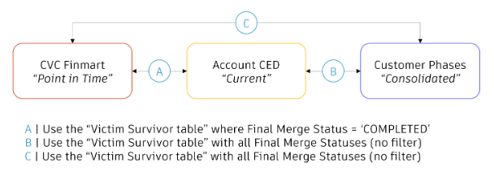

{==

## **Template instructions checklist**

* [x] Read the [Contribute to Customer Analytics Knowledge Network](https://eda-data-docs.autodesk.com/contribution/contribute-to-cakn) document before proceeding with this template.
* [ ] Create your Markdown file in the `eio_documentation/docs/analysis/` directory. The name of the file should be the title of the document, written in lowercase and using hyphens to replace spaces. For example: `traverse-account-data.md`.
* [ ] Copy all the content from the Markdown file of this template and paste it into the new Markdown file that you've created.
* [ ] **Title**: Replace the `How-to Analysis template` with the title of your document at the top of the page, between the initial `---` lines in the Markdown file. For standardization purposes, avoid including *How to* at the beginning. Instead, begin directly with a verb in the imperative form (e.g., Calculate, Write, Find, etc.).
* [ ] **Sections overview**: Familiarize yourself with the structure for this template.
      ```
      ├─ Key contacts
      ├─ Introduction
      │   ├─ Objective
      │   ├─ Purpose    
      │   └─ Notes
      ├─ Prerequisites
      ├─ Methodology
      ├─ Procedure
      │   ├─ Step 1
      |   |   └─ Sample query 1    
      │   ├─ Step 2
      |   |   └─ Sample query 2       
      │   ├─ Step 3
      |   |   └─ Sample query 3  
      │   ├─ ...
      │   └─ Step N
      |       └─ Sample query N        
      ├─ Clarifications
      │   └─ FAQ         
      └─ Related links
      ```
  * [ ] **Key contacts**: Add the names of the Subject Matter Experts for this document. Then, replace `#` with the link to their Aware profiles. The content of this block is placed at the top of the right sidebar on CAKN.
  * [ ] **Introduction**: Summarize the objective and purpose of the analysis, writing for a non-technical audience.
      - **Objective**: Write one sentence to explain the objective of this document (the WHAT).
      - **Purpose**: Add another sentence, a paragraph, and/or a list to explain the purpose of this guide (the WHY), the problem that it helps to solve (the HOW), and/or its main use case (the WHO and WHEN).
      - **Notes (optional)**: Indicate any dataset and/or metrics that are referred to in this analysis, including the link to their CAKN page. Add any extra note, other user cases, and/or  relevant how-to guide in another bullet point. If there aren't any relevant notes, remove this note block entirely.
  * [ ] **Prerequisites**: Indicate prerequisites using as many paragraphs as you need and/or a list of items. If there isn't any relevant requisite, you can just write "None."
      - For listing the datasets required, use the table format as the example below, adding the Atlan link for each specific dataset in the "View/Table" field.
  * [ ] **Methodology**: Describe the approach used in the analysis. 
      - Explain why you have chosen this particular method, highlighting the benefits of following it. You can use images or videos to illustrate your method. Also include the limitations (if any).
      - Finish listing the steps that will be described in the next section. 
  * [ ] **Procedure**: Describe the method explained above step-by-step.
      - For each step, include:  
           - Title with one sentence as a heading 3 (###).
           - Short description of que intended outcome as first paragraph.
           - SQL query, including additional notes at the beginning, if necessary.
           - Keep the structure with "Step 1" as heading 4 (####) as this allow this particular step to have it's own URL.
           - If you are using CTEs (Common Table Expression), it is expected the the final step contains all above steps, as Federated Analysts might not have access to your repo in DBT, therefore the code should be the compiled version.
           - Add an output table at the end of the final step (or after each step, within the collapsible code if preferred).
  * [ ] **Clarifications**: Add the title of each impacted use case and its description. Optionally, each FAQ can have a collapsible block with an Example/Recommendation, where you can include images if needed. Add Known issues separately where it is indicated, each on a separate bullet point.
  * [ ] **Related links**: Optionally, add links to pages that complement this document. Avoid the repetition of links that have been added in the previous sections. Indicate in parentheses the platform where it links to, provided it is not the CAKN website (for example the Wiki platform).

  The examples provided in each section below are taken from different documents. For additional examples, refer to the documents created in the `eio_documentation/docs/analysis/` directory.

!!! warning
    When you complete your document, remove both this instructions block and the instruction comments between `==` from the rest of the sections in this Markdown file.

!!! note "Publish the document on GitHub for review"
    Use the GitHub Desktop or the Terminal to create a branch, commit your changes, and push the document to GitHub. Follow these guidelines:

    1. Create a branch with the following naming pattern, replacing the Jira-ID and the rest of the words with the details of your task:
      - `jira-2120/cakn/create-name-of-document`.
    2. Add your changes to your branch and commit them. Write a commit message where indicated if you are using GitHub Desktop. If you are using the Terminal, you can write something similar to this example: `git commit -m "Created the (title of your document) document on CAKN"`.
    3. Push your changes and create a Pull Request, adding a screenshot of the document on your local environment in the description under a `## Test Case` section (drag and drop or copy and paste the image file into the GitHub description box).
    4. Add the Technical Writers and Delivery Managers as reviewers.

==}

<!-- KEY CONTACTS -->

<div id="how-to-template-info-main">
  <ul>
    <li><strong>Subject Matter Expert:</strong>
      <a target="_blank" href="#">Name of Subject Matter Expert</a>
    <li class="doc-status"><strong>Status:</strong> <span class="doc-ok">Published<span></li>
    <!-- <li><strong class="doc-status">Status:</strong> <span class="doc-wip">In Progress</span>.</li> -->
  </ul>
</div>

## :material-list-box-outline:{ .red-icon-heading } Introduction

<!-- 1. INTRODUCTION -->

<h3>Objective</h3>
This document explains how to calculate a financial metric `ACV` for a specific cohort of `customer phases`. This enables the analyst community to compare the Annual Contract value (ACV) between a "Net-New" and "New-Again" customer, and therefore provide valuable insight for the organization.

<h3>Purpose</h3>

The purpose of this guide is to help the analysts community to correlate those two different data domains (ie. Finance and Customer data) in the most appropriate and standardized way. Account data links business transactions to customer organizations and it is fundamental to nearly all analytics. Due to it's fluid behaviour, can be tricky to navigate when joining datasets across systems.

!!! note "Notes"
    It is fundamental to get familiar with the following concepts:

    - [ACV metric definition](../../onboarding/metrics/acv-metric.md)
    - [Customer Phases Concept](customer-phases.md/)


## :material-format-list-checks:{ .green-icon-heading } Prerequisites

<!-- 2. PREREQUISITES-->

In order to perform the following query, you need to have a access to the following tables:

| Schema/Database | View/Table | Basic Filters | Usage | 
| --------------- | ---------- | ------------- | ----- |
| BSD_PUBLISH.FINMART_PRIVATE | [CVC_FINMART](https://autodesk.atlan.com/assets/95f1294a-9e49-4639-af06-05087297a6d0/overview) | RECORD_TYPE = 'BILLING' | Used to capture ACV for all quarters |
| BSD_PUBLISH.FINMART_SHARED | [CVC_FINMART](https://autodesk.atlan.com/assets/0a4909f8-3f19-4d9c-b6ea-fd4b3a2e5128/overview)| RECORD_TYPE = 'BILLING' | Used to capture ACV for previous quarters |
| Add schema/database here | [Add table with link to Atlan here](#)| | Explain the usage here | 


- Request access via [ADP Access Management](https://access.adp.autodesk.com/data-access/snowflake). 
- For more information, please refer to [ADP Access Management User Guide](https://wiki.autodesk.com/pages/viewpage.action?spaceKey=CPDDPS&title=ADP+Access+Management+User+Guide), or contact the team on their slack channel [#adp-access-support](https://autodesk.enterprise.slack.com/archives/C05JFCCB0FK).

<!-- 
The block above can be replicated in all documentations that refer "ADP Access Management".
-->

## :fontawesome-solid-map-location:{ .purple-icon-heading } Methodology

<!-- 3. METHODOLOGY -->

Joining datasets across different systems is challenging as they might not reflect the same population nor updates regarding the account data. This is not different when joining **Finance data**, sourced from SAP, with **customer data**, sourced from SalesForce. 

It is important to understand the nature of the different systems:

1. **Finance Data**: transactional based = "point in time", represented in the table `cvc_finmart`
2. **Customer Data**: current account status, represented in the table `account_ced`
3. **Customer Phase Data**: categorize in which phase of the customer purchase cycle, represented in the table `customer_phases`.


<figure markdown>
  { width="900px" }
  <figcaption></figcaption>
</figure>

To navigate from `cvc_finmart`, which is a point in time fact table, to the consolidated status from `customer_phases`, and pulling the dimensions from `account_ced`, the following the steps will guide you:

## :material-clipboard-list:{ .yellow-icon-heading } Procedure

<!-- 4. PROCEDURE -->

### 1. Prepare the data with deduplicated accounts and dimensions  

This query removes known duplicates accounts from Account CED data, selects required dimensions, and joins with customer phases table. In this example e are selecting `account_geo`, `site_individual_flag` and `is_visible_in_sfdc`. For more information on those last 2 flags, please refer to [traversing account data](../customer_phases/traversing-account-data.md).

??? abstract "Deduplicating accounts from `account_total_merged_gtm_hierarchy` and getting dimensions from `account_ced` and `customer phases`"
    #### Step 1

   
    ``` sql linenums="1"
      -- this CTE is account_ced_dimension

        SELECT
          h.final_parent_account_csn    AS parent_csn,
          t.account_csn                 AS account_csn,
          c.customer_phase,
          c.customer_phase_start_date,
          CONCAT(SUBSTRING(c.customer_phase_start_date,1,4),'-',SUBSTRING(c.customer_phase_start_date,6,2),'-','01')  AS by_month_customer_phase_start_date,
          c.customer_phase_end_date,
          CONCAT(SUBSTRING(c.customer_phase_end_date,1,4),'-',SUBSTRING(c.customer_phase_end_date,6,2),'-','01')  AS by_month_customer_phase_end_date,

          a.site_geo                        AS account_geo,
          a.site_individual_flag, 
          a.is_visible_in_sfdc, 
          a.site_uuid_csn,
          CONCAT('FY',SUBSTRING(start_fiscal_year_quarter, 3, 2)) AS fiscal_year,
          c.START_FISCAL_YEAR_QUARTER
        FROM adp_publish.account_optimized.account_edp_optimized  a
        LEFT JOIN adp_publish.account_optimized.transactional_csn_mapping_optimized t
            ON a.site_uuid_csn = t.site_uuid_csn
        INNER JOIN ( -- this is deduplicating accounts
                SELECT 
                  DISTINCT site_account_csn,
                  final_account_csn, 
                  final_parent_account_csn     
                FROM eio_publish.reference_private.account_total_merged_gtm_hierarchy) h
            ON t.account_csn =  h.site_account_csn 
        LEFT JOIN  eio_publish.customer_shared.customer_phases c
            ON  h.final_parent_account_csn = c.parent_csn 
  
    ```

### 2. Join Finance data with Customer data  

This query is selects the relevant fields for the metrics `ACV`, `Billings` and `Multi-year Billings` from `cvc_finmart`, joins with `victim_survivor_mapping` to get the most updated view on merged accounts. It filters `final_merge_status = 'COMPLETED'`.

??? abstract "Joining `cvc_finmart` with `victim_survivor_mapping`"
    #### Step 2

    ``` sql linenums="1"
    -- this CTE is cvc_finmart_vs_mapping:

          SELECT 
            COALESCE( v.surviving_account_csn, fm.corporate_csn) AS account_csn, --swapping victim accounts with surviving
            fm.fy_and_fq_name,
            fm.settlement_start_dt,
          
            ---ACV
            fm.cc_fbm_total_acv_net1_usd,
            fm.cc_fbm_total_acv_net2_usd,
            fm.cc_fbm_total_acv_net3_usd,
            fm.cc_fbm_total_acv_net4_usd,
            fm.record_type,
            fm.transaction_dt,
 
            ---MY (additional example)
            fm.cc_fbd_bil_term_sgrp,
            fm.cc_billed_bgt_usd_cur,

            ---billings (additional example)
            fm.billed_srp_usd_amt,
            fm.bill_net1_usd_amt,
            fm.bill_net2_usd_amt,
            fm.billed_usd_amt,
            fm.billed_post_bcknd_disc_usd_amt

          FROM  bsd_publish.finmart_private.cvc_finmart AS fm 
          LEFT JOIN edm_publish.edm_public.victim_survivor_mapping v
            ON fm.corporate_csn = v.victim_account_csn AND final_merge_status ='COMPLETED'
          LEFT JOIN adp_publish.customer_success_optimized.date_info dt
            ON fm.settlement_start_dt =dt.dt
        
    ```

### 3. Title of Step 3

Description of Step 3

??? abstract "Title of query for Step 3"
    #### Step 3

    ``` sql linenums="1"  
    Add the SQL code here.
    ```


### 4. Title of Step 4

Description of Step 4

??? abstract "Title of query for Step 4"
    #### Step 4

    ``` sql linenums="1"  
    Add the SQL code here.
    ```

### Output table

| ACCOUNT_CSN | ACCOUNT_GEO | FISCAL_QUARTER | ACV_NET1_USD | ACV_NET2_USD | ACV_NET3_USD | ACV_NET4_USD | CUSTOMER_PHASE | SITE_INDIVIDUAL_FLAG | IS_VISIBLE_IN_SFDC |
| ----------- | ----------- | -------------- | ------------ | ------------ | ------------ | ------------ | -------------- | -------------- | -------------- |
| 5102514937 | AMER	|	FY21Q4 | 20,755.00	| 20,755.00 | 17,122.87	| 13,768.862 |	New Again | False | True |
| 5501010864 | EMEA | FY24Q1 | 500.58 | 500.58 | 500.58 | 500.58 | Net New | False | True |
| 5155957639 | APAC | FY23Q3 | 294.11 | 294.11 | 267.64 | 263.23 | Net New | False | True |

## :material-head-question:{ .grey-icon-heading } Clarifications

<!-- 5. CLARIFICATIONS -->

??? info "Specifications"

    #### 1. Which Account CSN(s) are included
    Victim survivor table is used to join the Entitlement CED and Account CED tables but the CSN surfaced in the product usage dataset depend on the which ever CSN available in the Entitlement CED and Account CED on the load date.

    #### 2. Account CSN availability
    Account CSN is available for all of the records. However the logic to get the account information for the records depends on the date partitions.

    ??? question "Example/Recommendation"
        There are two different codes for historic data depending on if the date partitions is before or after March 9, 2021. For dates prior to March 9, 2021, instead of using the point-in-time partition, the account CSN is brought into the data using the earliest available partition from the entitlement CED with the `end_customer_acct_csn` column populated (2021-03-09).

    #### 3. Impacted use case 3 title
    Describe impacted use case here.

    ??? question "Example/Recommendation"
        This block is optional.

!!! warning "Known issues"
    No known issues.

### FAQs

??? question "Is there a dashboard where the above logic is applied?"
    #### FAQ 1
    Yes, the [Executive Insights Dashboard](https://app.powerbi.com/groups/0cd3aea6-b4f2-47ea-b466-6e336b8b8216/reports/800d01ff-769a-437f-9631-d7e3db9c4322/ReportSection9212f1eabeb5ed59d63e?experience=power-bi) makes use of the same approach to report on prioritized KPIs. As it contains current quarter Financial data, users must be on the Trading Window List (TWL). Please email [insider.trading.compliance@autodesk.com](mailto:insider.trading.compliance@autodesk.com) for access. 

??? question "How can I calculate other metric for Net-New or New-Again customers?"
    #### FAQ 2
    To make use of the same logic, the metric dataset which will be queried in step 3 must have the same granularity as the other steps. which is by `account_csn` and `date`. This is required in order to place the correct customer phase based on `customer_phase_start_date` and `customer_phase_end_date`.

??? question "Question 3"
    #### FAQ 3
    Answer to question 3.
    


## :material-link:{ .grey-icon-heading } Relevant Links

- [CAKN Blog: Traversing Account Data (Wiki)](https://wiki.autodesk.com/pages/viewpage.action?spaceKey=EAX&title=CAKN+Blog%3A+Traversing+Account+Data)

