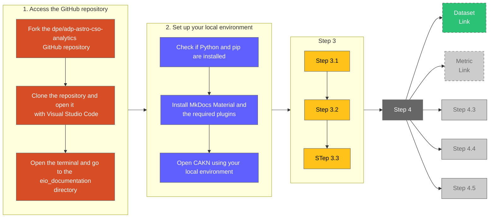

{==

## **Template instructions checklist**

* [x] Read the [Contribute to Customer Analytics Knowledge Network](https://eda-data-docs.autodesk.com/contribution/contribute-to-cakn) document before proceeding with this template.
* [ ] Create your Markdown file in the `eio_documentation/docs/onboarding/` directory. The name of the file should be the title of the document, written in lowercase and using hyphens to replace spaces. For example: `use-snowflake-database-as-a-data-source-with-power-bi-connector.md`.
* [ ] Copy all the content from the Markdown file of this template and paste it into the new Markdown file that you've created.
* [ ] **Title**: Replace the `How-to Standard Operating Procedure (SOP) template` with the title of your document at the top of the page, between the initial `---` lines in the Markdown file. For standardization purposes, avoid including *How to* at the beginning. Instead, begin directly with a verb in the imperative form (e.g., Calculate, Write, Find, etc.).
* [ ] **Sections overview**: Familiarize yourself with the structure for this template.
      ```
      ├─ Key contacts
      ├─ Introduction
      │   ├─ Objective
      │   ├─ Purpose    
      │   └─ Notes
      ├─ Scope
      ├─ Prerequisites
      ├─ Procedure
      │   ├─ Flowchart
      │   ├─ 1. Step 1
      │   │   ├─ Step 1.1
      │   │   ├─ Step 1.2
      │   │   └─ Step 1.3
      │   ├─ 2. Step 2
      │   │   ├─ Step 2.1
      │   │   ├─ Step 2.2
      │   │   └─ Step 2.3
      │   └─ 3. Step 3
      │       ├─ Step 3.1
      │       ├─ Step 3.2
      │       └─ Step 3.3
      ├─ Exception handling
      ├─ Clarifications
      │   ├─ Troubleshooting
      │   └─ Frequently Asked Questions (FAQs)
      └─ Related links
      ```
  * [ ] **Key contacts**: Add the names of the Subject Matter Experts for this document. Then, replace `#` with the link to their Aware profiles. The content of this block is placed at the top of the right sidebar on CAKN.
  * [ ] **Introduction**: Summarize the objective and purpose of the Standard Operating Procedure, writing for a non-technical audience.
      - **Objective**: Write one sentence to explain the objective of this guide.
      - **Purpose**: Add another sentence, a paragraph, and/or a list to explain the purpose of this guide (the WHY), the problem that it helps to solve, and/or its main use case.
      - **Notes (optional)**: Indicate any relevant information about this document, including a link if necessary. Add any additional notes in another bullet point within the same note block. If there aren't any important notes, remove this note block entirely.
  * [ ] **Scope**: Establish the limitations of this document to let users know what this guide covers and what it doesn't.
  * [ ] **Prerequisites**: Add a sentence, a paragraph, or a list, including links, indicating the required items users need to have covered before starting this guide. If there isn't any relevant requisite, you can just write "None."
  * [ ] **Procedure**: Follow the same structure and format as the examples provided.
      - **Flowchart**: Add a visual representation of the steps as a summary. Use either a Mermaid Flowchart diagram or an image.
      - **Steps**: The title of every step should start with a verb to specify the action that needs to be taken. Then, each substep should be in a collapsible block.
  * [ ] **Exception handling**: Indicate alternatives or exceptions to the main use case in this section. Every exception should be in a collapsible block.
  * [ ] **Clarifications**: Complete this section to help users solve common issues and understand related concepts or situations. Follow the examples provided below.
      - **Troubleshooting**: Describe every issue and its solution in a collapsible block. If there isn't any issue, remove this section from your document.
      - **Frequently asked questions (FAQs)**: Add every question and its answer in a collapsible block. If there isn't any issue, remove this section from your document.
  * [ ] **Related links**: Optionally, add links to pages that complement this document. Avoid the repetition of links that have been added in the previous sections. Indicate in parentheses the platform where it links to, provided it is not the CAKN website (for example the Wiki platform).

  The examples provided in each section below are taken from different documents. For additional examples, refer to the documents created in the `eio_documentation/docs/onboarding/` directory.

!!! warning
    When you complete your document, remove both this instructions block and the instruction comments between `==` from the rest of the sections in this Markdown file.

!!! note "Publish the document on GitHub for review"
    Use the GitHub Desktop or the Terminal to create a branch, commit your changes, and push the document to GitHub. Follow these guidelines:

    1. Create a branch with the following naming pattern, replacing the Jira-ID and the rest of the words with the details of your task:
      - `jira-2120/cakn/create-name-of-document`.
    2. Add your changes to your branch and commit them. Write a commit message where indicated if you are using GitHub Desktop. If you are using the Terminal, you can write something similar to this example: `git commit -m "Created the (title of your document) document on CAKN"`.
    3. Push your changes and create a Pull Request, adding a screenshot of the document on your local environment in the description under a `## Test Case` section (drag and drop or copy and paste the image file into the GitHub description box).
    4. Add the Technical Writers and Delivery Managers as reviewers.

==}

<!-- KEY CONTACTS -->

<div id="how-to-template-info-main">
  <ul>
    <li><strong>Subject Matter Expert:</strong>
      <a target="_blank" href="#">Name of Subject Matter Expert</a>,
      <a target="_blank" href="#">Name of Subject Matter Expert 2</a>
    </li>
    <li class="doc-status"><strong>Status:</strong> <span class="doc-ok">Published<span></li>
    <!-- <li><strong class="doc-status">Status:</strong> <span class="doc-wip">In Progress</span>.</li> -->
  </ul>
</div>

## :material-list-box-outline:{ .red-icon-heading } Introduction

<h3>Objective</h3>

The goal of this document is to establish the procedure that contributors to the Customer Analytics Knowledge Network (CAKN) platform need to follow to create a document.

<h3>Purpose</h3>

The purpose of these guidelines is to help the Enterprise Analytics Experience (EAX) team create standardized documentation that is easy to understand and use by Federated Analysts at Autodesk. More specifically, they aim to:

- Explain how to set up the local environment to begin for example, working on this platform.
- Speed up the process of creating a document.
- List item 3.
- List item 4.

!!! note
    - The creation of each document requires the use of a template. Once you finish reading this guide, you can [jump to the templates section](#41) to choose the one that you need.
    - Note 2.

## :material-circle-outline:{ .green-icon-heading } Scope

This guide describes the steps to start creating or editing a document on CAKN. It covers everything from preparing the local environment to choosing a template. However, it does not provide guidance on what the CAKN platform is, the specifications of Markdown, or the GitHub workflow.


## :material-format-list-checks:{ .purple-icon-heading } Prerequisites

- Connection to the [Autodesk VPN](https://one.autodesk.com/IT/articles/fe1298581b92515037e1557b234bcba5).
- Access to the [GitHub repository](https://git.autodesk.com/dpe/adp-astro-cso-analytics/tree/master/dags/dbt).
- Prerequisite 3.
- Prerequisite 4.


## :material-step-forward:{ .yellow-icon-heading } Procedure

### Flowchart

==**Example 1**: Create a Mermaid Flowchart diagram, using the following example as a reference. See the instructions provided in the code of the diagram in the Markdown file.==



==**Example 2**: Replace the image below==

<figure markdown>
  { width="600px" }
  <figcaption>Sample image caption</figcaption>
</figure>


### 1. Access the GitHub repository

??? abstract "Fork the `dpe/adp-astro-cso-analytics` repository"
    #### 1.1

    1. Go to the [`dpe/adp-astro-cso-analytics` website](https://git.autodesk.com/dpe/adp-astro-cso-analytics/tree/master/dags/dbt) on GitHub.
    2. Fork the repository.

??? abstract "Clone the repository and open it in Visual Studio Code"

    You can clone the repository using Visual Studio Code, the command line, or the GitHub Desktop app.
    
    For example, if you are using the integrated Terminal in Visual Studio Code, open the directory where you would like to clone the forked repository, and execute the following command (replace the sample URL with the URL of your repository):

    - `git clone https://link-to-your-forked-GitHub-repository.git`

    Alternatively, you can use the related indications on the Welcome screen in Visual Studio Code.

??? abstract "Open the `eio_documentation` directory in the terminal"
    #### 1.2

    Once the forked repository is cloned, open the `adp-astro-cso-analytics-forked\dags\dbt\documentations\eio_documentation` folder in the command line interface.
    
    You can use GitHub Desktop, Visual Studio Code, or the integrated terminal to accomplish this step.

    <figure markdown>
      { width="900px" }
      <figcaption>Using Visual Studio Code to open the eio_documentation directory in the Terminal</figcaption>
    </figure>


### 2. Set up your local environment

??? abstract "Check if Python and pip are installed"
    #### 2.1

    The CAKN documentation website is created with MkDocs, which is a static site generator. However, before setting up MkDocs, you need to have a recent version of Python and pip, the Python package manager, installed for it to work.

    Run the following commands in the Terminal to see if they are installed:

    1. `python --version`
    2. `pip --version`

    **If you see the version once you execute each command, move to the next step to [install MkDocs and the required plug-ins](#22)**.

    If you don't, refer to the [installing Python](https://www.mkdocs.org/user-guide/installation/#installing-python) and [installing pip](https://www.mkdocs.org/user-guide/installation/#installing-pip) sections on the official MkDocs Installation document.

??? abstract "Install MkDocs Material and the required plug-ins"
    #### 2.2

    Besides the main MkDocs package, you will need to install other features that enable more functionalities. For example, the Material theme enhances the reading and writing experience on the website, and the Awesome Pages plug-in is used to organize the menu items.

    Execute the following commands sequentially in the Terminal, ensuring each installation is complete before proceeding to the next:

    1. `pip install mkdocs`
    2. `pip install mkdocs-material`
    3. `pip install mkdocs-awesome-pages-plugin`
    4. `pip install mkdocs-glightbox`
    5. `pip install mkdocs-exclude-search`

??? abstract "Open CAKN using your local environment"
    #### 2.3

    Execute the following command in the terminal while you are in the `eio_documentation` directory:

    - `mkdocs serve`

    Then, you should be able to enter this URL into your web browser and see CAKN running in your local environment: [http://127.0.0.1:8000/](http://127.0.0.1:8000/).

    If you would like to terminate the process in the integrated terminal, you can use the ++ctrl+c++ keyboard shortcut.


### 3. Step 3

??? abstract "Title of Step 3.1"
    #### 3.1

    Explain Step 3.1 here.


??? abstract "Title of Step 3.2"
    #### 3.2

    Explain Step 3.2 here.


??? abstract "Title of Step 3.3"
    #### 3.3

    Explain Step 3.3 here.


### 4. Step 4

??? abstract "Title of Step 4.1"
    #### 4.1

    Explain Step 4.1 here.


## :material-map-marker-path:{ .grey-icon-heading } Exception handling

??? info "1. Use the Quick Edit button"

    Published documents on CAKN have a Quick Edit feature placed at the top right of the content, next to the main title.

    This feature allows us to make minor changes directly in the interface, eliminating the need to use Visual Studio Code or to set up the local environment.

    Use the Quick Edit button **only for quick textual corrections or updates**. Avoid using it for more significant changes or edits related to the layout or style of the document, since changes using this approach cannot be verified in the local environment before publishing them.

    While a GitHub branch will be created automatically, you will need to create a PR (Pull Request) following these guidelines:

    1. Explain the changes in the description box.
    2. Indicate that the change was made using the Quick Edit feature.
    3. There is no need to add a screenshot.
    4. Add Delivery Managers and Technical Writers as reviewers.

??? info "2. Title of Exception handling 2"

    Explain Exception handling 2 here.


## :material-head-question:{ .grey-icon-heading } Clarifications

### Troubleshooting

??? abstract "Title of issue 1"

    Explain the solution to issue 1 here.

### FAQs

??? question "What is a Service Account?"
    #### FAQ 1

    Service Accounts are normally different from your usual ADSK accounts. Service Accounts are a special type of non-human privileged account used to execute applications and run automated services, virtual machine instances, and other processes. Service Accounts can be privileged local or domain accounts, and in some cases, they may have domain administrative privileges. In Autodesk, normally service accounts follow the format: `svc_p_xxxxxxx`.

??? question "Add Question 2 here"
    #### FAQ 2

    Write the answer to Question 2 here.


## :material-link:{ .grey-icon-heading } Related Links

- [Form to create a Service Account (Autodesk One)](https://autodesk.service-now.com/helphub?id=evg_sc_cat_item&sys_id=5973e1b6c0344a0087da1d9d5b48a36d)
- [Page to register and manage ownership for the Service Account (Autodesk One)](https://employeehub.autodesk.com/apps/cms/service-account-ownership-form/)
- [Link 3](#)

