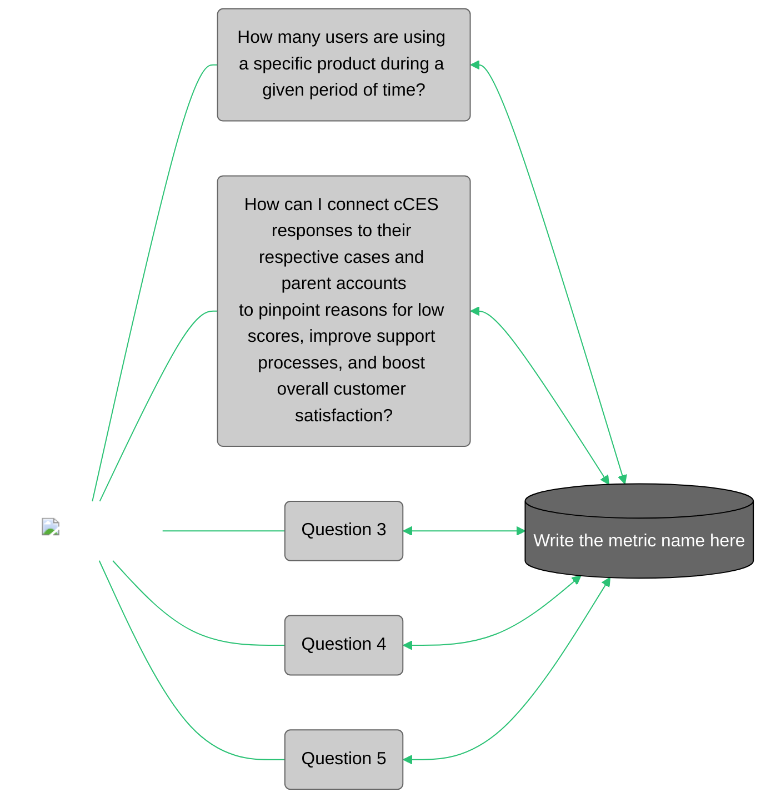

{==

## **Template instructions checklist**

* [x] Read the [Contribute to Customer Analytics Knowledge Network](https://eda-data-docs.autodesk.com/contribution/contribute-to-cakn) document before proceeding with this template.
* [ ] Create your Markdown file in the `eio_documentation/docs/metrics/` directory. The name of the file should be the name of the document in lowercase, using a hyphen as a space, and omitting parentheses. Use `md` as the file extension. For example: `annual-contract-value-acv.md`, `case-customer-effort-score-cces.md`, etc.
* [x] Copy all the content from the Markdown file of this template and paste it into the new Markdown file that you have just created.
* [ ] **Title**: Replace the `Metric template` text with the title of your document at the top of the page, between the initial `---` lines in the Markdown file. For standardization purposes, do not use metric in the title, write the title of the metric and its acronym, if any. For example: `Annual Contract Value (ACV)`.
* [ ] **Sections overview**: Familiarize yourself with the structure for this template.
  ```
  ├─ Key contacts
  ├─ Introduction
  │   └─ Notes
  ├─ Business use cases
  ├─ Metric details
  │   ├─ Overview
  │   │   └─ What does this metric measure?
  │   ├─ Calculation
  │   │   ├─ Metric granularity
  │   │   └─ Dimensions
  │   ├─ Caveats & clarifications
  │   ├─ Data tables
  │   ├─ Monitoring
  │   │   ├─ Report/Data for reconciliation
  │   │   ├─ Data quality checks & reports
  │   │   └─ Version checks
  │   └─ Downstream reports
  ├─ Sample queries
  └─ Related links
  ```
  * [ ] **Key contacts**: Replace `Subject Matter Expert:` and `Product Owner:` if necessary with the roles of the key contacts for this document, and add their name. Then, replace `#` with the link to their Aware profile. This block will appear at the top of the right sidebar of the document page on CAKN.
  * [ ] **Introduction**: Summarize the objective of the metric, preferably using one sentence. Then, add another paragraph or two explaining more details about the metric purpose to explain why it is important and/or other basic aspects, writing for a non-technical audience.
      - In the `note` block, indicate the datasets that build this metric, including the link to their page. Add any extra note in another bullet point.
  * [ ] **Business use cases**: Complete the diagram replacing each `Question` label with an actual business-related question that this metric answers. Add between 3 and 5 questions. If the question looks too long, you can use the `<br>` tag as a space for a line break. Then, add the name of the metric where it is indicated. Finally, add text below the diagram to provide more details or describe the business use cases in a more general way, writing for a non-technical audience.
  * [ ] **Metric details**: 
  *   - **Overview**: Start writing for a technical audience. These are the required Overview subsections:
      - **What does this metric measure?**: Depending on the metric, you can write one paragraph or as many paragraphs as you need to explain the necessary information. Add subsections if needed.
      - **Calculation**: Indicate the calculation details, preferably using a example. Add subsections if needed.
      - **Metric granularity**: If the metric granularity is already indicated in the dataset document, consider adding a link to it to avoid repetition.
      - **Dimensions**: Group dimensions by reporting object. Use a collapsible block for each reporting object as shown in the example.
  * [ ] **Caveats & clarifications**: Collapse the specifications. You can add an additional collapsible block to highlight or group different clarifications. If you need to include an image, add it in the corresponding collapsible Example/Recommendation block (see example below).
      - Known issues: Add each known issue on a separate bullet point. If there aren't any issues, just write: "No known issues."
  * [ ] **Data tables**: Add a table including the link to Atlan as shown in the example. Then, add the link to GitHub.
      - **Access**: Leave this block as is. If there is only a standalone table, replace the link in the first bullet point with the link to the specific schema page on the ADP Access Management website.
  * [ ] **Monitoring**: Complete the following sections.
      - **Report/Data for Reconciliation**: Add a button link to any relevant page or write any relevant details. If there isn't any information available, write: "There is no data reconciliation report for this metric".
      - **Data quality checks & reports**: Describe the relevant information regarding data quality checks. Add known data quality issues as shown in the example.
  * [ ] **Downstream reports**: Complete the table. If there isn't any report, remove this section entirely.
  * [ ] **Sample queries**: Follow the examples. Each SQL sample query should have a title and include a description. Keep the `### Sample query 1`, the `sql linenums="1"` information as it is in order to enable standardization. Follow the best practices regarding coding standards, and check that the sample queries are not repeated on the dataset document.
  * [ ] **Related links**: Optionally, add links to pages that complement this document. Avoid the repetition of links that have been added in the previous sections. Indicate in parenthesis the platform where it links to, provided it is not the CAKN website (e.g. (wiki)).

The examples provided in each section below are taken from different documents. For additional examples, refer to the documents created in the `eio_documentation/docs/metrics/` directory.

!!! warning
    When you complete your document, remove both this instructions block and the instruction comments between `==` from the rest of the sections in this Markdown file.

!!! note "Publish the document on GitHub for review"
    Use the GitHub Desktop or the Terminal to create a branch, commit your changes, and push the document to GitHub. Follow these guidelines:

    1. Create a branch with the following naming pattern, replacing the Jira-ID and the rest of the words with the details of your task:
      - `jira-2120/cakn/create-name-of-document`.
    2. Add your changes to your branch and commit them. Write a commit message where indicated if you are using GitHub Desktop. If you are using the Terminal, you can write something similar to this example: `git commit -m "Created the (title of your document) document on CAKN"`.
    3. Push your changes and create a Pull Request, adding a screenshot of the document on your local environment in the description under a `## Test Case` section (drag and drop or copy and paste the image file into the GitHub description box).
    4. Add the Technical Writers and Delivery Managers as reviewers.

==}


<div id="metric-template-info-main">
  <ul>
    <li><strong>Subject Matter Expert:</strong>
      <a target="_blank" href="#">Name of Subject Matter Expert</a>
    </li>
    <li><strong>Product Owner:</strong>
      <a target="_blank" href="#">Name of Product Owner</a>
    </li>
    <li class="doc-status"><strong>Status:</strong> <span class="doc-ok">Published<span></li>
    <!-- <li><strong class="doc-status">Status:</strong> <span class="doc-wip">In Progress</span>.</li> -->
  </ul>
</div>


## :material-chart-bar:{.red-icon-heading} Introduction

Active Users indicates the number of users per product that have used ADSK (Autodesk) products at least once in a given time period.

The purpose of this metric is to provide software product managers and federated analysts with a standard measure of customer activity to enable analysis and informed decisions about customer growth, engagement outcomes, and behavioral patterns.

!!! note

    - This metric is built from the [Product Usage dataset](../../customer-domain/usage/product-usage.md)
    - Active Users was previously known as Monthly Active Users (MAU).
    

## :material-connection:{ .green-icon-heading } Business use cases



The Active Users metric helps us understand how useful or common an Autodesk product is based on the number of users that are using it in a specific period of time. Besides calculating at a product level, it can also take into account a product collection or offering level, as well as whether usage is allocated to a parent or child account taking the tenant model and subscription relation into consideration.


## :material-database-settings:{ .purple-icon-heading } Metric details

### Overview
    
#### What does this metric measure?

Active Users measures the number of users (`oxygen_id`) that have authorized and/or used ADSK products at least once in a given time period. Time periods can be defined based on the requirement of the business question at hand. Repeat active users are users who have used the products in both the current period and the period immediately prior.

##### What counts as an active user?

An "active" user has authorized and/or used the product at least once in a given time period (based on the unique event timestamp date). Coverage depends on the product's ability to send data back to Autodesk.

There are some limitations that the data could not cover yet such as offline usage as well as for products like Autodesk Construction Solutions (ACS). Oxygen ID is used as the closest proxy to count people since it is meant to represent a distinct user.

##### Another sample heading to describe what this metric measures

Sample text that you can also replace or remove as needed.


### Calculation

==Example 1:==

Sum of a `acv_netn` field in a particular transaction date.

==Example 2:==

The cCES is typically calculated by counting the total number of survey response with scores 5 or higher and dividing it by the total number of survey responses.​

??? example 

    For example, let's say you collect CES responses from five customers (considering a survey was sent after the case was closed).

    | Customer       | Score                | Score Scale                            |   
    |----------------|----------------------|----------------------------------------|
    | Customer 1     | 6                    | Easy                                   |
    | Customer 2     | 5                    | Somewhat easy                          |
    | Customer 3     | 7                    | Very easy                              |
    | ==Customer 4== | ==3==                | ==Somewhat difficult==                 |
    | Customer 5     | 6                    | Easy                                   |

    Customer 4 is highlighted to indicate that the score is not taken into account because the score provided is lower than 5.

    Therefore, the calculation is:
    **cCES** = (4/5)*100 = 80%

#### Metric granularity

==If the metric granularity is indicated on the dataset document, add a link to it to avoid repetition:==

Active Users has the same metric granularity as the [Product Usage dataset](https://eda-data-docs.autodesk.com/customer-domain/usage/product-usage/#lowest-granularity).

==Otherwise, specify it as follows:==

ACV measures the annualized contract value at a **date** and **single billing transaction** (or `src_id` level in `cvc_finmart`). Functionally, the metric is available as low as the order number (`sales_order_nbr`) level. However, the metric is easily rolled up to any dimensions available in Finmart.


#### Dimensions (Segments/Filters/Slicers)

There are 5 main reporting objects with their respective attributes:

??? info "Surveys"
    ##### Join Key: `response_id`
    - Modality
    - Finished
    - Progress
    - Key Drivers
    - Survey Date
    - Survey Comments

??? info "Case"
    ##### Join Key: `case_number`
    - Case Owner
    - Case Status
    - Case Topic
    - Case Type
    - Case Closed Date
    - Case Open Date
    - Case Language
    - Case Origin
    - Case Sub Origin
    - Case Owner Team
    - Case Product Feature
    - Case Resolution Days

??? info "Add reporting object here"
    ##### Join Key: `add_join_key_here`
    - Add dimension here
    - Add another dimension here


### Caveats & clarifications

??? info "Specifications"
    #### 1. This metric counts the `oxygen_id`
    It does not use `device_id` because the metric is created for COO organizations so they can make a decision about how to approach their customers. That being said, customer-based unique identification (like `oxygen_id`) gives more information about our customers. Furthermore, other Active Users metrics, for example in [PHD](https://phd.autodesk.com/product-usage/mau/AutoCAD), are created for the product manager who cares more about the development of products before customers.

    #### 2. Don't take sum or averages as usage calculations or MAUs are rolled up to different levels of aggregation
    Make sure `subscription_src` is used accordingly, by defining the business purposes or business questions that want to be achieved or answered and be consistent.

    ??? question "Example/Recommendation"
        This block is optional.

    #### 3. Title of impacted use case
    Describe impacted use case here.

    ??? question "Example/Recommendation"
        This block is optional.

??? info "Add an extra specifications block if needed here"
    #### 1. Impacted use case 1 title
    Describe impacted use case here.

    ??? question "Example/Recommendation"
        This block is optional.

!!! warning "Known issues"
    - **Dirty Pools:** this situation happens when the system picks the product based on the subscription model and the earliest expiry date of the subscription in order. Sometimes, ADP did not get the information of used products and decided to fill in the product information with that logic. 
    - For non-commercial usage products, the single authorization in the CLic Usage dataset could last more than a day. However, after further verification for commercial usage, the single authorization id in CLic Usage only lasts for a day. That said when counting active users for commercial purposes, CLic Authorization could give sufficient coverage.


### Data tables

==Example 1:==

#### Snowflake

| Schema/Database | View/Table | Basic Filters |
| --------------- | ---------- | ------------- |
| EIO_PUBLISH.USAGE_SHARED | [USAGE_SUS_DAILY](https://autodesk.atlan.com/assets/cdf46c92-add3-4282-9684-b8619eb6a6e9/overview) | |


==Example 2, which includes multiple lines within a row (using the `<br>` tag):==

#### Snowflake

| Schema/Database                          | View/Table                                   | Basic Filters                           | Notes          |
|------------------------------------------|----------------------------------------------|-----------------------------------------|----------------|
| EIO_PUBLISH.ENGAGEMENT_PRIVATE           | [SURVEY_QUESTION_OPTION](https://autodesk.atlan.com/assets/b30a4be6-02a6-4f4c-bb81-b3d9b891792e/overview) | survey_id = 'SV_aWd9zzdU4we7QTr'<br>question_id = 'QID6'<br>question_id = 'QID21'<br>question_id = 'QID22' | <br>CES Question<br>CES Drivers<br>CES Comments               |
| EIO_PUBLISH.ENGAGEMENT_PRIVATE           | [SURVEY_QUESTION_RESPONSE](https://autodesk.atlan.com/assets/1694328e-5a12-4b47-a5fb-accfd048ece0/overview) | survey_id = 'SV_aWd9zzdU4we7QTr'<br>progress = '100'<br>finished = '1'<br>question_id = 'QID6'<br>question_id = 'QID21'<br>question_id = 'QID22' | <br><br><br> CES Question<br>CES Drivers<br>CES Comments              |                                       |                |
| ADP_WORKSPACES.CORE_ENTERPRISE_DATA_SHARED | [PERSON](https://autodesk.atlan.com/assets/50c4876b-e5f0-409e-9b67-098d41d8d260/overview) |                                   | Hashed               |
| ADD_DATABASE.SCHEMA_HERE | [Table name with link to Atlan](#) | Add Basic Filters here | Add notes here |


##### Access

- Request access via [ADP Access Management](https://access.adp.autodesk.com/data-access/snowflake). 
- For more information, please refer to [ADP Access Management User Guide](https://wiki.autodesk.com/pages/viewpage.action?spaceKey=CPDDPS&title=ADP+Access+Management+User+Guide), or contact the team on their slack channel [#adp-access-support](https://autodesk.enterprise.slack.com/archives/C05JFCCB0FK).


### Sample queries
    
??? abstract "1. Calculate the MAU based on product level"
    #### Sample query 1

    This query is producing the calculation of MAU on product level. It answers the question: how many users of AutoCAD in June 23?

    ``` sql linenums="1"
    WITH temp AS
    (SELECT 
            feature_name,
            MONTH(usage_date) AS MONTH,
            YEAR(usage_date) AS YEAR,
            oxygen_id
    FROM eio_publish.usage_shared.usage_sus_daily
    -- use the subscription_src filter if you only want the data sourced from CLic table which is based on the subscription id,
    -- if you also want to consider the active users within the same team (tenant id and pool id) the subscription_src filter is not required.
    WHERE subscription_src = 'clic_subscription'
    AND usage_date >= '2023-06-01'
    AND usage_date <= '2023-06-30'
    AND feature_name = 'AutoCAD'
    )

    SELECT
            feature_name,
            MONTH,
            YEAR,
            COUNT(DISTINCT oxygen_id) AS MAU
    FROM temp
    GROUP BY
            feature_name,
            MONTH,
            YEAR
            ORDER BY MONTH, YEAR
    ```

??? abstract "2. Title of sample query 2"
    #### Sample query 2

    Describe the sample query here.

    ``` sql linenums="1"
    Add the SQL code here.
    ```
    
### Monitoring

#### Report / Data for reconciliation

==Example 1:==

[CTS Dashboard :simple-powerbi:](https://app.powerbi.com/groups/4a576fc3-b0da-4f2e-b6a8-3d13a27fe6f5/reports/3801584f-2466-43e5-adc7-7c5ae9c70e73/ReportSectiond817e8b8456f3a012a88?experience=power-bi){ .md-button .md-button--primary }

[Sample button link](#){ .md-button .md-button--primary }

==Example 2:==

There is no data reconciliation report for this metric.

#### Data quality checks & reports

!!! warning "Known data quality issues"

    1. For dates prior to March 9, 2021, instead of using the point-in-time partition, the account CSN is brought into the data using the earliest available partition from the entitlement CED with the `end_customer_acct_csn` column populated (2021-03-09). This results in a (98% coverage for subscriptions). The two methods are required due to the entitlement CED only introducing the `end_customer_acct_column` (`account_csn`) on March 9, 2021.

    2. Add the second known data quality issue here.


### Downstream reports

| Report / Process Title | Report / Process Description | Link to More Details | Consumers |
| ---------------------- | ---------------------------- | -------------------- | --------- |
| Client Services Dashboard | | [Link Here](https://app.powerbi.com/groups/cd75b404-a33c-4013-bf26-55de3657ed93/reports/88339c06-ef4c-423b-8c79-23d83853af30/ReportSectione892add47c3f07779b9d?experience=power-bi) | Client Services Team |
| Customer Technical Support Dashboard | | [Link Here](https://app.powerbi.com/groups/4a576fc3-b0da-4f2e-b6a8-3d13a27fe6f5/reports/3801584f-2466-43e5-adc7-7c5ae9c70e73/ReportSectiond817e8b8456f3a012a88?experience=power-bi) | CTS Team |
| Add another title here if needed | | [Add link Here](#) ||


## :material-link:{.yellow-icon-heading} Related links

- [Customer analytics standardisation (wiki)](https://wiki.autodesk.com/display/EAX/Customer+analytics+standardisation)
- [Product Usage: Prototype (wiki)](https://wiki.autodesk.com/display/EAX/Product+Usage%3A+Prototype)
