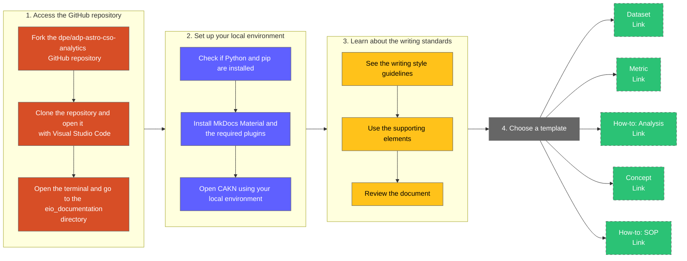

<!-- KEY CONTACTS -->

<div id="how-to-template-info-main">
  <ul>
    <li><strong>Subject Matter Expert:</strong>
      <a target="_blank" href="https://aware.autodesk.com/manuel.arnedo.sanchez">Manuel Arnedo Sánchez</a>,
      <a target="_blank" href="https://aware.autodesk.com/alice.miranda">Alice Miranda</a>
    </li>
    <li class="doc-status"><strong>Status:</strong> <span class="doc-ok">Published<span></li>
    <!-- <li><strong class="doc-status">Status:</strong> <span class="doc-wip">In Progress</span>.</li> -->
  </ul>
</div>


## :material-list-box-outline:{ .red-icon-heading } Introduction

<h3>Objective</h3>

The goal of this document is to establish the procedure that contributors to the Customer Analytics Knowledge Network (CAKN) platform need to follow to create a document.

<h3>Purpose</h3>

The purpose of these guidelines is to help the Enterprise Analytics Experience (EAX) team create standardized documentation that is easy to understand and use by Federated Analysts at Autodesk. More specifically, they aim to:

- Explain how to set up the local environment to begin for example, working on this platform.
- Speed up the process of creating a document.
- Define common patterns that keep documentation organized.
- Prepare the ground to form a unified voice as a team.

!!! note
    The creation of each document requires the use of a template. Once you finish reading this guide, you can [jump to the templates section](#41) to choose the one that you need.

## :material-circle-outline:{ .green-icon-heading } Scope

This guide describes the steps to start creating or editing a document on CAKN. It covers everything from preparing the local environment to choosing a template. However, it does not provide guidance on what the CAKN platform is, the specifications of Markdown, or the GitHub workflow.


## :material-format-list-checks:{ .purple-icon-heading } Prerequisites

- Connection to the [Autodesk VPN](https://one.autodesk.com/IT/articles/fe1298581b92515037e1557b234bcba5).
- Familiarity with GitHub, version control, and the [GIT Strategy](https://wiki.autodesk.com/pages/viewpage.action?spaceKey=EAX&title=GIT+Strategy).
- Access to the [GitHub repository](https://git.autodesk.com/dpe/adp-astro-cso-analytics/tree/master/dags/dbt).
- The [Visual Studio Code](https://code.visualstudio.com/) code editor.

## :material-step-forward:{ .yellow-icon-heading } Procedure

### Flowchart



### 1. Access the GitHub repository

??? abstract "Fork the `dpe/adp-astro-cso-analytics` repository"
    #### 1.1

    1. Go to the [`dpe/adp-astro-cso-analytics` website](https://git.autodesk.com/dpe/adp-astro-cso-analytics/tree/master/dags/dbt) on GitHub.
    2. Fork the repository.

??? abstract "Clone the repository and open it in Visual Studio Code"

    You can clone the repository using Visual Studio Code, the command line, or the GitHub Desktop app.
    
    For example, if you are using the integrated Terminal in Visual Studio Code, open the directory where you would like to clone the forked repository, and execute the following command (replace the sample URL with the URL of your repository):

    - `git clone https://link-to-your-forked-GitHub-repository.git`

    Alternatively, you can use the related indications on the Welcome screen in Visual Studio Code.

??? abstract "Open the `eio_documentation` directory in the terminal"
    #### 1.2

    Once the forked repository is cloned, open the `adp-astro-cso-analytics-forked\dags\dbt\documentations\eio_documentation` folder in the command line interface.
    
    You can use GitHub Desktop, Visual Studio Code, or the integrated terminal to accomplish this step.

    <figure markdown>
      { width="900px" }
      <figcaption>Using Visual Studio Code to open the eio_documentation directory in the Terminal</figcaption>
    </figure>


### 2. Set up your local environment

??? abstract "Check if Python and pip are installed"
    #### 2.1

    The CAKN documentation website is created with MkDocs, which is a static site generator. However, before setting up MkDocs, you need to have a recent version of Python and pip, the Python package manager, installed for it to work.

    Run the following commands in the Terminal to see if they are installed:

    1. `python --version`
    2. `pip --version`

    **If you see the version once you execute each command, move to the next step to [install MkDocs and the required plug-ins](#22)**.

    If you don't, refer to the [installing Python](https://www.mkdocs.org/user-guide/installation/#installing-python) and [installing pip](https://www.mkdocs.org/user-guide/installation/#installing-pip) sections on the official MkDocs Installation document.

??? abstract "Install MkDocs Material and the required plug-ins"
    #### 2.2

    Besides the main MkDocs package, you will need to install other features that enable more functionalities. For example, the Material theme enhances the reading and writing experience on the website, and the Awesome Pages plug-in is used to organize the menu items.

    Execute the following commands sequentially in the Terminal, ensuring each installation is complete before proceeding to the next:

    1. `pip install mkdocs`
    2. `pip install mkdocs-material`
    3. `pip install mkdocs-awesome-pages-plugin`
    4. `pip install mkdocs-glightbox`
    5. `pip install mkdocs-exclude-search`

??? abstract "Open CAKN using your local environment"
    #### 2.3

    Execute the following command in the terminal while you are in the `eio_documentation` directory:

    - `mkdocs serve`

    Then, you should be able to enter this URL into your web browser and see CAKN running in your local environment: [http://127.0.0.1:8000/](http://127.0.0.1:8000/).

    If you would like to terminate the process in the integrated terminal, you can use the ++ctrl+c++ keyboard shortcut.


### 3. Learn about the writing standards

??? abstract "See the writing style guidelines"
    #### 3.1

    ##### General guidelines
    Refer to the following indications as you create or edit a document:

    - [**Autodesk Editorial Style Guide**](https://styleguide.autodesk.com/): The main resource published by Autodesk to assist with the development of written content. It is a single, universal guide to help us speak with one voice across the company. It’s your main resource for all customer-facing content—from marketing campaigns to support articles to learning content.
    - [**Chicago Manual of Style**](https://www.chicagomanualofstyle.org/home.html): The 'defacto' standard that many organizations adopt as the foundation of their own style guides, and Autodesk is no exception as the Autodesk Editorial Style Guide is itself based on this standard.

    ##### Acronyms
    The first time that you add an acronym in a document, provide its full definition in parentheses. This should be done once for each acronym used.

    ##### Lists
    - Finish each item in a list (whether numerical or bulleted) with a period if it forms a full sentence.
    - If a list contains only one item, consider reformatting the list item into a regular sentence or paragraph.
    - If all items in a list are composed of only a few words, short code snippets, or links, and not full sentences, do not add a period or any other punctuation at the end.

    ##### Use of templates
    Retain the structure of sections, format, and styling (for example, icon headings and collapsible blocks) as provided in the templates for standardization purposes. The objective of using templates is to help you focus on the content, while ensuring it renders properly on CAKN. This is why it's important to follow Step 2, allowing you to check the document locally before it is published.


??? abstract "Use the supporting elements"
    #### 3.2

    ##### Admonitions

    Admonitions are content blocks that include notes, SQL code, warning boxes, and other types of information. They are used to organize the layout on templates. Some of these content blocks can be made collapsible depending on each template.

    Whenever you see the `???` or `!!!` symbols in a Markdown file in Visual Studio Code, this indicates the introduction of an admonition. You will need to add an indentation of 4 spaces on a new line to include the content within the block.

    For example, the text you are currently reading is in an admonition, which is collapsible because it is configured with `???`.

    !!! note
        However, this is another admonition whose type is `note`. This block is not collapsible because it is configured with `!!!`. There are also 4 spaces at the beginning of this sentence as you can see on the Markdown file of this document.

    **Use admonitions by following each template accordingly**.
  
    ##### Diagrams

    CAKN templates include Mermaid.js diagrams which are supported by the Material theme for MkDocs. These diagrams can be flowcharts or Entity Relationship Diagrams. They provide visual guidance and allow contributors to edit information without creating a separate image file.

    For example, the [Flowchart](#flowchart) in this document is a Mermaid diagram.

    Each template includes the instructions for completing these mermaid diagrams.

    ##### Images

    Ensure that any image you add has a filename written in lowercase, with hyphens used in place of spaces. Use preferably a `png` extension in lowercase. For example: `sample-image.png`, `active-users-metric-check.png`, etc.
    
    Each image pertaining to the same document should be placed in a directory that shares the name of the document. This directory should be inside an `assets` folder located at the same level as the document. If there isn't an `assets` directory already, create one. See the example below for an image created for the `active-users.md` document:

    ```
    └─ eio_documentation
        └─ docs
            └─ metrics
                └─ assets
                    └─ active-users
                        └─ monitoring-version-checks-1.png
    ```

    Images should be added according the following pattern, where you would need to change the URL, `title`, `figcaption`, and `width` details if needed.
  
    For example, this code generates the sample image below:

    ``` html
    <figure markdown>
      { width="600px" }
      <figcaption>Sample image caption</figcaption>
    </figure>
    ```

    <figure markdown>
      { width="600px" }
      <figcaption>Sample image caption</figcaption>
    </figure>


??? abstract "Review the document"
    #### 3.3

    ##### Check grammar, spelling, and style

    You can use different tools to review the text of your document as you create it:

    - Dictionaries: For example, the [Merriam-Webster](https://www.merriam-webster.com/) dictionary.
    - [AutodeskGPT](https://one.autodesk.com/apps/ai-chat/).
    - [Code Spell Checker](https://marketplace.visualstudio.com/items?itemName=streetsidesoftware.code-spell-checker): This is a Visual Studio Code plug-in.
    - [Acrolinx for Visual Studio Code](https://marketplace.visualstudio.com/items?itemName=acrolinx.vscode-sidebar): You will need to connect to your Enterprise account to use this plug-in. Visit [this document](https://wiki.autodesk.com/pages/viewpage.action?spaceKey=KCS&title=Using+Acrolinx+to+Help+You+Write+Better) to learn more about this tool.

    ##### Verify the content in your local environment

    - Remember to save your document and run the `mkdocs serve` on the Terminal (as described in Step 2.3). This will allow you to check that your document is being created properly.

### 4. Choose a template

??? abstract "List of CAKN document templates"
    #### 4.1

    - [Dataset template](https://eda-data-docs.autodesk.com/contribution/cakn-document-templates/dataset/)
    - [Metric](https://eda-data-docs.autodesk.com/contribution/cakn-document-templates/metric/)
    - [How-to: Analysis](https://eda-data-docs.autodesk.com/contribution/cakn-document-templates/how-to-analysis/)
    - [Concept](https://eda-data-docs.autodesk.com/contribution/cakn-document-templates/concept/)
    - [How-to: Standard Operating Procedure (SOP)](https://eda-data-docs.autodesk.com/contribution/cakn-document-templates/how-to-sop/)


## :material-map-marker-path:{ .grey-icon-heading } Exception handling

??? info "1. Use the Quick Edit button"

    Published documents on CAKN have a Quick Edit feature placed at the top right of the content, next to the main title.

    This feature allows us to make minor changes directly in the interface, eliminating the need to use Visual Studio Code or to set up the local environment.

    Use the Quick Edit button **only for quick textual corrections or updates**. Avoid using it for more significant changes or edits related to the layout or style of the document, since changes using this approach cannot be verified in the local environment before publishing them.

    While a GitHub branch will be created automatically, you will need to create a PR (Pull Request) following these guidelines:

    1. Explain the changes in the description box.
    2. Indicate that the change was made using the Quick Edit feature.
    3. There is no need to add a screenshot.
    4. Add Delivery Managers and Technical Writers as reviewers.
