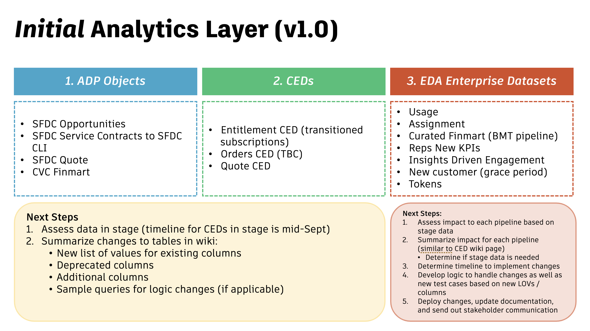

The children pages captured under this Wiki are EDA's assessment of the New Transaction Model's impact to data objects in ADP. Our assessment is based on our initial analytics layer, which is a mix of source tables, EDM-owned curated objects, and EDA-owned pre-release datasets.

<figure markdown>
  { width="900px" }
</figure>

## Impact assessment documentation

- [Cvc_Finmart (R2.1.2)](cvc-finmart-r2-1-2.md)
- [Opportunity and Opportunity_Line_Item (R2.1.2)](opportunity-and-opportunity-line-item-r2-1-2.md)
- [Quote and Quote Line Item (R2.1.2)](quote-and-quote-line-item-r2-1-2.md)
- [Service Contract and Contract Line Item (R2.1.2)](service-contract-and-contract-line-item-r2-1-2.md)