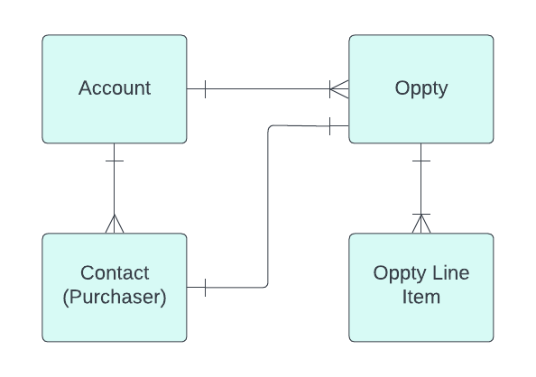

<div id="data-impact-assessment-template-info-main">
  <ul>
    <li><strong>Subject Matter Expert:</strong>
      <a target="_blank" href="https://aware.autodesk.com/michael.aubry">Mike Aubrey</a>
    </li>
    <li class="doc-status"><strong>Status:</strong> <span class="doc-ok">Published<span></li>
    <!-- <li><strong class="doc-status">Status:</strong> <span class="doc-wip">In Progress</span>.</li> -->
  </ul>
</div>

## :fontawesome-solid-magnifying-glass-chart: Introduction

This article provides a overview of the changes made to the Salesforce Opportunity table through Apollo's 2.1.2 release and how these changes impact the underlying business. The article is structured to provide the federated analytical community with a summary of the changes made to the table, and discuss possible uses and outline potential business impacts or tactical challenges for analysts introduced by these changes.

## :material-book-search: Background

Opportunities are potential selling events for new and renewal business. They represent the chance for the enterprise to sell a product or service to an existing or potential customer. Opportunities play an important role in sales pipeline management and prioritization. They are assigned stages to describe their progression from prospect to qualification to solution-building to proposal/negotiation, and finally to closing. The goal of a sales opportunity is to covert the opportunity into a sale, which helps the business grow and generate revenue.

The following conceptual data model is provided to describe Opportunities: 

<figure markdown>
  
</figure>

Shown above: One account can have many opportunities. One purchaser (stored in the data as a primary contact) is assigned per Opportunity. Opportunities can have many opportunity line items attached. Not shown: Opportunities can only link to one lead, one owner, one partner. Opportunities can link to more than one order which are at the opportunity line item level.  Opportunities can (and do) link to multiple other opportunities. They often link to multiple subscriptions, service contracts, contract line items, assets, and quotes. NxM simplifies many of the service contract and subscription elements. [The impact assessment for service contract and contract line item changes is here](https://wiki.autodesk.com/pages/viewpage.action?pageId=1878601085).

### Opportunities & Renewal Business (AIR/ROM Transition to 'Subscription Opportunities')

Pre-NxM (Pre [New Transaction Model](https://wiki.autodesk.com/display/BMP/New+Transaction+Model+Business+Policy+Workstream)) there are two types of renewals assignable to opportunities: AIR and ROM renewals. AIR (Autodesk Internal Renewals) opportunities are used mainly by the commercial customer success team as a pipeline management object and to track customer success advisor, renewal executive and customer success activities like human-to-human emails and phone calls. ROM (Renewal Opportunity Management) opportunities are used to manage the transactive elements of renewal conversions like auto-triggered emails and updates to salesforce as customers progress through renewal workflows. AIR Opportunities are assigned to customer success advisors and renewal executives. ROMs are not. Both can link to the same contract line item and they often offer similar yet different records of the same renewal event. (More detail about ROMs and AIRs [are available here](https://wiki.autodesk.com/display/CDA/AIR+Opportunity+vs.+ROM+Opportunity+Reconciliation).)

In Q3 FY24, AIR and ROM opportunities will transition to 'Subscription Opportunities' for any eligible NxM Single User Subscription (SUS) renewal based on the timeline dictated by their country of origin's [NxM GTM (go-to-market) country go-live date](https://wiki.autodesk.com/display/BMP/NxM+Eligible+Countries+and+Rollout+Timing). The first country to adopt this will be Australia in November, 2023. North America will follow with a target of May. EMEA in August. Then, Japan in the second half of the year. To align with Apollo and NxM (Next Generation Model) business requirements [Salesforce made changes](https://wiki.autodesk.com/display/DPED/SFDC+Data+Model+updates) to its [Opportunity model](https://wiki.autodesk.com/display/DBP/Opportunity+Data+Model+for+R2.1.2) to consolidate AIR and ROM renewals. A summary of these changes and their NXM business context are provided in the next section.

## :material-format-list-bulleted: Summary of changes

The following [business processes will be affected](https://wiki.autodesk.com/pages/viewpage.action?pageId=1646343177) for Agency/NxM supported countries (Australia in November):

Affected:

- **New 'Subscription Opportunities' will be based on the Offering Data Model (ODM)**
- **Renewal Opportunities (AIR & ROM) will transition on a rolling basis as they come up for renewal**
    - Renewal Opportunities (ROM) will no longer exist for Renewal processing (AUTO RENEW OFF scenarios).
    - Agents will use Subscription data and Subscription Opportunities to manage the renewal process.
    - Autodesk Sales teams will use Subscription Opportunities to manage the renewal process. In the event of multiple Subscription Opportunities, Sales will merge them before creating quotes.

Unaffected:

- **No changes are anticipated for the Deal Discount Approval (DDA) process**. Opportunities will continue to be used for DDA approvals.

A high level summary of additions to the Opportunity and Opportunity Line Item SFDC data tables are listed below:

- **Transition Paths:** Added AIR and ROM transition paths, including fields for opportunity splits and reseller changes.
- **Opportunity Status Additions:** Added opportunity status and auto-renewal flag.
- **Sales Context Additions:** New contextual shared notes column was added for Autodesk reps and partners to share notes.
- **Join Path Consolidation:** Streamlined and consolidated join paths to other data objects, including linkages to quotes, subscriptions, parent accounts, and orders.
- **Quote, Order and Subscription Data:** Columns were added to provide detail regarding attached quotes, orders, and subscriptions. These include payment terms, payment methods, and subscription status.

## :material-table-edit: Data structure updates

This section outlines NxM specific column additions to the Opportunity and Opportunity Item tables that are of specific relevance to the November release. Note this is not a comprehensive list. It is specifically new fields to take note of to discuss NxM. 

- Opportunity
- Opportunity Line Item

### Fields added

The following is an abridged data dictionary for the fields added to the opportunity and opportunity line item tables. SFDC fields labels and definitions were derived where possible from the [sfdc data dictionary](https://wiki.autodesk.com/x/yQwVKw). Where definitions were not available or incomplete, a "proposed business definition." was created. Their statuses were listed next to their definitions. Primary source notes were included as well. 

#### NxM Specific Opportunity fields added

??? info "NxM relevant Opportunity fields added to bsd_publish.sfdc_shared.opportunity:"

    Fields that are in *staging `bsd_publish_int.sfdc_shared.opportunity`*, but are not in *production `bsd_publish.sfdc_shared.opportunity*:

    | Index | SFDC field label | SFDC API name | Data type | Values | Proposed business definition <br> (Note these are not official definitions) | Acceptance status | Primary source description/notes |
    | --- | --- | --- | --- | --- | --- | --- | --- |
    | 1 | Opportunity key | OPPORTUNITY_KEY__C | varchar | `SUBSCRIPTION=5501888321=5501670233=4000566345=3-Year=2023=8` | Opportunity key for Subscription Opportunities.  Provides a summary of the equivalent csns for objects joined with by sfdc id. <br> 1. Renewal Type <br> 2. Account CSN on the Service Contract. (Derivable from accountid on the opportunity.) <br> 3. Reseller account csn on the contract line item. (Derivable from partner_account__c on the opportunity.) <br> 4. Purchaser on contract line item. (Derivable from primary_customer_id on the Opportunity.) <br> 5. Term (Annual or 3-Year) <br> 6. Close Date Year & Month | Proposed | Does not appear in [R2.1.2 list](https://wiki.autodesk.com/display/DBP/Opportunity+Data+Model+for+R2.1.2), but it is new in stage table. <br> Logic: <br> `ContractLineItem.ServiceContract.Account.Account_Csn__c + '-' + ContractLineItem.Reseller_Account__r.Account_Csn__c + '-' + ContractLineItem.Purchaser__r.Contact_Csn__c + '-' + ContractLineItem.Actual_End_Date__c` |
    | 2 | Shared Notes | SHARED_NOTES__C | varchar | `<p>9/12 CMU - LVM with John to discuss additional AECs or path to EBA?</p><p><br></p><p>9/7 CMU - John indicating a project is ramping up that may require more AECs in fall/winter...move to stage 3 </p><p><br></p><p>[Please start entering your Notes here between brackets]</p><p>Christopher Munson: </p><p>2023-07-18 14:57:47(GMT):</p><p>7/17 CMU Flex consumption continues. Move this to Dec where they can go with more FLEX or with New AECs. Plus review ABCPro usage for Revit and CVL applications....grow the 12/29 contract for ABCP to 100 user plus more AECs</p><p><br></p><p>3/7/23 CMU - Olsson purchased 22K in FLEX in Dec 2023 as part of their larger $500K purchase, this opportunity was held as place holder for future FLEX as they consume tokens through H1…moving out to June 2023</p>` | User input field that enables partner and internal sales representatives to collaborate using a common field | Proposed | Manual entry text field. Created as part of Partner collaboration hub. <br><br> Business Purpose : Partner and Internal Reps can collaborate using this field <br> Requestor : Amit Pundir(CSE) <br> Data Owner : Amit Pundir(CSE) <br> Date Last Verified(mm/dd/yy) : 09/19/2021 <br> Last Verified By : Amit Pundir(CSE) <br><br> [DPED:Salesforce Data Dictionary](https://wiki.autodesk.com/pages/createpage.action?spaceKey=EAX&title=Opportunity&linkCreation=true&fromPageId=1865537443) |

#### Opportunity Line Item fields added

??? info "NxM relevant Opportunity fields added to bsd_publish.sfdc_shared.opportunity:"

    Fields that are in *staging `bsd_publish_int.sfdc_shared.opportunitylineitem`*, but are not in *production `bsd_publish.sfdc_shared.opportunitylineitem`*:

    | Index | SFDC field label | SFDC API name | Data type | Values | Proposed business definition <br> (Note these are not official definitions) | Acceptance status | Primary source description/notes |
    | --- | --- | --- | --- | --- | --- | --- | --- |
    | 1 | Auto Renew Formula | AUTO_RENEW_FORMULA__C | varchar | ON, OFF |  |  |  |
    | 2 | Line Item Action | LINE_ITEM_ACTION__C | varchar | New, Extension, True-up, Switch, Renewal, Co-term | Indicates the action taken for the line item. <br> New = A product was added manually <br> Switch = Rep changed ("switched") the product. <br> True up = Indicates an outstanding balance to be "trued up." When the quantity is non-zero, a True up line item is added to the line item. <br> Extension = <br> Renewal = <br> Co-Term = | Incomplete | Picklist <br> [Line Item Action to License Type mapping](https://wiki.autodesk.com/display/DPED/Line+Item+Action+to+License+Type+mapping) <br> [Subscription Opportunity Merge](https://wiki.autodesk.com/display/DPED/Subscription+Opportunity+Merge) <br> [Opportunity Data Model for R2.1.2](https://wiki.autodesk.com/display/DBP/Opportunity+Data+Model+for+R2.1.2) |
    | 3 | Offering Data Model Transition Eligible | ODM_TRANSITION_ELIGIBLE__C | boolean | true, false | ODM_TRANSITION_ELIGIBLE' is a boolean column that indicates if the legacy SKU based product offerings linked to the sales opportunity have a matching new Offering Data Model (ODM) product. This is important context to know for which renewal opportunities will renew as new NxM Subscription Opportunities or which expired Opportunities would link to ODM Offerings if recreated.  <br> It indicates that the Cli associated with Oli is legacy Cli(BIC Indirect/ BIC direct) and will be transitioned on the next financial transaction. <br> Formula : <br> Contract_Line_Item__r.NTM_Eligible__c | Proposed | ODM = Offering Data Model. The transition refers to moving away from the considerably more complex legacy SKU (stock keeping unit) model  <br> DECISION 11/14/23 Include this field as an example, but make sure all examples link to the primary source in the CLI and endorse CLI source as best practice. |
    | 4 | Order Booking Date | ORDER_BOOKING_DATE__C | date (yyyy-MM-dd) | 2023-06-30, 2023-09-12 | Pelican order booking date of a Renewal order through GUAC MOE flow. <br> GUAC MOE = Great Ubiquitous All-encompassing Checkout Manual Order Entry | Proposed | Opportunity Data Model for [R2.1.2](https://wiki.autodesk.com/display/DBP/Opportunity+Data+Model+for+R2.1.2) <br> stamped with Pelican order booking date of Renewal order through GUAC MOE flow |
    | 5 | Order Number | ORDER_NUMBER__C | varchar | 1000210917, 1000208292 | ORDER_NUMBER__C <br> SBQQ__PARENTID__C, <br> SBQQ__QUOTELINE__C, <br> SBQQ__SUBSCRIPTIONTYPE__C | Proposed | [Opportunity Data Model for R2.1.2](https://wiki.autodesk.com/display/DBP/Opportunity+Data+Model+for+R2.1.2) |
    | 6 | Payment Method | PAYMENT_METHOD__C | varchar | ZIP, Cash, Net Banking, Direct Debit, Credit Card, PAYPAL, LOC | Payment method used to purchase the subscription.  | Proposed | ZIP is a 3rd party credit app; LOC = Line of Credit |
    | 7 | Pelican Subscription ID | PELICAN_SUBSCRIPTION_ID__C | varchar | <a href="/lightning/r/ContractLineItem/ 8113g000000NhJYAA0/view" target="_self">57657220146894</a> | Pelican Subscription ID is an html string that contains the Pelican Subscription record identifier and the contract line item id it links to. | Proposed | [Opportunity Data Model for R2.1.2](https://wiki.autodesk.com/display/DBP/Opportunity+Data+Model+for+R2.1.2) <br> Formula - HYPERLINK("/lightning/r/ContractLineItem/"+ CASESAFEID(Contract_Line_Item__c) +"/view", Contract_Line_Item__r.Pelican_Subscription_Id__c , "_self") <br> If you need Pelican Subscription Id, this is how you can get it. <br> OpportunityLineItem → Contract_Line_Item__c → Pelican_Subscription_Id__c  or <br> OpportunityLineItem → Reference_Subscription__c → Pelican_Subscription_Id__c <br><br> DECISION 11/14/23 Include this field as an example, but make sure all examples link to the primary source in the CLI and endorse CLI source as best practice. |
    | 8 | Promotion Discount Amount | PROMOTION_DISCOUNT_AMOUNT__C | double | 0, 12.8, 1841, 394500 | Discount amount off SRP.  Net 0 to Net 1 | Skipped | [O2P - Opportunity - Quote Price Mapping](https://wiki.autodesk.com/display/DBP/O2P+-+Opportunity+-+Quote+Price+Mapping) <br> Currency ([Source](https://wiki.autodesk.com/display/DBP/Opportunity+Fields#OpportunityFields-1585386746)) <br> [Subscription Opportunity Creation from BIC Indirect Cli#608814984](https://wiki.autodesk.com/display/DBP/Subscription+Opportunity+Creation+from+BIC+Indirect+Cli#SubscriptionOpportunityCreationfromBICIndirectCli-608814984) <br> populated by Price Population job by calling O2P GetContextualPrice Api. It can also be updated by manual price refresh button. <br> Unclear where stage data gets the original price amount, or the original currency. It appears to be out of sync with PROMOTION_DISCOUNT_PERCENT__C |
    | 9 | Promotion Discount Percent | PROMOTION_DISCOUNT_PERCENT__C | double | 0, 5, 15, 20 | Percent discount amount off SRP.  Net 0 to Net 1 | Skipped |  Percent ([Source](https://wiki.autodesk.com/display/DBP/Opportunity+Fields#OpportunityFields-1585386746)) <br> SEE <br> PROMOTION_DISCOUNT_AMOUNT__C |
    | 10 | Promotion Date | PROMOTIONENDDATE__C | date (yyyy-MM-dd) | 2023-07-18, 2023-08-15, 2023-09-01 | 	If there is a promotion on an offer, it has an end date. Transaction date should be before the end of this date. It is an attribute on the opportunity line item. | Skipped | |
    | 11 | Quantity To Reduce | QUANTITY_TO_REDUCE__C | double | 0, 1,4,6 | Derived from contractlineitem. The quantity of seats reduced from the original total seats on subscription. Joined from contractlineitem.quantity_to_reduce__c | Proposed | [DPED:Salesforce Data Dictionary](https://wiki.autodesk.com/x/rxYVKw) <br> Business Purpose : To store the quantity to be reduced from total seats of subscription <br> Requestor : Ayushi Srivastava (Salesforce Platform Engineering Team) <br> Data Owner : Shraddha Dubey (Salesforce Platform Engineering Team) <br> Date Last Verified(mm/dd/yy) : 14/12/2021 <br> Last Verified By : Ayushi Srivastava (Salesforce Platform Engineering Team) <br> DECISION 11/14/23 Include this field as an example, but make sure all examples link to the primary source in the CLI and endorse CLI source as best practice. |
    | 12 | Renewal Discount Amount | RENEWAL_DISCOUNT_AMOUNT__C | double | 0, 6.02, 10949.92, 173580 | Discount offered at time of renewal. (SEE QUOTE IMPACT WIKI) | Skipped | Currency ([Source](https://wiki.autodesk.com/display/DBP/Opportunity+Fields#OpportunityFields-1585386746)) <br> [Subscription Opportunity Creation from BIC Indirect Cli#608814984](https://wiki.autodesk.com/display/DBP/Subscription+Opportunity+Creation+from+BIC+Indirect+Cli#SubscriptionOpportunityCreationfromBICIndirectCli-608814984) <br> populated by Price Population job by calling O2P GetContextualPrice Api. It can also be updated by manual price refresh button. |
    | 13 | Renewal Discount Percent | RENEWAL_DISCOUNT_PERCENT__C | double | 0, 3.5, 10 |  | Skipped | Percent ([Source](https://wiki.autodesk.com/display/DBP/Opportunity+Fields#OpportunityFields-1585386746)) <br> [Subscription Opportunity Creation from BIC Indirect Cli#608814984](https://wiki.autodesk.com/display/DBP/Subscription+Opportunity+Creation+from+BIC+Indirect+Cli#SubscriptionOpportunityCreationfromBICIndirectCli-608814984) <br> populated by Price Population job by calling O2P GetContextualPrice Api. It can also be updated by manual price refresh button. |
    | 14 | Representative Email ID | REP_EMAIL_ID__C | varchar | abc@autodesk.com | Sales representative email address who initiated the Renewal order through GUAC MOE flow | Proposed | [Opportunity Data Model for R2.1.2](https://wiki.autodesk.com/display/DBP/Opportunity+Data+Model+for+R2.1.2) <br> stamped with Rep email id who initiated the Renewal order through GUAC MOE flow | 
    | 15 | SBQQ Quote Line Item ID | SBQQ__QUOTELINE__C | varchar | aL97g0000009DtZCAU, aL97g0000008wtKCAQ | Quote Line Item ID for the CPQ Quote associated with the Opportunity Line Item. <br> Quote Line Item ID = ID in the QUOTELINE__C table. <br> SBQQ = <br> CPQ = Configure Price Quote | Incomplete |  |
    | 16 | Service Duration Discount Amount | SERVICE_DURATION_DISCOUNT_AMOUNT__C | double | 0, 319.04, 141212.81 | (See quote price wiki) | Skipped | [O2P - Opportunity - Quote Price Mapping](https://wiki.autodesk.com/display/DBP/O2P+-+Opportunity+-+Quote+Price+Mapping) <br> [Apollo R2.1.1 and R2.1.2 O2P Discounts & Promotions Design](https://wiki.autodesk.com/pages/viewpage.action?pageId=1504251429) <br> Currency ([Source](https://wiki.autodesk.com/display/DBP/Opportunity+Fields#OpportunityFields-1585386746)) <br> [Subscription Opportunity Creation from BIC Indirect Cli#608814984](https://wiki.autodesk.com/display/DBP/Subscription+Opportunity+Creation+from+BIC+Indirect+Cli#SubscriptionOpportunityCreationfromBICIndirectCli-608814984) <br> populated by Price Population job by calling O2P GetContextualPrice Api. It can also be updated by manual price refresh button. |
    | 17 | Service Duration Discount Percent | SERVICE_DURATION_DISCOUNT_PERCENT__C | double | 0, 5.75, 10 |  | Skipped | Percent ([Source](https://wiki.autodesk.com/display/DBP/Opportunity+Fields#OpportunityFields-1585386746)) <br> [Subscription Opportunity Creation from BIC Indirect Cli#608814984](https://wiki.autodesk.com/display/DBP/Subscription+Opportunity+Creation+from+BIC+Indirect+Cli#SubscriptionOpportunityCreationfromBICIndirectCli-608814984) <br> populated by Price Population job by calling O2P GetContextualPrice Api. It can also be updated by manual price refresh button. |
    | 18 | Special Program Discount Amount | SPECIAL_PROGRAM_DISCOUNT_AMOUNT__C | double | -1363.72, 0, 375, 1260, 234750 |  |  | [O2P - Opportunity - Quote Price Mapping](https://wiki.autodesk.com/display/DBP/O2P+-+Opportunity+-+Quote+Price+Mapping) <br> [Apollo R2.1.1 and R2.1.2 O2P Discounts & Promotions Design](https://wiki.autodesk.com/pages/viewpage.action?pageId=1504251429) <br> Currency ([Source](https://wiki.autodesk.com/display/DBP/Opportunity+Fields#OpportunityFields-1585386746)) <br> [Subscription Opportunity Creation from BIC Indirect Cli#608814984](https://wiki.autodesk.com/display/DBP/Subscription+Opportunity+Creation+from+BIC+Indirect+Cli#SubscriptionOpportunityCreationfromBICIndirectCli-608814984) | populated by Price Population job by calling O2P GetContextualPrice Api. It can also be updated by manual price refresh button. |
    | 19 | Subscription Status | SUBSCRIPTION_STATUS__C | varchar | SUBSCRIPTION_STATUS__C, CANCELLED, SUSPENDED, PENDING, TERMINATED, ACTIVE, CANCELED, INACTIVE, EXPIRED, DELINQUENT | Pelican Status in contract line item <br><br> Subscription Status indicates the current state of the pelican subscription associated with the opportunity line item. This provides insight about our business relationship with the customer that could influence pipeline forecasting. <br> - 'Active': The subscription is currently in use and payments are up-to-date. Current date is earlier than the or equal to the pelican subscription id's expiration date. <br> - ‘Suspended’: The subscription is temporarily on hold, often due to payment issues. The current date is later than the pelican subscription id's suspension date. <br> - 'Pending': The subscription has been set up but not yet fully activated. <br> - 'Terminated': The subscription has been permanently stopped, typically due to non-payment or decision by the customer. The current date is later than the pelican subscription id's termination date. <br> - 'Cancelled': The subscription has been stopped before the end of the term, usually by the customer's request. <br> 'Expired': The subscription has reached its end date and has not been renewed. The current date is later than the pelican subscription id's expiration date. <br> 'Inactive': The subscription is not currently in use, but can be reactivated. <br> 'Delinquent': The subscription is active, but payments are overdue. | Proposed | DECISION 11/14/23 Include this field as an example, but make sure all examples link to the primary source in the CLI and endorse CLI source as best practice. <br> Picklist. [Opportunity Data Model for R2.1.2](https://wiki.autodesk.com/display/DBP/Opportunity+Data+Model+for+R2.1.2) | 
    | 20 | Suspension Date | SUSPENSION_DATE__C | date (yyyy-MM-dd) | 2012-09-25, 2015-03-01, 2026-09-29 | Last date customers can access software attached to the contract . Only seen for ODM subscriptions.  | Skipped | DECISION 11/14/23 Include this field as an example, but make sure all examples link to the primary source in the CLI and endorse CLI source as best practice. |
    | 21 | Switch From To Term | SWITCH_FROM_TO_TERM__C | varchar | 3-Year To Annual, 3-years, Annual To 3-Year, Annual To Monthly, Direct Debit, Monthly To Annual | Shows the Switch Term request From/To value from the related BIC Direct Contract Line Item. | Incomplete | [DPED:Salesforce Data Dictionary](https://wiki.autodesk.com/x/rxYVKw) <br> This shows the Switch Term request From/To value from related Bic Direct CLI. shown on the Opty product page <br> DECISION 11/14/23 Include this field as an example, but make sure all examples link to the primary source in the CLI and endorse CLI source as best practice. |
    | 22 | Switch Price Condition | SWITCH_PRICE_CONDITION__C | varchar |	M2S, M2SMU, M2SY2, M2SY4, MTC, MU, None, SU1, SU2, SU4, UP, false | M2S = Maintenance to Subscription <br> M2SME = Maintenance to Subscription Multi User <br> M2SY2 =  <br> M2SY4 = <br> MTC = <br> MU = Multi User <br> SU1 = <br> SU2 = <br> SU4 = <br> UP = <br> false = | Incomplete | [Switch Program LOVs](https://wiki.autodesk.com/display/DBP/Switch+Program+LOVs) <br> What do these acronyms mean?  Eric Batz might know.|
    | 23 | Switch Term Request Date | SWITCH_TERM_REQUEST_DATE__C | `timestamptz(yyyy-MM-dd HH:mm:ss fffffffff)` | 2023-06-21 04:39:00.000000000 +00:00 | This shows the Switch Term request date from related for ODM Subscriptions. Comes from CLI.  | Incomplete | [DPED:Salesforce Data Dictionary](https://wiki.autodesk.com/x/rxYVKw) <br> This shows the Switch Term request date from related BiC Direct CLI. shown on Opty product page <br> DECISION 11/14/23 Include this field as an example, but make sure all examples link to the primary source in the CLI and endorse CLI source as best practice. |
    | 24 | Transitioned AIR | TRANSITIONED_AIR__C | varchar | A-10007376, A-10513541, A-10924898, A-11321502 | For Subscription Opportunities  (ODM) this field contains the opportunity_number__c of Opportunities transitioned from AIR (Autodesk Internal Renewals) to the Offering Data Model. | Proposed | IF(Contract_Line_Item__r.RecordType.Name = 'Direct' , Contract_Line_Item__r.Autodesk_Opportunity__r.Opportunity_Number__c , Contract_Line_Item__r.Asset__r.Autodesk_Opportunity__r.Opportunity_Number__c ) <br> DECISION 11/14/23 Include this field as an example, but make sure all examples link to the primary source in the CLI and endorse CLI source as best practice. |
    | 25 | True Up | TRUE_UP__C | varchar | aJe7g00000007dFCAQ, aJe7g0000004On8CAE | Reference for True Up record in TRUE_UP__C for customers on premium subscription.  | Incomplete | [DPED:Salesforce Data Dictionary](https://wiki.autodesk.com/x/rxYVKw) <br> Business Purpose : Reference for True Up record for Premium OLI <br> Requestor : Chay Godla(Salesforce Platform Engineering Team) <br> Data Owner : Ela Juneja/Shraddha Dubey(Salesforce Platform Engineering Team) <br> Date Last Verified(mm/dd/yy) : 08/25/2021 <br> Last Verified By : Chay Godla(Salesforce Platform Engineering Team) |
    | 26 | Weighted Line ACV | WEIGHTED_LINE_ACV__C | double | 	66360, 1022260, 3504181 | The predicted ACV that will close based on the ACV associated with the line item multiplied by the probability the Opportunity will win.   It is the Line_Item_ACV__c multiplied by the Probability value in the Opportunity. | Proposed | [DPED:Salesforce Data Dictionary](https://wiki.autodesk.com/x/rxYVKw) <br> [https://wiki.autodesk.com/x/rxYVKw](https://wiki.autodesk.com/x/rxYVKw) <br> Opportunity.Probability * Line_Item_ACV__c <br> DECISION 11/14/23 Include this field as an example, but make sure all examples link to the primary source in the CLI and endorse CLI source as best practice. |

## :material-file-code: Sample queries

### General Use Code

The following are sql examples are provided to assist navigating opportunity data within salesforce.

??? abstract "Snowflake sql code is built to provide basic Opportunity information"

    The following snowflake sql code is built to provide basic Opportunity information. While far from comprehensive, it consists of columns and critical joins that will be a useful baseline for many use cases. (Note, it includes some, but not all of the new columns. More exhaustive column lists are provided in subsequent examples):

    ```sql
    SELECT DISTINCT
    -- Opportunity Details
          R.NAME                         AS RECORD_TYPE
        , OPP.ID                         AS OPPORTUNITY_ID
        , OPP.OPPORTUNITY_NUMBER__C      AS OPPORTUNITY_NUMBER
        , OPP.NAME                       AS OPPORTUNITY_NAME
        , OPP.TOTAL_LIST_PRICE_AMOUNT__C AS TOTAL_LIST_PRICE_AMOUNT
        , OPP.CURRENCYISOCODE            AS CURRENCY_ISO_CODE
        , OPP.TOTAL_SEAT_COUNT__C        AS TOTAL_SEAT_COUNT
        , OPP.STAGENAME                  AS STAGE
        , OPP.FORECAST_CATEGORY__C       AS FORECAST_CATEGORY
        , OPP.CREATEDDATE                AS CREATE_DATE
        , OPP.CLOSEDATE                  AS CLOSE_DATE
    -- End Customer Account Details
        , OPP.ACCOUNTID                  AS END_CUSTOMER_ACCOUNT_ID
        , OPP.END_CUSTOMER_CSN__C        AS END_CUSTOMER_ACCOUNT_CSN
        , A.NAME                         AS END_CUSTOMER_ACCOUNT_NAME
        , A.COUNTRY__C                   AS END_CUSTOMER_COUNTRY
    -- Primary Contact Details
        , OPP.PRIMARY_CONTACT__C         AS PRIMARY_CONTACT_ID
        , C.CONTACT_CSN__C               AS PRIMARY_CONTACT_CSN
        , C.EMAIL                        AS PRIMARY_CONTACT_EMAIL
        , C.EMAIL_DOMAIN                 AS PRIMARY_CONTACT_EMAIL_DOMAIN
    -- Owner Details
        , OPP.OWNERID                    AS OWNER_ID
        , U.NAME                         AS OWNER_NAME
        , U.TITLE                        AS OWNER_TITLE
        , U.MANAGER_FULL_NAME__C         AS OWNER_MANAGER_FULL_NAME
    -- Partner Details
        , OPP.PARTNER_ACCOUNT__C         AS PARTNER_ACCOUNT_ID
        , P.ACCOUNT_CSN__C               AS PARTNER_ACCOUNT_CSN
        , P.NAME                         AS PARTNER_ACCOUNT_NAME
        , P.COUNTRY__C                   AS PARTNER_ACCOUNT_COUNTRY
    -- Quote attached to Opportunity
        , Q.NAME                         AS QUOTE_NUMBER
        , Q.SBQQ__STATUS__C              AS QUOTE_STATUS
    -- Opportunity Line Item Details
        , OPL.ID                         AS OPPORTUNITY_LINE_ITEM_ID
        , OPL.LINE_LICENSE_TYPE__C       AS LINE_LICENSE_TYPE
        , OPL.RENEWAL_STATUS__C          AS RENEWAL_STATUS
        , OPL.TRANSITIONED_AIR__C        AS TRANSITIONED_AIR_OPPORTUNITY_NUMBER
        , NULLIF(REGEXP_SUBSTR(OPL.ROM_OPPTY_LINK__C, 'target="_blank">(.*?)</a>', 1, 1, 'e'),' ') AS ROM_OPPORTUNITY_NUMBER
    -- Contract Line Item Details
        , OPL.CONTRACT_LINE_ITEM__C      AS CONTRACT_LINE_ITEM_ID
        , CLI.PAYMENT_METHOD__C          AS PAYMENT_METHOD
            --, L.PAYMENT_METHOD__C       AS PAYMENT_METHOD -- DERIVED FROM CLI.PAYMENT_METHOD__C
        , CLI.NTM_ELIGIBLE__C            AS ODM_TRANSITION_ELIGIBLE
            --, L.ODM_TRANSITION_ELIGIBLE__C AS ODM_TRANSITION_ELIGIBLE -- DERIVED FROM CLI.NTM_ELIGIBLE__C
        , CLI.OFFERING_PROD_LINE__C      AS OFFERING_PRODUCT_LINE
        , CLI.ASSET_PRODUCT_LINE__C      AS ASSET_PRODUCT_LINE
        , CLI.SUBSCRIPTION_TYPE__C       AS SUBSCRIPTION_TYPE
        , CLI.PELICAN_SUBSCRIPTION_ID__C AS SUBSCRIPTION_ID
            --, REGEXP_SUBSTR(L.PELICAN_SUBSCRIPTION_ID__C,  '.*>([0-9]+)<.*', 1, 1, 'e') AS PELICAN_SUBSCRIPTION_ID -- DERIVED FROM CLI.PELICAN_SUBSCRIPTION_ID__C
    FROM BSD_PUBLISH.SFDC_SHARED.OPPORTUNITY OPP
    LEFT JOIN BSD_PUBLISH.SFDC_SHARED.OPPORTUNITYLINEITEM OPL ON OPL.OPPORTUNITY_NUMBER__C = OPP.OPPORTUNITY_NUMBER__C
    LEFT JOIN BSD_PUBLISH.SFDC_SHARED.RECORDTYPE R ON R.ID = OPP.RECORDTYPEID
    LEFT JOIN BSD_PUBLISH.SFDC_SHARED.CONTRACTLINEITEM CLI ON CLI.ID = OPL.CONTRACT_LINE_ITEM__C
    LEFT JOIN BSD_PUBLISH.SFDC_SHARED.SBQQ__QUOTE__C Q ON Q.OPPORTUNITY__C = OPP.OPPORTUNITY_NUMBER__C
    LEFT JOIN BSD_PUBLISH.SFDC_SHARED.ACCOUNT A ON A.ID = OPP.ACCOUNTID
    LEFT JOIN BSD_PUBLISH.SFDC_SHARED.ACCOUNT P ON P.ID = OPP.PARTNER_ACCOUNT__C
    LEFT JOIN BSD_PUBLISH.SFDC_SHARED.CONTACT C ON C.ID = OPP.PRIMARY_CONTACT__C
    LEFT JOIN BSD_PUBLISH.SFDC_SHARED.USER U ON U.ID = OPP.OWNERID
    WHERE
          1=1
    AND RECORD_TYPE = 'Subscription Opportunity'
    AND QUOTE_NUMBER IS NOT NULL
    AND CLI.SUBSCRIPTION_TYPE__C = 'ODM'
    AND OPP.END_CUSTOMER_COUNTRY__C = 'Australia'
    AND OPL.TRANSITIONED_AIR__C IS NOT NULL
    ORDER BY OPP.OPPORTUNITY_NUMBER__C, OPL.ID
    LIMIT 500
    ```

### Transition Paths - Added AIR and ROM transition paths, including fields for opportunity splits and reseller changes.

Any existing Autodesk Internal Renewal Opportunity eligible to become a 'Subscription Opportunity' will have both a new Subscription Opportunity and an old, legacy AIR Opportunity. The following code provides example of Opportunities converting from old AIRs to new Subscription Opportunities: 

??? abstract "Route AIR Renewal to New NxM Renewal 'Subscription Opportunity'"

    #### Example 1

    ```sql
    WITH OPPORTUNITY AS (
        SELECT DISTINCT
    -- Opportunity Details
                        R.NAME                         AS RECORD_TYPE
                      , OPP.OPPORTUNITY_NUMBER__C      AS OPPORTUNITY_NUMBER
                      , OPP.NAME                       AS OPPORTUNITY_NAME
                      , OPP.TOTAL_LIST_PRICE_AMOUNT__C AS TOTAL_LIST_PRICE_AMOUNT
                      , OPP.CURRENCYISOCODE            AS CURRENCY_ISO_CODE
                      , OPP.TOTAL_SEAT_COUNT__C        AS TOTAL_SEAT_COUNT
                      , OPP.STAGENAME                  AS STAGE     
                      , OPP.CREATEDDATE                AS CREATE_DATE         
                      , OPP.CLOSEDATE                  AS CLOSE_DATE 
    -- Opportunity Line Item Details
                      , OPL.ID                         AS OPPORTUNITY_LINE_ITEM_ID
                      , OPL.LINE_LICENSE_TYPE__C       AS LINE_LICENSE_TYPE
                      , OPL.RENEWAL_STATUS__C          AS RENEWAL_STATUS
                      , OPL.TRANSITIONED_AIR__C        AS TRANSITIONED_AIR_OPPORTUNITY_NUMBER
    -- Contract Line Item Details
                      , OPL.CONTRACT_LINE_ITEM__C      AS CONTRACT_LINE_ITEM_ID
                      , CLI.NTM_ELIGIBLE__C            AS ODM_TRANSITION_ELIGIBLE
                      , CLI.OFFERING_PROD_LINE__C      AS OFFERING_PRODUCT_LINE
                      , CLI.ASSET_PRODUCT_LINE__C      AS ASSET_PRODUCT_LINE
        FROM BSD_PUBLISH_INT.SFDC_SHARED.OPPORTUNITY OPP
                LEFT JOIN BSD_PUBLISH.SFDC_SHARED.OPPORTUNITYLINEITEM OPL
                          ON OPL.OPPORTUNITY_NUMBER__C = OPP.OPPORTUNITY_NUMBER__C
                LEFT JOIN BSD_PUBLISH.SFDC_SHARED.RECORDTYPE R ON R.ID = OPP.RECORDTYPEID
                LEFT JOIN BSD_PUBLISH.SFDC_SHARED.CONTRACTLINEITEM CLI ON CLI.ID = OPL.CONTRACT_LINE_ITEM__C
    )
    SELECT DISTINCT
    _TO.*
    , _FROM.*
    FROM OPPORTUNITY AS _TO
    LEFT JOIN OPPORTUNITY AS _FROM ON _FROM.OPPORTUNITY_NUMBER = _TO.TRANSITIONED_AIR_OPPORTUNITY_NUMBER
    WHERE _TO.TRANSITIONED_AIR_OPPORTUNITY_NUMBER IS NOT NULL
    ORDER BY _TO.OPPORTUNITY_NUMBER,_TO.OPPORTUNITY_LINE_ITEM_ID
    LIMIT 500
    ;
    ```

??? abstract "Route ROM Renewal to new NxM Renewal 'Subscription Opportunity'"
    #### Example 2

    Any existing Autodesk ROM (Internal Renewal Opportunity Management) Opportunities eligible to become a 'Subscription Opportunity' will have both a new Subscription Opportunity and an old, legacy ROM Opportunity. The following code provides example of Opportunities converting from old ROMs to new Subscription Opportunities: 

    ``` sql
    WITH OPPORTUNITY AS (
        SELECT DISTINCT
    -- Opportunity Details
                        R.NAME                         AS RECORD_TYPE
                      , OPP.ID                         AS OPPORTUNITY_ID
                      , OPP.OPPORTUNITY_NUMBER__C      AS OPPORTUNITY_NUMBER
                      , OPP.NAME                       AS OPPORTUNITY_NAME
                      , OPP.TOTAL_LIST_PRICE_AMOUNT__C AS TOTAL_LIST_PRICE_AMOUNT
                      , OPP.CURRENCYISOCODE            AS CURRENCY_ISO_CODE
                      , OPP.TOTAL_SEAT_COUNT__C        AS TOTAL_SEAT_COUNT
                      , OPP.STAGENAME                  AS STAGE
                      , OPP.CREATEDDATE                AS CREATE_DATE                  
                      , OPP.CLOSEDATE                  AS CLOSE_DATE
    -- Opportunity Line Item Details
                      , OPL.ID                         AS OPPORTUNITY_LINE_ITEM_ID
                      , OPL.LINE_LICENSE_TYPE__C       AS LINE_LICENSE_TYPE
                      , OPL.RENEWAL_STATUS__C          AS RENEWAL_STATUS
        , NULLIF(REGEXP_SUBSTR(OPL.ROM_OPPTY_LINK__C, 'target="_blank">(.*?)</a>', 1, 1, 'e'),' ') AS ROM_OPPORTUNITY_NUMBER
    -- Contract Line Item Details
                      , OPL.CONTRACT_LINE_ITEM__C      AS CONTRACT_LINE_ITEM_ID
                      , CLI.NTM_ELIGIBLE__C            AS ODM_TRANSITION_ELIGIBLE
                      , CLI.OFFERING_PROD_LINE__C      AS OFFERING_PRODUCT_LINE
                      , CLI.ASSET_PRODUCT_LINE__C      AS ASSET_PRODUCT_LINE
        FROM BSD_PUBLISH.SFDC_SHARED.OPPORTUNITY OPP
                LEFT JOIN BSD_PUBLISH.SFDC_SHARED.OPPORTUNITYLINEITEM OPL
                          ON OPL.OPPORTUNITY_NUMBER__C = OPP.OPPORTUNITY_NUMBER__C
                LEFT JOIN BSD_PUBLISH.SFDC_SHARED.RECORDTYPE R ON R.ID = OPP.RECORDTYPEID
                LEFT JOIN BSD_PUBLISH.SFDC_SHARED.CONTRACTLINEITEM CLI ON CLI.ID = OPL.CONTRACT_LINE_ITEM__C
    )
    SELECT DISTINCT
    _TO.*
    , _FROM.*
    FROM OPPORTUNITY AS _TO
    LEFT JOIN OPPORTUNITY AS _FROM ON _FROM.OPPORTUNITY_NUMBER = _TO.ROM_OPPORTUNITY_NUMBER
    WHERE _TO.ROM_OPPORTUNITY_NUMBER IS NOT NULL AND _TO.ROM_OPPORTUNITY_NUMBER <> _TO.OPPORTUNITY_NUMBER
    ORDER BY _TO.OPPORTUNITY_NUMBER,_TO.OPPORTUNITY_LINE_ITEM_ID
    LIMIT 500
    ;
    ```

??? abstract "Opportunity Split Example"
    #### Example 3

    Renewal Opportunities can be split into multiple opportunities. The following logic shows which opportunities were previously one opportunity and have split: 

    ```sql
    WITH OPPORTUNITY AS (
        SELECT DISTINCT
    -- Opportunity Details
                        R.NAME                         AS RECORD_TYPE
                      , OPP.ID                         AS OPPORTUNITY_ID
                      , OPP.OPPORTUNITY_NUMBER__C      AS OPPORTUNITY_NUMBER
                      , OPP.NAME                       AS OPPORTUNITY_NAME
                      , OPP.TOTAL_LIST_PRICE_AMOUNT__C AS TOTAL_LIST_PRICE_AMOUNT
                      , OPP.CURRENCYISOCODE            AS CURRENCY_ISO_CODE
                      , OPP.TOTAL_SEAT_COUNT__C        AS TOTAL_SEAT_COUNT
                      , OPP.STAGENAME                  AS STAGE
                      , OPP.CREATEDDATE                AS CREATE_DATE
                      , OPP.CLOSEDATE                  AS CLOSE_DATE
    -- Opportunity Line Item Details
                      , OPL.ID                         AS OPPORTUNITY_LINE_ITEM_ID
                      , OPL.LINE_LICENSE_TYPE__C       AS LINE_LICENSE_TYPE
                      , OPL.RENEWAL_STATUS__C          AS RENEWAL_STATUS
                      , OPL.SPLIT_QUANTITIES__C

    -- Contract Line Item Details
                      , OPL.CONTRACT_LINE_ITEM__C      AS CONTRACT_LINE_ITEM_ID
                      , CLI.NTM_ELIGIBLE__C            AS ODM_TRANSITION_ELIGIBLE
                      , CLI.OFFERING_PROD_LINE__C      AS OFFERING_PRODUCT_LINE
                      , CLI.ASSET_PRODUCT_LINE__C      AS ASSET_PRODUCT_LINE
                      , CLI.SPLIT_OPPORTUNITY__C       AS SPLIT_OPPORTUNITY
        FROM BSD_PUBLISH.SFDC_SHARED.OPPORTUNITY OPP
                LEFT JOIN BSD_PUBLISH.SFDC_SHARED.OPPORTUNITYLINEITEM OPL
                          ON OPL.OPPORTUNITY_NUMBER__C = OPP.OPPORTUNITY_NUMBER__C
                LEFT JOIN BSD_PUBLISH.SFDC_SHARED.RECORDTYPE R ON R.ID = OPP.RECORDTYPEID
                LEFT JOIN BSD_PUBLISH.SFDC_SHARED.CONTRACTLINEITEM CLI ON CLI.ID = OPL.CONTRACT_LINE_ITEM__C
    )
    SELECT DISTINCT
    _SPLIT_TO.*
    , _SPLIT_FROM.*
    FROM OPPORTUNITY AS _SPLIT_TO
    LEFT JOIN OPPORTUNITY AS _SPLIT_FROM ON _SPLIT_FROM.SPLIT_OPPORTUNITY = _SPLIT_TO.OPPORTUNITY_ID
    WHERE _SPLIT_TO.SPLIT_OPPORTUNITY IS NOT NULL
    ORDER BY _SPLIT_TO.OPPORTUNITY_NUMBER,_SPLIT_TO.OPPORTUNITY_LINE_ITEM_ID
    LIMIT 500
    ;
    ```

??? abstract "Opportunity Switch Examples"
    #### Example 4

    Renewal Opportunities can switch into different renewal conditions. The following logic shows which opportunities were previously one opportunity and switched to another: 

    ```sql

    SELECT DISTINCT
    -- Opportunity Details
          R.NAME                               AS RECORD_TYPE
        , OPP.ID                               AS OPPORTUNITY_ID
        , OPP.OPPORTUNITY_NUMBER__C            AS OPPORTUNITY_NUMBER
        , OPP.NAME                             AS OPPORTUNITY_NAME
        , OPP.TOTAL_LIST_PRICE_AMOUNT__C       AS TOTAL_LIST_PRICE_AMOUNT
        , OPP.CURRENCYISOCODE                  AS CURRENCY_ISO_CODE
        , OPP.TOTAL_SEAT_COUNT__C              AS TOTAL_SEAT_COUNT
        , OPP.STAGENAME                        AS STAGE
        , OPP.FORECAST_CATEGORY__C             AS FORECAST_CATEGORY
        , OPP.CREATEDATE                       AS CREATE_DATE
        , OPP.CLOSEDATE                        AS CLOSE_DATE
    -- Opportunity Line Item Details
        , OPL.ID                               AS OPPORTUNITY_LINE_ITEM_ID
        , OPL.LINE_LICENSE_TYPE__C             AS LINE_LICENSE_TYPE
        , OPL.RENEWAL_STATUS__C                AS RENEWAL_STATUS
    
    -- Contract Line Item Details
        , OPL.CONTRACT_LINE_ITEM__C            AS CONTRACT_LINE_ITEM_ID
        , CLI.SWITCH_CONTRACT_TERM__C          AS SWITCH_CONTRACT_TERM
        , CLI.SWITCH_FROM_TO_TERM__C           AS SWITCH_FROM_TO_TERM
                --, OPL.SWITCH_FROM_TO_TERM__C
        , CLI.SWITCH_TERM_REQUEST_DATE__C      AS SWITCH_TERM_REQUEST_DATE
                --, OPL.SWITCH_TERM_REQUEST_DATE__C
        , CLI.SWITCH_PRICE_CONDITION__C        AS SWITCH_PRICE_CONDITION
                --, OPL.SWITCH_PRICE_CONDITION__C
        , CLI.SWITCH_BILLING_TERM__C           AS SWITCH_BILLING_TERM
        , CLI.SWITCH_FROM_SUBSCRIPTION__C      AS SWITCH_FROM_SUBSCRIPTION -- Contract Line Item ID
        , CLI.ASSET_SWITCH_TYPE__C             AS ASSET_SWITCH_TYPE
                  --, OPL.ASSET_SWITCH_TYPE__C
        , CLI.ASSET_SWITCH_TYPE_CODE__C        AS ASSET_SWITCH_TYPE_CODE
        , CLI.ASSET_PRODUCT_LINE__C            AS ASSET_PRODUCT_LINE
        , CLI.PAYMENT_METHOD__C                AS PAYMENT_METHOD
            --, OPL.PAYMENT_METHOD__C
        , CLI.OFFERING_PROD_LINE__C            AS OFFERING_PRODUCT_LINE
    
        , CLI.SUBSCRIPTION_TYPE__C             AS SUBSCRIPTION_TYPE
        , CLI.PELICAN_SUBSCRIPTION_ID__C       AS PELICAN_SUBSCRIPTION_ID
            --, REGEXP_SUBSTR(OPL.PELICAN_SUBSCRIPTION_ID__C,  '.*>([0-9]+)<.*', 1, 1, 'e')
    FROM BSD_PUBLISH.SFDC_SHARED.OPPORTUNITY OPP
    LEFT JOIN BSD_PUBLISH.SFDC_SHARED.OPPORTUNITYLINEITEM OPL ON OPL.OPPORTUNITY_NUMBER__C = OPP.OPPORTUNITY_NUMBER__C
    LEFT JOIN BSD_PUBLISH.SFDC_SHARED.RECORDTYPE R ON R.ID = OPP.RECORDTYPEID
    LEFT JOIN BSD_PUBLISH.SFDC_SHARED.CONTRACTLINEITEM CLI ON CLI.ID = OPL.CONTRACT_LINE_ITEM__C
    WHERE 1=1
    AND CLI.SWITCH_FROM_TO_TERM__C IS NOT NULL -- Ex: Annual to 3-Year
    --AND CLI.SWITCH_PRICE_CONDITION__C IS NOT NULL -- EX: M2S, SU4, SU1
    --AND CLI.SWITCH_BILLING_TERM__C IS NOT NULL -- EX: A02, A06
    --AND CLI.SWITCH_FROM_SUBSCRIPTION__C IS NOT NULL -- EX: = '8117g000000d3EkAAI'
    --AND CLI.ASSET_SWITCH_TYPE__C IS NOT NULL-- EX: 'Switch at Renewal', 'Maint to Subs'
    ORDER BY OPP.OPPORTUNITY_NUMBER__C, OPL.ID
    LIMIT 500
    ;
    ```

**Opportunity Context Additions** - Many new fields were added to provide more context around the opportunity. These include next actions details, lifecycle and health status details, line item actions (new, extension, true-up, renewal, etc), compliance lock status, auto-renewal flag, and customer meeting scheduled flag. Further context is also added from fields sourced by the order and quote objects. The following example provides these fields along with several more to provide added context for most Opportunities.

??? abstract "Opportunity examples with opportunity context fields"
    #### Example 5

    ```sql
    SELECT DISTINCT
    -- Opportunity Details
          R.NAME                         AS RECORD_TYPE
        , OPP.ID                         AS OPPORTUNITY_ID
        , OPP.OPPORTUNITY_NUMBER__C      AS OPPORTUNITY_NUMBER
        , OPP.NAME                       AS OPPORTUNITY_NAME
        , OPP.TOTAL_LIST_PRICE_AMOUNT__C AS TOTAL_LIST_PRICE_AMOUNT
        , OPP.CURRENCYISOCODE            AS CURRENCY_ISO_CODE
        , OPP.TOTAL_SEAT_COUNT__C        AS TOTAL_SEAT_COUNT
        , QLI.TERM__C                    AS TERM_CHECK
        , OPP.TERM__C                    AS TERM
        , OPP.STAGENAME                  AS STAGE
        , OPP.FORECAST_CATEGORY__C       AS FORECAST_CATEGORY
        , OPP.PROBABILITY                AS PROBABILITY
        , OPP.CREATEDDATE                AS CREATE_DATE
        , OPP.CLOSEDATE                  AS CLOSE_DATE
        , OPP.EXPIRATION_DATE__C         AS EXPIRATION_DATE
    -- Opportunity Detail Fields
        , OPP.OPPORTUNITY_KEY__C
        , OPPORTUNITY_KEY__C             AS OPPORTUNITY_KEY
            /*
                , CONCAT(UPPER(OPP.RENEWAL_TYPE__C)
                , '=', A.ACCOUNT_CSN__C
                , '=', PR.ACCOUNT_CSN__C
                , '=', C.CONTACT_CSN__C
                , '=', OPP.TERM__C
                , '=',YEAR(OPP.CLOSEDATE::DATE)
                , '=',MONTH(OPP.CLOSEDATE::DATE)
                ) AS OPPORTUNITY_KEY_DERIVED
              */
        , OPP.SHARED_NOTES__C                  AS SHARED_NOTES
        , OPP.PACT_COMPLETENESS__C             AS PACT_COMPLETENESS
        , OPP.CHALLENGES__C                    AS CHALLENGES
        , OPP.AUTHORITY__C                     AS AUTHORITY
        , OPP.MONEY__C                         AS MONEY
        , OPP.MEETING_SCHEDULED__C             AS MEETING_SCHEDULED
        , OPP.LIFE_CYCLE_HEALTH_FIELD__C       AS LIFECYLE_HEALTH
        , OPP.LIFE_CYCLE_HEALTH_REASON__C      AS LIFECYCLE_HEALTH_REASON
        , OPP.LIFE_CYCLE_HEALTH_UPDATE_DATE__C AS LIFECYCLE_HEALTH_UPDATE
        , OPP.PARTNER_RISK_INDICATOR__C        AS PARTNER_RISK_INDICATOR
        , OPP.LICENSE_COMPLIANT__C             AS LICENSE_COMPLIANT
    -- Opportunity Account Details
    
        , OPP.ACCOUNTID                    AS END_CUSTOMER_ACCOUNT_ID
        , OPP.END_CUSTOMER_CSN__C          AS END_CUSTOMER_ACCOUNT_CSN
        , A.NAME                           AS END_CUSTOMER_ACCOUNT_NAME
        , A.COUNTRY__C                     AS END_CUSTOMER_COUNTRY
        --, OPP.COUNTRY__C
        , A.PARENTID                       AS END_CUSTOMER_PARENT_ACCOUNT_ID
    -- Opportunity Contact Details
        , OPP.PRIMARY_CONTACT__C           AS PRIMARY_CONTACT_ID
        , C.CONTACT_CSN__C                 AS PRIMARY_CONTACT_CSN
        , C.EMAIL                          AS PRIMARY_CONTACT_EMAIL
        , C.EMAIL_DOMAIN                   AS PRIMARY_CONTACT_EMAIL_DOMAIN
    -- Opportunity Owner Details
        , OPP.OWNERID                      AS OWNER_ID
        , U.NAME                           AS OWNER_NAME
        , U.TITLE                          AS OWNER_TITLE
        , U.MANAGER_FULL_NAME__C           AS OWNER_MANAGER_FULL_NAME
    -- Partner Details
        , OPP.PARTNER_ACCOUNT__C           AS PARTNER_ACCOUNT_ID
        , PR.ACCOUNT_CSN__C                AS PARTNER_ACCOUNT_CSN
        , PR.NAME                          AS PARTNER_ACCOUNT_NAME
        , PR.COUNTRY__C                    AS PARTNER_ACCOUNT_COUNTRY
    -- Quote attached to Opportunity
        , Q.NAME                           AS QUOTE_NUMBER
        , Q.SBQQ__STATUS__C                AS QUOTE_STATUS
        , Q.CREATEDDATE                    AS QUOTE_CREATE_DATE
        , Q.SBQQ__ENDDATE__C               AS QUOTE_END_DATE
        , Q.SBQQ__SOURCE__C                AS QUOTE_SOURCE
    -- Opportunity Line Item Details
        , OPL.ID                           AS OPPORTUNITY_LINE_ITEM_ID
        , OPL.LINE_LICENSE_TYPE__C         AS LINE_LICENSE_TYPE
        , OPL.LINE_ITEM_ACTION__C
        , OPL.RENEWAL_STATUS__C            AS RENEWAL_STATUS
        , OPL.TRANSITIONED_AIR__C          AS TRANSITIONED_AIR_OPPORTUNITY_NUMBER
        , NULLIF(REGEXP_SUBSTR(OPL.ROM_OPPTY_LINK__C, 'target="_blank">(.*?)</a>', 1, 1, 'e'),' ') AS ROM_OPPORTUNITY_NUMBER
        , OPL.AUTO_RENEW_FLAG__C           AS AUTO_RENEW_FLAG
        , OPL.COM_AUTO_PILLAR_1__C         AS COMMERCE_AUTOMATION_PILLAR_1
        , OPL.FLEX_PACK_SIZE__C            AS FLEX_PACK_SIZE
        , OPL.QUANTITY                     AS QUANTITY
        , OPL.FLEX_TOKENS__C               AS FLEX_TOKENS
        , OPL.ORDER_NUMBER__C              AS ORDER_NUMBER
        , OPL.ORDER_BOOKING_DATE__C        AS ORDER_BOOKING_DATE
        , OPL.ORIGINAL_QUANTITY__C         AS ORGINAL_QUANTITY
        , OPL.TRUE_UP__C                   AS TRUE_UP
        , OPL.LINE_ITEM_ACV__C             AS LINE_ITEM_ACV
        , OPL.WEIGHTED_LINE_ACV__C         AS WEIGHTED_LINE_ACV
    -- QUOTE Line Item Details
        , QLI.ID                           AS QUOTE_LINE_ITEM_ID
        , QLI.SBQQ__REGULARPRICE__C        AS REGULAR_PRICE
        , QLI.SBQQ__TOTALDISCOUNTAMOUNT__C AS DISCOUNT_AMMOUNT
        , QLI.VOLUMEDISCOUNTAMOUNT__C      AS VOLUME_DISCOUNT_AMMOUNT
        , QLI.PROMOTIONDISCOUNTAMOUNT__C   AS PROMOTION_DISCOUNT_AMMOUNT
    -- Contract Line Item Details
        , OPL.CONTRACT_LINE_ITEM__C        AS CONTRACT_LINE_ITEM_ID
        , CLI.PAYMENT_METHOD__C            AS PAYMENT_METHOD
            --, L.PAYMENT_METHOD__C         AS PAYMENT_METHOD -- DERIVED FROM CLI.PAYMENT_METHOD__C
        , CLI.NTM_ELIGIBLE__C              AS ODM_TRANSITION_ELIGIBLE
            --, L.ODM_TRANSITION_ELIGIBLE__C AS ODM_TRANSITION_ELIGIBLE -- DERIVED FROM CLI.NTM_ELIGIBLE__C
        , CLI.OFFERING_PROD_LINE__C        AS OFFERING_PRODUCT_LINE
        , CLI.ASSET_PRODUCT_LINE__C        AS ASSET_PRODUCT_LINE
        , CLI.SUBSCRIPTION_TYPE__C         AS SUBSCRIPTION_TYPE
        , CLI.PELICAN_SUBSCRIPTION_ID__C   AS SUBSCRIPTION_ID
            --, REGEXP_SUBSTR(L.PELICAN_SUBSCRIPTION_ID__C,  '.*>([0-9]+)<.*', 1, 1, 'e') AS PELICAN_SUBSCRIPTION_ID -- DERIVED FROM CLI.PELICAN_SUBSCRIPTION_ID__C
    FROM BSD_PUBLISH.SFDC_SHARED.OPPORTUNITY OPP
    LEFT JOIN BSD_PUBLISH.SFDC_SHARED.OPPORTUNITYLINEITEM OPL ON OPL.OPPORTUNITY_NUMBER__C = OPP.OPPORTUNITY_NUMBER__C
    LEFT JOIN BSD_PUBLISH.SFDC_SHARED.RECORDTYPE R ON R.ID = OPP.RECORDTYPEID
    LEFT JOIN BSD_PUBLISH.SFDC_SHARED.CONTRACTLINEITEM CLI ON CLI.ID = OPL.CONTRACT_LINE_ITEM__C
    LEFT JOIN BSD_PUBLISH.SFDC_SHARED.SBQQ__QUOTE__C Q ON Q.OPPORTUNITY__C = OPP.OPPORTUNITY_NUMBER__C
    LEFT JOIN BSD_PUBLISH.SFDC_SHARED.SBQQ__QUOTELINE__C QLI ON QLI.OPPORTUNITY_LINE_ITEM__C = OPL.ID
    LEFT JOIN BSD_PUBLISH.SFDC_SHARED.ACCOUNT A ON A.ID = OPP.ACCOUNTID
    LEFT JOIN BSD_PUBLISH.SFDC_SHARED.ACCOUNT PR ON PR.ID = OPP.PARTNER_ACCOUNT__C
    LEFT JOIN BSD_PUBLISH.SFDC_SHARED.CONTACT C ON C.ID = OPP.PRIMARY_CONTACT__C
    LEFT JOIN BSD_PUBLISH.SFDC_SHARED.USER U ON U.ID = OPP.OWNERID
    WHERE
          1=1
    AND OPP.PACT_COMPLETENESS__C > 1
    --AND OPP.LICENSE_COMPLIANT__C IS NOT NULL
    --AND OPL.AUTO_RENEW_FLAG__C IS NOT NULL
    --AND OPL.COM_AUTO_PILLAR_1__C IS NOT NULL
    --AND OPL.FLEX_TOKENS__C IS NOT NULL
    --AND QLI.PROMOTIONDISCOUNTAMOUNT__C  IS NOT NULL
    ORDER BY OPP.OPPORTUNITY_NUMBER__C, OPL.ID
    LIMIT 500
    ```

## :material-text: Impact Assessment

### Productivity Impact

Changes to the Opportunity data model are anticipated to have the following impact on the analytical community within the next year: 

1. Disruption of Existing Processes: By definition, the addition of new columns will disrupt existing processes and workflows. All existing reports and dashboards that use Opportunities will be affected. Those concerned with renewal business lineage either through AIR or ROM opportunities should plan to re-architect to adopt these new join paths.
2. Additional Data Traversal Steps: With the addition of a new opportunity renewal type, there will be additional steps required to traverse the data. This could lead to increased processing time and slower analysis. It could also lead to a higher risk of errors and omissions.
3. Increased Training Requirements: With the addition of a new opportunity type, the learning curve to use the data within these tables has not been alleviated; it has expanded. Until ROM, and AIR opportunities are entirely deprecated users should assume increased time will be required to traverse the new paths provided by NxM and accommodate the old ones for countries not yet transitioned. With well over 600 columns across both tables, users unfamiliar with existing columns will require mentorship or investment in subject domain documentation - which we do not have today.

### Data Impact

#### Australia November 2023 Go-Live 

Australia will require specific monitoring prior to and after go-live. As the first country adopting NxM for single user subscription it would be prudent to proactively know the volume likely AIR and ROM renewals that will convert and monitor their progress to observe their conversion looking for patterns or differences in behavior vs prior activity.  

## :material-text-short: Conclusion

In Q3 FY24, AIR and ROM opportunities will transition into NxM SUS Subscriptions based on the timeline dictated by their NxM GTM (go-to-market) country go-live date. Salesforce has made changes to its Opportunity model to consolidate these overlapping concepts, to align with Apollo and NxM (Next Generation Model) business requirements. Critical join fields were added to connect NxM Subscription opportunities to their order, go-to-market hierarchy, quote line item, subscription, split opportunities, and transitioned opportunities. Select data was added as well for both subscription single user and Flex opportunities that include tokens, discount amounts, payment methods and sales representative notes. The addition of these new columns will disrupt existing processes and workflows. All existing reports and dashboards that use Opportunities will be affected. Those concerned with renewal business lineage either through AIR or ROM opportunities should plan to re-architect to adopt these new join paths. This could lead to increased processing time and slower analysis. It could also lead to a higher risk of errors and omissions. Until ROM, and AIR opportunities are entirely deprecated users should assume increased time will be required to traverse the new paths provided by NxM and accommodate the old ones for countries not yet transitioned. With well over 600 columns across both tables, users unfamiliar with existing columns will require mentorship or investment in subject domain documentation to enable successful adoption and application.

## :material-link: References

Cited in Article:

1. [NxM](https://wiki.autodesk.com/display/BMP/New+Transaction+Model+Business+Policy+Workstream)
2. [AIR Opportunity vs. ROM Opportunity Reconciliation](https://wiki.autodesk.com/display/CDA/AIR+Opportunity+vs.+ROM+Opportunity+Reconciliation)
3. [NxM Eligible Countries and Rollout Timing](https://wiki.autodesk.com/display/BMP/NxM+Eligible+Countries+and+Rollout+Timing)
4. [Apollo R2.1 - Architecture/Design](https://wiki.autodesk.com/pages/viewpage.action?pageId=1646343177)
5. [SFDC Data Model updates](https://wiki.autodesk.com/display/DPED/SFDC+Data+Model+updates)
6. [Opportunity Data Model for R2.1.2](https://wiki.autodesk.com/display/DBP/Opportunity+Data+Model+for+R2.1.2)
7. [sfdc data dictionary](https://wiki.autodesk.com/x/yQwVKw)

Others:

- [Opportunity Management#1CreateanOpportunity](https://wiki.autodesk.com/display/WSPP/Opportunity+Management#OpportunityManagement-1CreateanOpportunity)
- [Sales Opportunity - Migration during R2.1.2 Launch](https://wiki.autodesk.com/display/DPED/Sales+Opportunity+-+Migration+during+R2.1.2+Launch)
- [EDH Opportunity Dataset Details#DataModel](https://wiki.autodesk.com/display/ESAE/EDH+Opportunity+Dataset+Details#EDHOpportunityDatasetDetails-DataModel)
- [Apollo R2.1.2 Impact Assessment (CED) - Enterprise Data Management (EDM) - Autodesk Confluence Wiki](https://wiki.autodesk.com/pages/viewpage.action?pageId=1737210596)
- [Opportunities and Actions](https://wiki.autodesk.com/pages/viewpage.action?pageId=1470801361) Enterprise Dataset Documentation
- [DPED:PJSFDCKOA-558 - Oppty Tech debt](https://wiki.autodesk.com/x/cKmJZQ)
- [DPED:Salesforce Data Dictionary](https://wiki.autodesk.com/x/yQwVKw)