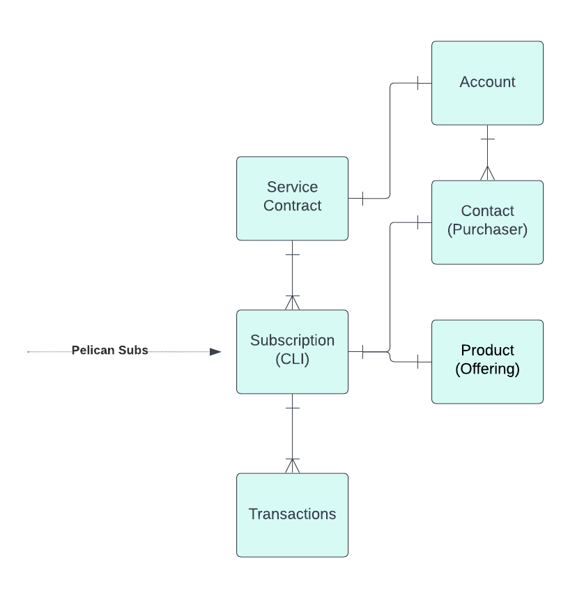

<div id="data-impact-assessment-template-info-main">
  <ul>
    <li><strong>Subject Matter Expert:</strong>
      <a target="_blank" href="https://aware.autodesk.com/devin.drewry">Devin Drewry</a>
    </li>
    <li class="doc-status"><strong>Status:</strong> <span class="doc-ok">Published<span></li>
    <!-- <li><strong class="doc-status">Status:</strong> <span class="doc-wip">In Progress</span>.</li> -->
  </ul>
</div>

## :fontawesome-solid-magnifying-glass-chart: Introduction

This article provides a overview of the changes made to the Salesforce Service Contract + Contract Line Item tables through Apollo's 2.1.2 release and how these changes impact the underlying business. The article is structured to provide the federated analytical community with a summary of the changes made to the table, and discuss possible uses and outline potential business impacts or tactical challenges for analysts introduced by these changes.

## :material-book-search: Background

Service contracts hold customer's entitlement information within Salesforce - contract line items are the level that hold individual pelican subscription IDs. The high level process involves 1. a customer purchasing an entitlement, 2. an entitlement creation process running (in Pelican or SFDC currently, depending on whether it's a direct/indirect purchase). Under the new transaction model, all purchases will be direct, so pelican subscriptions will be created first, which then generate contract line items within salesforce (bucketed into service contracts). The current indirect model generates contracts first and then creates pelican subscriptions second. The current model also has "Assets" (generally unique by serial number), that will no longer exist under the ODM/NXM data structure.

<figure markdown>
  
  <figcaption>New Subscription Entity Relationship</figcaption>
</figure>

## :material-format-list-bulleted: Summary of changes

Similar to the prior setup, subscriptions will be associated with contract line items, bucketed into service contracts. The data models are not changing in super impactful ways. However, new service contracts and CLIs will be created for the ODM subscriptions, which could have some impacts on existing analyses looking at contract-level information. This transition will happen at the time of the first financial transaction on non-ODM subs after the full go-live for 2.1.2. As such, queries generally won't break, but analyses may need to account for the transition to new contract IDs for ODM.

Additionally, these fields will move from Service Contract to ODM CLI:

1. Purchaser Name and Email
2. ODM attributes instead of SKU attributes
    - Contract Term
    - Billing Behavior
3. EWS?
4. Wiki with list of fields: Subscription Data Model for R2.1.2

Subscriptions on the contract line item + Asset will be converted to new ODM contract line item:

1. Subs Id will not change
2. Subs will be moved under a new Service Contract
3. Subs will have the Purchaser Name and Email
4. Subs will have Billing Behavior and Term

Assets will no longer be created (the SFDC ASSET__C table). Some fields previously stored on the asset will be moved to the contract line item level.

[SFDC Data Model updates](https://wiki.autodesk.com/display/DPED/SFDC+Data+Model+updates)

## :material-table-edit: Data structure updates

### Upcoming Data Model

These data model tables and definitions are sourced from this wiki page: [Subscription Data Model for R2.1.2](https://wiki.autodesk.com/display/DBP/Subscription+Data+Model+for+R2.1.2)

#### Service Contract

??? info "Service Contract data fields"

    | Index | Column name | SFDC field name | Data type | Field definition | Joins to columns | New/Existing? | Source | Notes |
    | ----- | ----------- | --------------- | --------- | ---------------- | ---------------- | ------------- | ------ | ----- |
    | ID | SFDC Unique Identifier | Text | The unique ID within SFDC for each service contract | SFDC Service Contract ID | Existing | SFDC |  |
    | AGREEMENT_NUMBER__C | Agreement Number | Text | The unique ID for each contract used in systems outside of SFDC | Agreement Number | Existing | SFDC |  |
    | AGREEMENT_START_DATE | Agreement Start Date | Date | Earliest start date of all subscriptions on the contract |  | Existing | SFDC | Verify |
    | AGREEMENT_END_DATE | Agreement End Date | Date | Latest end date of all subscriptions on the contract |  | Existing | SFDC | Verify |
    | RECORDTYPEID | RecordType | Text | Unique ID for SFDC recordtype table. NXM line items will show as "ODM". | SFDC Record Type ID | Existing | SFDC |  |
    | ACCOUNTID | Account SFDC Unique Identifier | Text | End customer account for the service contract. Each account will only have one service contract. | SFDC Account ID | Existing | SFDC |  |
    | ACCOUNT_NAME__C | Account Name | Text | End customer account name. Taken from SFDC Account table. |  | Existing | SFDC | Verify |
    | STATUS | Contact Status | Text | Expired, Inactive, Active. Need definitions for each. |  | Existing | SFDC | Verify |
    | CREATEDDATE | Created Date | Date | DRAFT: Date service contract was created in Salesforce. |  | Existing | SFDC | Verify |
    | CURRENTTERMSTARTDATE__C | Current Term Start Date | Date | DRAFT: Date of the most recent subscription start date. |  | Existing | SFDC | Verify |


#### Contract Line Item

??? info "Contract Line Item data fields"

    | Index | Column name | SFDC field name | Data type | Field definition | Joins to columns | New/Existing? | Source | Notes |
    | ----- | ----------- | --------------- | --------- | ---------------- | ---------------- | ------------- | ------ | ----- |
    | 1 | ID | SFDC Unique Identifier | Text | The unique ID within SFDC for each contract line item | SFDC Contract Line Item ID | Existing | Salesforce |  |
    | 2 | LineItemNumber | Line Item Number | Text | Unique Number for a Cli within a given Contract |  | Existing | Salesforce |  |
    | 3 | Purchaser__c | Purchaser | Text | User who bought the Subscription | SFDC Contact ID | Existing | Pelican | Mapped to Purchaser field on the CLI. Should be Mapped to contact Role related list in OLI. Should also be the Primary Contact on the OLI |
    | 4 | Sales_Channel__c | Sales Channel | Text | If the Subscription is purchased through direct vs solution provider (E.g. values: Direct and Indirect) |  | NEW | Pelican |  |
    | 5 | Quantity | Quantity | Number | Quantity on Subscription |  | Existing | Pelican |  |
    | 6 | Export_Control_Status__c | Account Export Control Status | Text | Export Control Status of Account associated with Subscription |  | Existing | Salesforce(Account) | Sourced from SFDC Account object rather than being taken from Pelican |
    | 7 | Payment_Method__c | Payment Method | Text | Type of Payment Method <br> E.g. values: Credit Card, LOC etc. <br> List of Values need to be consistent between Pelican and Salesforce |  | NEW | Pelican |  |
    | 8 | StartDate | Start Date | Date | Subscription Start Date |  | Existing | Pelican |  |
    | 9 | Actual_End_Date__c | Actual End Date | Date | For SUS, same as NEXT RENEWAL DATE <br> Draft: The end date for the subscription, not including any grace period. |  | Existing | Pelican |  |
    | 10 | Next_Renewal_Date__c | Next Renewal Date | Date | Only applicable for SUS <br> Draft: The data when subscription will be up for renewal |  | New | Pelican | Mapped directly from Pelican value |
    | 11 | EndDate | End Date | Date | Date when Subscription is suspended. |  | New | Pelican | Mapped directly from Pelican value |
    | 12 | Termination_Date__c | Termination Date | Date | Date when Sbuscription is Terminated |  | New | Pelican |  |
    | 13 | Reseller_Account__c | Agent/Reseller Account | Text | Solution Provider on the Subscription | SFDC Account ID | Existing | Pelican | Mapped from Pelican subscription Partner CSN |
    | 14 | OfferingId__c | Offering | Text | Offering on Subscription | Offering ID | Existing | Pelican | Maps to Product2 table in SFDC |
    | 15 | Offering_Product_Line_Code__c | Offering Code | Text | Reference from Product 2 |  | Existing | O2P |  |
    | 16 | Access_Model__c | Access Model | Text | 	How access to the bundle is granted; within the composition there may be a mix of license models which need to be taken into consideration. |  | Existing | Pelican |  |
    | 17 | Intended_usage__c | Intended Usage | Text | Governs the way in which a subscription can be sold and/or used. |  | Existing | Pelican |  |
    | 18 | Connectivity__c | Connectivity | Text | Whether the customer needs to be connected to the cloud in order to run the software. |  | Existing | Pelican |  |
    | 19 | Connectivity_Interval__c | Connectivity Interval | Text | Duration of time before the customer needs to reconnect to the cloud to continue running the software. |  | Existing Pelican |  |
    | 20 | Service Plan__c | Service Plan | Text | Benefits available based on intended usage, customer choice or type; references the offering comprising the service plan composition. This is established at Offering creation time. |  | Existing | Pelican | Verify that this is the Service Plan Offering Code from the ODM |
    | 21 | Billing_Behavior_Picklist__c | Billing Behavior | Text | Whether the customer needs to renew at the end of the term |  | Existing | Pelican |  |
    | 22 | Term__c | Term | Text | For how long access will be granted; 30 days, monthly, yearly, multi-year, purchases are perpetual or can have an expiration (credits) |  | Existing | Pelican |  |
    | 23 | Billing_Type__c | Billing Type | Text | When the customer is charged |  | Existing | Pelican |  |
    | 24 | Billing_Frequency__c | Billing Frequency | Text | How often the customer is charged within the term |  | Existing | Pelican |  |
    | 25 | Subscription_Currency__c | Currency | Text | DRAFT: Currency used to purchase the subscription |  | New | Pelican |  |
    | 26 | Subscription_Currency_code__C | Subscription Currency Code | Text | DRAFT: Currency code used to purchase the subscription |  |  |  |  |
    | 27 | Pelican_Status__c | Pelican Status | Text | Subscription Status <br> DRAFT: Subscription status taken from Pelican |  | Existing | Pelican |  |
    | 28 | Pelican_Subscription_Id__c | Pelican Subscription Id | Text | Subscription ID (Pelican Unique Attribute) | Pelican Subscription IDs | Existing | Pelican |  |
    | 29 | Opportunity__c | Subscription Opportunity | Text | Maps to Subscription Oppty for O2P <br> DRAFT: SFDC Opportunity ID for the related Subscription Opportunity | SFDC Opportunity ID | New | Salesforce |  |
    | 30 | Parent_Opportunity__c | Parent Subscription Opportunity | Text | This will impact oppty visibility in Autodesk Account. <br> Also, this field should capture the original opportunity split was initiated from. | SFDC Opportunity ID | New | Salesforce | It is populated when subscription opportunity is split. |
    | 31 | Split_Opportunity__c | Split Opportunity | Text | DRAFT: It is populated on original subscription Opportunity when subscription opportunity is split. | SFDC Opportunity ID | Existing | Salesforce | It is populated on original subscription Opportunity when subscription opportunity is split. Used to identify if split opportunity is closed (in key logic) and then create new opportunity (if another split occurs) else new split items will move to closed Opportunity. |
    | 32 | Switch_Billing_Term__c | Switch Billing Term | Text | This is requested billing Term by Customer any time during Subs lifecycle. |  | Existing | Pelican |  |
    | 33 | Switch_Price_Condition__c | Switch_Price_Condition__c | Text | For transition CLI: should come from Referral Program Type on Asset for ODM CLI it will be referenced from Pelican |  | New | Pelican |  |
    | 34 | Opportunity_Creation_Error__c | Subscription Opportunity Creation Error | Text | Error Attribute tracking errors on Renewal Creation Job |  | New | Salesforce |  |
    | 35 | Contact_Marketo_Lead_Id__c | Purchaser Marketo Lead Id | Text | Subscription Contact Id mapped with Marketo Lead Id | SFDC Contact ID | New | Salesforce(Contact) Contact Object | |
    | 36 | Sync_to_Marketo__c | Sync to Marketo | Text | Flag for syncing Subscription to Marketo |  | Existing | Contact Object |  |
    | 37 | mkto_ns_index__c | Marketo Native Sync Index | Number | External Id for syncing Subscription to Marketo |  | New | Salesforce Contact Object |  |
    | 38 | Nurturing_Reseller__c | Nurture Reseller | Text | For existing Subs, any time there is order transaction, the nurture reseller from old CLI should copy on the new CLI. <br> (logic to update this field should be different from legacy CLI. On legacy CLI this field is updated at the time of ROM creation. On an ODM CLI, it should be stamped from the Resseller_Account__c at T-90) | SFDC Account ID | Existing | Salesforce → <br> Legacy CLI <br> Conversion: <br> Blank <br> Extension: <br> Salesforce → <br> Legacy CLI |  |
    | 39 | Nurturing_Lock_Date__c | Nurture Lock Date | Date | Date when Nurture Reseller Value is locked |  | Existing | Salesforce → <br> Legacy CLI <br> Conversion: <br> Blank <br> Extension: <br> Salesforce → <br> Legacy CLI | logic same as Nurturing_Reseller__c |
    | 40 | Original_Solution_Provider__c | Original Solution Provider | Text | DRAFT: Agency selling the subscription. Reseller of record from the pre-ODM subscription (taken from SFDC Asset table). | SFDC Account ID | New | Salesforce <br> Custom Assets Object | Taken from Asset for transition CLIs |
    | 41 | Auto_Renew_Turn_Off_Reason__c | Auto Renew Turn off Reason | Text | DRAFT: Reason selected by user for turning off subscription auto renew |  | New |  |  |
    | 42 | Auto_Renew_Turn_Off_Comments__c | Auto Renew Turn Off Comments | Text | DRAFT: Comments given by user showing why auto renew was turned off |  | New |  | Descoped from MVP |
    | 43 | Switch_From_Subscription__c | Switch from Subscription | Text | Applies to Switch Product, Subscription Split | SFDC Contract Line Item ID | Existing |  |  |
    | 44 | Added_To_Subscription_Id__c | Added To Subscription Id | Text | Add seats to subs <br> DRAFT: Subscription ID that this subscription is adding new seats to | Pelican Subscription ID | New  |  |  |
    | 45 | LC_Originated_Subscription__c | LC Originated Subs | Boolean | Will refer to asset for migration, for new it will take the value from Pelican |  | New | Pelican <br> Conversion: <br> SFDC → Custom Asset Object | Set to true when ORDER CONTEXT(from Pelican)= LC |
    | 46 | Auto_Renew__c | Auto Renew | Text | Captures whether customer turned off Auto Renew (ON, OFF, NA) |  | New | Pelican | (ON, OFF, NA) |
    | 47 | Pelican_Order__c | Pelican Order | Text | DRAFT: The most recent purchase order ID from Pelican associated with this subscription | Pelican Purchase Order ID | New | Pelican |  |
    | 48 | Renewal_Counter__c | Renewal Counter | Text | DRAFT: The number of times this subscription has been renewed. Includes pre-ODM renewals where applicable. |  | New | Salesforce | Incremented on every renewal order for ODM and transition <br> in case of migration renewal : stamp it from old asset + 1 <br> in case of migration non renewal : stamp it from old asset <br> in case of net new = 0 |
    | 49 | Open_Order__c | Open Order | Text | DRAFT: Pelican purchase order for this subscription that has not yet been completed/approved (e.g., still has pending payment) | Pelican Purchase Order ID | New | Pelican |  |
    | 50 | RecordTypeId | RecordType | Text | Unique ID for SFDC recordtype table. NXM line items will show as "ODM". | SFDC Record Type ID | Existing | Salesforce |  |
    | 51 | Quantity to Reduce | Quantity to reduce | Number | Stores the intimation for reduced quantity - mid term which is processed on anniversary date. | New | Pelican |  |
    | 52 | Do_Not_Create_Renewal__c | Do Not Create Renewal | Boolean | Stops creation of renewal |  | New | SFDC → Asset Custom Object |  |
    | 53 | Do_Not_Create_Renewal_Reason__c | Do Not Create Renewal Reason | Text | Free form text with reason to stop renewal |  | New | SFDC → Asset Custom Object |  |
    | 54 | Migrated_From_Subscription__c | Migrated From Subscription | Text | This will have the reference to legacy Contract line item in case of conversion | SFDC Contract Line Item ID |  |  |  |
    | 55 | Old_Subscription__c | Old Subscription Id | Text | In case of Split, it will contain old subscription id | Pelican Subscription ID |  |  |  |
    | 56 | LC_PURCHASE_SEATS |  | Number | DRAFT: The number of seats purchased on this subscription considered to be from the license compliance program |  |  | SFDC → Custom Asset Object |  |
    | 57 | Reference_Subscription_Id__c | Reference Subscription ID | Text | In the event of a co-term/switch, the original Subscription ID prior to the co-term/switch event | Pelican Subscription ID | New | Pelican |  |
    | 58 | ADSK_M2S_Switch_Order_Date__c | ADSK M2S Switch Order Date | Date | Use this in combination of switch type code to populate additional info on OLI related list of Subs Opportunity on conversion. |  | Existing on Custom Assets <br><br>NeW on ODM CLI | Salesforce → Custom Asset Object |  |
    | 59 | Switch_Type_Code__c | 	Switch Type Code | Picklist | Use this in combination of ADSK M2S Switch Order Date to populate additional info on OLI related list of Subs Opportunity on conversion. |  | Existing on Custom Assets <br><br> New on ODM CLI | Salesforce → Custom Asset Object |  |
    | 60 | EXPIRATION_REASON__C | Expiration Reason | Text | DRAFT: The reason given by the customer for subscription expiration |  | ? | ? | 10/6 - No definition |
    | 61 | SUBSCRIPTION_TYPE__C | Subscription Type | Text | Model the subscription was purchased under <br> Values: Direct, ODM, Indirect |  |  |  | SFDC Formula |
    | 62 | PREVIOUS_OPPORTUNITY__C | Previous Subscription Opportunity | Text | This will have Id of the Subscription Opportunity associated with previous term | Opportunity ID |  |  |  |
    | 63 | OFFERING_NAME__C | Offering Name | Text | SFDC Formula field pulling Name from OFFERINGID__C |  |  |  |  |
    | 64 | Auto_Renew_Off_Date__c | Auto Renew Off Date | Date | Populated based on when AUTO_RENEW__C flag changed (date when auto-renew was set to off) |  |  |  |  |
    | 65 | Next_Renewal_Opportunity_Creation__c | Next Renewal Opportunity Creation | Boolean | Internal field used for next term Subscription Opportunity Creation |  |  |  | 10/12 - need to check what TRUE means |
    | 66 | NTM_ELIGIBLE__C | NTM Eligible (Old CLIs) | Boolean | This is not relevant for ODM Clis. It is only used for BIC Indirect and Direct Clis. It indicates whether the Cli is eligible for transition to ODM. |  |  |  |  |

#### Fields Removed

No fields were removed from servicecontract or contractlineitem for R2.1.2.

The asset table will be no longer used for R2.1.2.

## :material-head-question: Open Questions

??? question "Questions as of 9/21/2023"

    ### Questions as of Sep 21, 2023

    #### 1. What's the correct wiki reference? We've been using the subscription data model page, but it doesn't include all the columns that are in BSD_PUBLISH_INT in snowflake staging

    9/26 - No additional wiki references. There's an additional ODM architecture that we may be able to reference on the subscription data model: [Subscription Data Model](https://wiki.autodesk.com/display/BMP/Subscription+Data+Model).

    #### 2. Will all fields in the BSD_PUBLISH_INT table be included after 2.1.2? Is there a mapping for which will be used or definitions for ones not in the subscription data model?

    9/26 - All fields showing up currently should be finalized. We can follow up with the engineering team to get column level definitions for things not included on the other wiki pages.

    #### 3. What's the business reason behind generating new service contracts for the same subscriptions?

    9/26 - Pre-NXM service contracts are created based on orders, so customers can have multiple service contracts (harder to tell all subscriptions for a given customer). NXM service contracts are 1:1 with end customer CSNs, so all subscriptions for a given customer will be on their single service contract.

    #### 4. How do we identify new ODM CLIs?

    9/26 - All line items under NXM service contracts, which are identified using the new ODM record type in Salesforce.

    #### 5. Are the subscription ID columns using CLI SFDC IDs or pelican subscription IDs?

    10/12 - Depends on the field. The ones used are listed in the data dictionary for CLI above in the "Joins to Column" column.

    #### 6. What's the difference between these subscription columns?

    - SWITCH_FROM_SUBSCRIPTION__C
        - Subscription ID used for switch orders
    - SWITCHED_FROM_SUBSCRIPTION__C
        - 10/6 - retired
    - MIGRATED_FROM_SUBSCRIPTION__C
        - References the old CLI ID on ODM CLIs
    - REFERENCE_SUBSCRIPTION_ID__C
        - In the event of a co-term/switch, the original Subscription ID prior to the co-term/switch event
    - OLD_SUBSCRIPTION_ID__C
        - 10/6 - retired

    #### 7. REFERENCE_SUBSCRIPTION_ID__C includes both SFDC CLIs and pelican subscription IDs in BSD_PUBLISH_INT. Should it be only one or the other for the NXM CLIs?

    10/13 - Should only have pelican subscription IDs

    #### 8. Is NTM_ELIGIBLE__C only true on CLIs from the previous data model?

    Will all NXM CLIs also have this field set to true?

    #### 9. What is NEXT_RENEWAL_OPPORTUNITY_CREATION__C used for?

    10/13 - Internal field used for next term Subscription Opportunity Creation. Presumably shows that the new renewal subscription opportunity has already been created and used internally within SFDC.

    #### 10. What's the difference between previous_opportunity__c and parent_opportunity__c?

    - 10/13 - Previous opportunity is the last subscription opportunity (e.g., if a subscription is renewed, it will show the closed subscription opportunity while the opportunity column shows the new one for the next renewal)
    - 10/13 - parent opportunity is used if the opportunities get split for any reason.

    #### 11. Are there any fields that will be persisting across to the NXM where the LOVs change?

    - 9/26 - Service contract will still be using record type, account, start date, end date with a new record type.
    - 9/26 - Need to follow up with the engineering team about specifics for changing LOVs.

    #### 12. Are there any fields that will be remaining in the table but no longer used for NXM CLIs?

    9/26 - Need to follow up with the engineering team about specifics for changing LOVs.

## :material-file-code: Sample queries

This section has sample queries covering a variety of use cases with the NXM contract and contract line item updates.

### Linking an NXM contract/CLI to the prior subscription's agreements (and vice versa)

??? abstract "Linking Prior CLI to NXM CLI"

    This query uses migrated_subscription__c to find the SFDC ID of the pre-NXM contract line item. The join is a self join on the contractlineitem table.

    ``` sql linenums="1"
    -- Migrated subscriptions using CLI ID
    select
        c.id as service_contract_sfdc_id
        , c.agreement_number__c
        , c.startdate as agreement_start_date
        , c.enddate as agreement_end_date
        , c.accountid
        , r.name as cli_record_type_name
        , cli.id as lineitem_id
        , cli.product2id
        , cli.lineitemnumber
        , cli.entitlement__c
        , cli.pelican_offering_id__c
        , cli.offering_product_line_code__c
        , cli.offering_product_line__c
        , cli.active_seats__c
        , cli.quantity
        , cli.subscription_type__c
    FROM BSD_PUBLISH.SFDC_SHARED.SERVICECONTRACT c
    JOIN BSD_PUBLISH.SFDC_SHARED.CONTRACTLINEITEM cli ON c.id = cli.servicecontractid
        JOIN bsd_publish.sfdc_shared.recordtype r
            ON cli.recordtypeid = r.id
    where cli.id in
    (
    SELECT Migrated_From_Subscription__c
    FROM BSD_PUBLISH.SFDC_SHARED.CONTRACTLINEITEM cli
    JOIN bsd_publish.sfdc_shared.recordtype r
        ON cli.recordtypeid = r.id
        WHERE r.name = 'ODM'
        and migrated_from_subscription__c is not null
    );
    ```

### Joining the NXM CLIs to their associated subscription opportunities

??? abstract "Finding subscription opportunities"

    This query joins NXM service contracts + CLIs to the associated subscription opportunities + opportunity line items. The join is done at the lineitem level. This join could be many to one (need to verify if new subscription opportunities get opened at each renewal).

    ``` sql linenums="1"
    WITH SERVICE_CONTRACT_LINEITEMS AS (
        SELECT
            c.id as service_contract_sfdc_id
            , c.agreement_number__c
            , c.startdate as agreement_start_date
            , c.enddate as agreement_end_date
            , r.name as cli_record_type_name
            , cli.id as cli_sfdc_id
            , cli.lineitemnumber
            , cli.Pelican_Subscription_Id__c
            , cli.offering_id__c
            -- , cli.pelican_offering_id__c -- This looks irrelevant, always null
            , cli.offering_name__c
            , cli.startdate as cli_subscription_start_date
            , cli.enddate as cli_subscription_end_date
            , cli.opportunity__c as subscription_opportunity_sfdc_id
            , cli.pelican_order__c
            , cli.subscription_type__c
            , cli.purchaser__c
            , cli.quantity as subscription_quantity
            , cli.Reseller_Account__c
            , cli.status
            , cli.pelican_status__c
            , cli.contract_term__c
            , cli.term__c -- Don't use contract_term__c. Do we need a mapping table?
            , cli.billing_behavior__c
            , cli.lc_originated_subscription__c
            , cli.lc_purchased_seats__c
        FROM BSD_PUBLISH.SFDC_SHARED.SERVICECONTRACT c
        JOIN BSD_PUBLISH.SFDC_SHARED.CONTRACTLINEITEM cli ON c.id = cli.servicecontractid
        JOIN bsd_publish.sfdc_shared.recordtype r
            ON cli.recordtypeid = r.id
        WHERE r.name = 'ODM'
    )
    , OPPORTUNITY_LINEITEMS AS (
        SELECT
            r.name as opp_record_type
            , o.id as opp_sfdc_id
            , o.name as opp_name
            , o.accountid as opp_account
            , o.start_date__c
            , o.closedate
            , O.AGREEMENT_NUMBER__C
            , O.agreement_numbers__c
            , o.stagename
            , oli.name as opp_li_name
            , oli.pelican_subscription_id__c as oli_pelican_subscription_id__c
            , oli.contract_line_item__c
            , oli.quantity
            , oli.account_csn__c
            , oli.term__c
            , oli.line_item_action__c
        FROM BSD_PUBLISH.SFDC_SHARED.OPPORTUNITY o
        JOIN BSD_PUBLISH.SFDC_SHARED.OPPORTUNITYLINEITEM oli
            ON o.id = oli.opportunityid
        JOIN bsd_publish.sfdc_shared.recordtype r
            ON o.recordtypeid = r.id
        WHERE r.name = 'Subscription Opportunity'
    )
    SELECT
        sc.*
        , o.*
    FROM SERVICE_CONTRACT_LINEITEMS sc
    JOIN OPPORTUNITY_LINEITEMS o
        ON sc.cli_sfdc_id = o.contract_line_item__c
    ;
    ```

### Joining a subscription to the orders/quotes that purchased it

??? abstract "Joining ContractLineItem to CVC_FINMART"

    This query joins the SFDC Service Contract + Contract Line Item tables to CVC_FINMART using the pelican order number and pelican subscription ID. Note that this is a many to one relationship (e.g., renewal orders on the same subscription), so depending on the use case, users may need to filter the finmart data to a certain transaction or utilize additional date information on the contract line item to identify more recent transactions. This query does not include that logic.

    ``` sql linenums="1"
    WITH SERVICE_CONTRACT_LINEITEMS AS (
        SELECT
            c.id as service_contract_sfdc_id
            , c.agreement_number__c
            , c.startdate as agreement_start_date
            , c.enddate as agreement_end_date
            , r.name as cli_record_type_name
            , cli.id as cli_sfdc_id
            , cli.lineitemnumber
            , cli.Pelican_Subscription_Id__c
            , cli.offering_id__c
            -- , cli.pelican_offering_id__c -- This looks irrelevant, always null
            , cli.offering_name__c
            , cli.startdate as cli_subscription_start_date
            , cli.enddate as cli_subscription_end_date
            , cli.opportunity__c as subscription_opportunity_sfdc_id
            , cli.pelican_order__c
            , cli.subscription_type__c
            , cli.purchaser__c
            , cli.quantity as subscription_quantity
            , cli.Reseller_Account__c
            , cli.status
            , cli.pelican_status__c
            , cli.contract_term__c
            , cli.term__c -- Don't use contract_term__c. Do we need a mapping table?
            , cli.billing_behavior__c
            , cli.lc_originated_subscription__c
            , cli.lc_purchased_seats__c
        FROM BSD_PUBLISH.SFDC_SHARED.SERVICECONTRACT c
        JOIN BSD_PUBLISH.SFDC_SHARED.CONTRACTLINEITEM cli ON c.id = cli.servicecontractid
        JOIN bsd_publish.sfdc_shared.recordtype r
            ON cli.recordtypeid = r.id
        WHERE r.name = 'ODM'
    )
    , finmart AS (
        select
            src_id
            , sales_order_nbr
            , ecc_sales_order_nbr
            , sales_order_line_nbr
            , bic_order_nbr
            , po_type
            , po_nbr
            , pelican_order_line_nbr
            , pelican_subscription_id
            , offering_id
            , offering_name
            , billing_behavior_cd
            , billed_quantity
            , billed_usd_amt
            , cc_fbm_sf_subs_seats_billed
            , cc_fbm_recur_acv_net3_usd
            , order_action_desc
            , quote_nbr
        from bsd_publish.finmart_private.cvc_finmart
        where record_type = 'BILLING'
    )
    , quote as (
        select
            q.name as quote_number
            , q.createddate as quote_date
            , q.quote_status__c
            , q.sbqq__account__c as quote_account_sfdc_id
            , q.agent_contact__c as agent_contact_sfdc_id
            , q.sbqq__primarycontact__c as purchaser_contact_sfdc_id
            , q.sbqq__opportunity2__c
            , q.total__c as quote_total_amount
            , qli.sbqq__quantity__c as quote_quantity
            , qli.sbqq__listprice__c as quote_list_price
            , qli.sbqq__discount__c as quote_discount
            , qli.lineitemaction__c as quote_line_item_action
            , p.OFFERINGID__C as quote_offering_id
            , qli.subscription_id__c
            , qli.subscription__c
        from bsd_publish.sfdc_shared.sbqq__quote__c q
        JOIN bsd_publish.sfdc_shared.sbqq__quoteline__c qli
            ON q.id = qli.sbqq__quote__c
        JOIN bsd_publish.sfdc_shared.product2 p
            ON qli.SBQQ__Product__c = p.id
    )
    SELECT
        sc.*
        , f.*
        , q.*
    FROM SERVICE_CONTRACT_LINEITEMS sc
    JOIN FINMART f
        ON sc.pelican_order__c = f.bic_order_nbr
        AND sc.pelican_subscription_id__c = f.pelican_subscription_id
    JOIN QUOTE q
        ON f.quote_nbr = q.quote_number
        AND f.offering_id = q.quote_offering_id
    ;
    ```

### Joining CLI to the offering/product tables

??? abstract "Joining ContractLineItem to Offering"

    This query joins the contract line items to their offering information using offering ID.

    ``` sql linenums="1"

    WITH SERVICE_CONTRACT_LINEITEMS AS (
        SELECT
            c.id as service_contract_sfdc_id
            , c.agreement_number__c
            , c.startdate as agreement_start_date
            , c.enddate as agreement_end_date
            , r.name as cli_record_type_name
            , cli.id as cli_sfdc_id
            , cli.lineitemnumber
            , cli.Pelican_Subscription_Id__c
            , cli.offering_id__c
            -- , cli.pelican_offering_id__c -- This looks irrelevant, always null
            , cli.offering_name__c
            , cli.startdate as cli_subscription_start_date
            , cli.enddate as cli_subscription_end_date
            , cli.opportunity__c as subscription_opportunity_sfdc_id
            , cli.pelican_order__c
            , cli.subscription_type__c
            , cli.purchaser__c
            , cli.quantity as subscription_quantity
            , cli.Reseller_Account__c
            , cli.status
            , cli.pelican_status__c
            , cli.contract_term__c
            , cli.term__c -- Don't use contract_term__c. Do we need a mapping table?
            , cli.billing_behavior__c
            , cli.lc_originated_subscription__c
            , cli.lc_purchased_seats__c
        FROM BSD_PUBLISH.SFDC_SHARED.SERVICECONTRACT c
        JOIN BSD_PUBLISH.SFDC_SHARED.CONTRACTLINEITEM cli ON c.id = cli.servicecontractid
        JOIN bsd_publish.sfdc_shared.recordtype r
            ON cli.recordtypeid = r.id
        WHERE r.name = 'ODM'
    )
    , offering AS (
        SELECT
            offering_id
            , offering_code
            , offering_name
            , unit_of_measure
            , offering_category
            , business_model
            , marketing_name
            , revenue_treatment
        FROM edh_publish.edh_shared.offering_latest
    )
    SELECT
        sc.*
        , o.*
    FROM SERVICE_CONTRACT_LINEITEMS sc
    JOIN offering o
        ON sc.offering_id__c = o.offering_id
    ;
    ```

## :material-text: Impact Assessment

EIO Projects referencing these tables:

- IDE (CONTRACTLINEITEM + SERVICECONTRACT)
    - Need to verify the join used to get service contract info for BIC direct orders
    - May not necessarily need this after NXM, but will have to verify
        - 10/3: This looks like the correct join path still. If anything, will need to update with subscription opportunities (and can link to the opps through that join as well)
    - [Git link with the relevant join](https://git.autodesk.com/dpe/adp-astro-cso-analytics/blob/master/dags/dbt/engagement/ide_base/models/transform/adp_source/ide_order_opp_flag_mapping.sql#L33)
- NPS (SERVICECONTRACT)
    - Referenced [here in Git](https://git.autodesk.com/dpe/adp-astro-cso-analytics/blob/master/dags/dbt/engagement/nps/models/transform/nps_products_engagement_transform.sql#L71)
        - Looks like no change will be needed since the agreement should still be stored in Name, but need to verify
            - 10/3: This looks to still be true
        - Potentially update the join to use one of the agreement number columns in servicecontract
    - Similar join [in this model](https://git.autodesk.com/dpe/adp-astro-cso-analytics/blob/master/dags/dbt/engagement/nps/models/transform/nps_territory_transform.sql)
- Tflex (SERVICECONTRACT)
    - Referenced [in this model](https://git.autodesk.com/dpe/adp-astro-cso-analytics/blob/master/dags/dbt/usage/tflex/models/transform/tflex_adjustment_recon_fct_transform.sql#L71)
        - Looks like no changes, join is on SFDC and uses normal identifiers
            - 10/3: seems like account name will still be populated
        - Will need to verify that the transactions joins are the same after changes
            - 10/3: Looks like everything should still be the same

## :material-text-short: Conclusion

Subscription information within SFDC will now all be stored in the contract line item objects. Existing use cases looking at subscription information through these contracts and joining opportunities to service contract may need some small updates to logic to get the correct fields for the ODM contract line items + Subscription Opportunities. However, the entitlement CED and subscription pelican should still have similar behavior as before these NXM changes. Service contracts will also be simplified to be one contract per SFDC account ID, which should help with simplifying and consolidating analyses at the account level.

Existing EIO projects that reference these tables look to not need any updates as the fields used will be carried forward into the new version.

Depending on the analysis, analysts may need to account for transitioned service contracts as those start happening on the new purchase model. We aren't familiar with any analyses using service contracts to determine customer lifecycle, but analyses along those lines would need to be updated to handle this transition.
