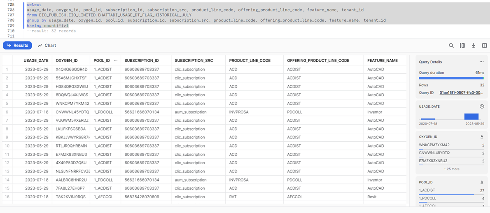
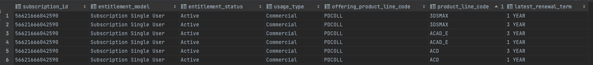

  <ul>
    <li><strong>Document Owner:</strong> 
      <a href="https://aware.autodesk.com/eveline.surbakti">Eveline Surbakti</a>
    </li>
    <li><strong>Product Owner:</strong> 
      <a href="https://aware.autodesk.com/ola.sadowska">Ola Sadowska</a>
    </li>
    <li><strong>Analyst SME:</strong> 
      <a target="_blank" href="https://aware.autodesk.com/jayme.kielo">Jayme Kielo</a>,
      <a target="_blank" href="https://aware.autodesk.com/eveline.surbakti">Eveline Surbakti</a>
    </li>
    <li><strong>Engineer SME:</strong> 
      <a target="_blank" href="https://aware.autodesk.com/dipanjana.bhattacharyya">Dipanjana Bhattacharyya</a>
    </li>
    <li class="doc-status"><strong>Status:</strong> Published</li> 
   <!-- <li><strong class="doc-status">Status:</strong> In Progress</li>  -->
  </ul>

## :material-table-multiple:{ .red-icon-heading } Introduction

The Product Usage dataset provides information about active users in a table to help make strategic decisions. 

!!! note
    - To learn about the metric related to this dataset, visit the [Active Users document](https://eda-data-docs.autodesk.com/metrics/active-user).

## :fontawesome-solid-suitcase:{ .green-icon-heading } Business relevance

1. The more a customer uses a product, the more satisfied they are likely to be with it. When a product meets a customer's needs and expectations, they are more likely to continue using it, recommend it to others, and even purchase additional products or services.
2. Tracking how customers use a product can help identify areas for improvement. By understanding how customers are using a product, Autodesk, as customer focus company can better understand how to improve its features and service.
3. Product usage data can provide insights into customer behavior and preferences. This information can be used to develop more targeted marketing campaigns and messaging that resonates with customers.
4. When customers use a product frequently and are satisfied with it, they are more likely to continue to renew the subscription and potentially even upgrade to a higher-priced contract or agreement. This can lead to revenue growth for the company.

## :material-book-search:{ .purple-icon-heading } Overview

The product usage dataset gathers the data of users from single user subscription and commercial usage only in a table named `usage_sus_daily`.

### :material-table: `usage_sus_daily`

#### Upstream sources

This table contains information from different systems such as CLic (Cloud Licensing) and data sources such as entitlement and subscriptions.

#### Lowest granularity

A unique record for the table is at the combination of `usage_date`, `oxygen_id`, `tenant_id`, `pool_id`, `subscription_id`, `subscription_src`, `product_line_code`, `offering_product_line_code`, and `feature_name` granularity.

#### Business logic for derived fields

??? info "Fields with logic and business context"

    | ID | Field | Logic | Business context |
    | - | ----- | ----- | ---------------- |
    | 1 | `child_account_csn_level_dirty_team_flag` | ,CASE WHEN b.tenant_id is not null then 1 else 0 end as child_account_csn_level_dirty_team_flag | It flags child accounts without `tenant_id` |
    | 2 | `offering_product_line_code` |`coalesce(usage.offering_product_line_code, entitlement.offering_product_line_code)` | Offering product line code is sourced from Authorisation CLic table, if that is absent, the information from Entitlement CED will be filled in. |
    | 3 | `parent_account_csn_level_dirty_team_flag` | It flags parent accounts without `tenant_id` |
    | 4 | `subscription_src` | One of two values: 1. `clic_subscription` -> subscription ID was captured in CLic. 2. `aum_subscription` -> the subscription ID was not captured directly in CLic but is also on the same offering and team in AUM. | Identifies if the subscription ID was captured directly in CLic or if the subscription has inferred usage from being of the same offering on the same team. More details in [this caveats section](#1-usage-allocation-based-on-business-purposes-using-subscription_src-column) |

#### Caveats & clarifications

??? info "Specifications regarding data availability"

    #### 1. Which Account CSN(s) are included
    Victim survivor table is used to join the Entitlement CED and Account CED tables but the CSN surfaced in the product usage dataset depend on the which ever CSN available in the Entitlement CED and Account CED on the load date.

    #### 2. Account CSN availability
    Account CSN is available for all of the records. However the logic to get the account information for the records depends on the date partitions.

    ??? question "Example/Recommendation"
        There are two different codes for historic data depending on if the date partitions is before or after March 9, 2021. For dates prior to March 9, 2021, instead of using the point-in-time partition, the account CSN is brought into the data using the earliest available partition from the entitlement CED with the end_customer_acct_csn column populated (2021-03-09).

    #### 3. Entitlement model availability
    First release of the data only have SUS and Commercials records. The entitlement information is sourced from the entitlement CED table.

    ??? question "Example/Recommendation"
        **^^Don't^^ use this table for entitlement models other than single user subscriptions**.

    #### 4. Products availability
    Products included are products based on Authorization CLic table.

    #### 5. Feature type availability
    Only if the product line code is available in Entitlement CED table.

    #### 6. Account CSN and latest renewal term availability (a bug in source tables)
    There is a possibility that end customer account csn (Account CSN) and the latest renewal term from Entitlement CED causing the issue.

    When using the combination of usage date, oxygen id, tenant id, pool id, subscription id, subscription source, product line code, offering product line code, and feature name as primary keys, there is a very small chance of it to be duplicates. 

    Out of the total of 3 years records, there are 32 records with duplicates. After further investigation, the logic just picked any values that are available in the data sources at the point of time.

    ??? question "Example/Recommendation"
        

        **^^Checking the source table (the entitlement CED):^^**

        **1. `latest_renewal_term`**

        

        It also has different latest renewal term across the unique combination of PK.  

        **2. `account_csn`**

        

        
        
        Same applies to the end customer account csn information:

        

??? info "Specifications regarding sync and load details"

    #### 1. Entitlement Sync Nuance
    One of the dependant data sources is the entitlement CED which is dependent on both Pelican and SFDC. There is a sync issue between the two where Pelican refreshes every hour but SFDC refresh time is every six hours. Implications on the product usage data set is there is a small set of records for new customers which have not fully synced who will be excluded from the end of month refresh. These records will be captured in the following refresh. 

    ??? question "Example/Recommendation"
        **^^New Entitlements:^^**

        - Regarding the allocation of usage to the account, for users who use/bought new subscription on the last day of the month will be allocate to the next month because the generated subscription id might be delayed by a day.

    #### 2. Technical table load
    1. Pipeline should be run daily.
    2. There is primary key check set up as a test called primary_key_verification.sql
    3. The first model of the pipeline is dependant on the clic_authorization table. This table is different than most tables in Snowflake as it has historic partitions and not only the latest. Each daily refresh should only pull in the latest partition of the clic_authorization. There is a one day delay in the data being refreshed and so the first model in the dbt project pulling in the clic_authorization data looks for the current day - 2 day date partition.

    #### 3. Load date is not the same with usage date
    There is a delay in the data sources (Authorisation CLic). Load date and usage date are often the same, but not all the time. 

    ??? question "Example/Recommendation"
        Usage date is recommended to be used instead of load date for the MAU calculation.

??? info "Specifications regarding Active Users calculation"

    #### 1. Usage allocation based on business purposes using `subscription_src` column
    The subscription_src column is created with a purpose. The goal of using subscription_src column is to support the business strategy planning while considering team model concept in mind. 

    It identifies if the subscription ID was captured directly in Clic or if the subscription has inferred usage from being of the same offering on the same team.

    One of two values:

    `clic_subscription` → subscription ID was captured in CLic

    `aum_subscription` → the subscription ID was not captured directly in CLic but is also on the same offering and team in AUM
  
    ??? question "Example/Recommendation"
        Make sure subscription_src is used accordingly, by defining the business purposes or business question that want to be achieved or answered and be consistent.

        Option 1

        Allocate usage to account based on the subscription ID captured in CLic.

        By adding the filter: where `subscription_src` = `clic_subscription`

        Option 2

        Allocate usage to account based on all product subscription IDs on team.

        This calculation is done by default without any filters.

        Real example:

        
        
    #### 2. Checking the accuracy of the MAU Calculation based on product usage dataset against other sources (table or dashboard)
    The product usage dataset uses Authorization CLic table as the proxy for usage. Authorization CLic has users authorization activities. The users are considered as active if they are authorized and/or used the product.

    ??? question "Example/Recommendation"
        The trend of the usage can be similar across different sources over time, but since they are sourced from a different sources there is no expectation that they will give the exact number. That said, comparing accuracy of metrics are irrelevant. 

        Example:

        When comparing our data to the PSET table (SPG_PUBLISH.SUS_PPU_SHARED.PRODUCT_USAGE) for an older partition (for example April 2020). Counting unique tenant+usage date combo and about 3% are not captured in the data. From further investigation it's because these records don't have a subscription ID in the CLic Authorization data as they are from a legacy source.

!!! warning "Known issues"
    No known issues.

### :fontawesome-solid-diagram-project: Data model

`eio_publish.usage_shared.usage_sus_daily` is a standalone table.

## :material-table-search:{ .yellow-icon-heading } Dataset details

### :material-table-eye: Dataset location

| Data Warehouse | Schema/Database | View/Table      | Notes |
| -------------- | --------------- | --------------- | ----------------- |
| `eio_publish`    | `usage_shared`    | `usage_sus_daily` | |

### :material-table-key: Access

- Request access via [ADP Access Management](https://access.adp.autodesk.com/data-access/snowflake?id=2a9RWoU8iTcnqRkvLKj47J). 
- For more information, please refer to [ADP Access Management User Guide](https://wiki.autodesk.com/pages/viewpage.action?spaceKey=CPDDPS&title=ADP+Access+Management+User+Guide), or contact the team on their slack channel [#adp-access-support](https://autodesk.enterprise.slack.com/archives/C05JFCCB0FK).

### :material-table-sync: Refresh frequency

Daily (1PM UTC)

### :material-table-cog: Data dictionaries

Atlan (data catalog) link:

- [`usage_sus_daily`](https://autodesk.atlan.com/assets/cdf46c92-add3-4282-9684-b8619eb6a6e9/overview)

## :material-file-code:{ .grey-icon-heading } Sample queries

To obtain specific information about Active Users using SQL, you can see sample queries on the metric documentation [here](../metrics/active-users-metric.md#sample-queries). 

## :material-link:{ .grey-icon-heading } Related links

- [Product Usage Prototype (wiki)](https://wiki.autodesk.com/display/EAX/Product+Usage%3A+Prototype)
- [Proof of Concept (wiki)](https://wiki.autodesk.com/display/EAX/Usage+Findings)
- [Customer analytics standardization (wiki)](https://wiki.autodesk.com/display/EAX/Customer+analytics+standardisation)
