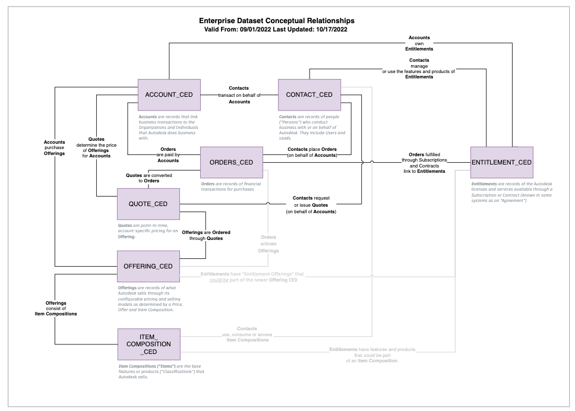

##Introduction

!!! info 
    "He who cannot describe the problem will never find the solution to that problem." - Confucius

**The problem**: Data at Autodesk is messy. Most employees struggle to describe how business concepts and datasets fit together. Years of rapid growth, disruptive business model transition and an ethos of "move fast and break stuff" have resulted in a data landscape that few understand how to connect and even fewer know how to describe. Let's change that.

The purpose of this article is to use conceptual and physical data modeling to simplify how data analysts and data scientists clarify and understand data at Autodesk. These techniques are not new, but they can be unfamiliar to members of the analytics community. This article presents a generalized and pragmatic approach to understand how to navigate Autodesk's "enterprise datasets" through the conceptual relationships that describe why they fit together and the physical relationships that describe how they fit together. The proof-of-concept models below are not official models. (There are no official models for the as-built state of Autodesk data.) They are point-in-time, "parsimonious" (aka "good-enough") accountings from we as the analyst community may find helpful. British statistician George Box wrote the aphorism that, "All models are wrong, but some are useful." By explicitly defining data perspectives commonly and transparently - right or wrong - the intent is to spark discussion and iterate to advance more standardized ways of discussing data.

Well documented architectural data models are not only important for system and data architects to build systems. They are also invaluable to end users as a roadmap or "wayfinder" method to build insights for the enterprise. Just like "geometric CAD models" allow building architects and mechanical engineers to better understand their projects, so could "informational data models" allow Autodesk's analytical community to better understand theirs - and drive innovation to realize the potential of Data-as-a-Product.

##Background
###What is DaaP?

"Data-as-a-Product" ("Daap") is when product-design principles are applied to data-products and the desired outcome is a positive end user experience. Achieving DaaP is a core goal within the Data Mesh philosophy whose primary goal is to gain value from data at scale within complex and large organizations.  Zhamak Dehghani, the author of Data Mesh - Delivering Data-Driven Value at Scale, extrapolates:

The motivations of data as a product are to:

- Remove the possibility of creating domain-oriented data silos by changing the relationship of teams with data. Data becomes a product that teams share rather than collect and silo.
- Create a data-driven innovation culture, by streamlining the experience of discovering and using high-quality data, peer-to-peer, without friction.
- Create resilience to change with built-time and run-time isolation between data products and explicitly defined data sharing contracts so that changing one does not destabilize others.
- Get higher value from data by sharing and using data across organizational boundaries. 
- **Source**: Dehghani; Data Mesh - Delivering Data_driven Value at Scale, 1st ed: 7, 29

Data visualization matters to realize the promise of DaaP because Dehghani presumes leaders, domain product owners, and end users possess communication methods necessary to share and use data across boundaries. Without common, simple methods to describe what teams need, DaaP cannot succeed. No one will understand each other.

##What is Data Modeling?

Steve Hoberman, the author of Data Modeling Made Simple describes data modeling as a set of symbols and text to communicate precise representation about information landscapes to simplify complex information:

!!! quote
    All models are wayfinding tools. A model is a set of symbols and text used to make a complex concept easier to grasp. The world around us is full of obstacles that can overwhelm our senses and make it very challenging to focus only on the relevant information needed to make intelligent decisions. A map helps a visitor navigate a city. An organization chart helps an employee understand reporting relationships. A blueprint helps an architect communicate building plans. The map, organization chart, and blueprint are all types of models that represent a filtered, simplified view of something complex, with the goal of improving a wayfinding experience by helping people understand part of the real world. (Hoberman; Data Modeling Made Simple, 2nd Ed; 12-13)

There are three types of data models: Conceptual, Logical and Physical. Conceptual models outline key ideas that are basic and critical to express a big picture idea or a business process. Logical data models expand on that concept by adding details to support the high-level concepts in the conceptual model. Physical models are what literally gets created in a database and describe how each concept manifests in tables and columns. The different levels of granularity enable different discussions based on the micro or macro needs of the business question to be solved.

#Enterprise Datasets Conceptual Data Model

Conceptual Data Models enable simple, educational, and clarifying conversations between stakeholders to concentrate on how key concepts relate to each other. It is tempting when discussing business challenges to use synonyms, and generalizations that can muddy descriptions and mask gaps in understanding. Conceptual models encourage specificity and brevity. Business leaders can derive value from conceptual data models by discerning both the big-picture and specific conceptual relationships on the same diagram. Individual contributors can cite a reference and answer with precision about why concepts are related. Conceptual data models are not literal connections. (They are not like a decision-tree or a "choose-your-own-adventure" book.) They focus on basic and critical ideas that the audience must know first before further specifics add complexity, exceptions, and nuance. 

##Conceptual Data Model

The Conceptual data model below summarizes how Accounts and Contacts transact within the Order process and utilize Autodesk's Entitlements. The boxes represent each Core Enterprise Dataset (CEDs) (collectively referable to other publicly curated analytical datasets as "Enterprise Datasets"). Each box has a definition explaining how they relate to Autodesk and the lines represent conceptual relationships between each dataset. They have a sentence to describe the connection between the boxes. Dark lines are clearly connected. Light lines are appropriate to discuss as connected for business-level associations, but the overlap between the connected concepts are less defined. Such distinction is not typical for conceptual models, but the reality is some concepts continue to be a work in progress. Autodesk introduced multiple business models over the last decade - and the data reflects that. Use of shading was an attempt to acknowledge the challenge without being overly distracting.

##The Core Enterprise Datasets Conceptual data model is shown below: 

[Confluence Source Page](https://wiki.autodesk.com/pages/viewpage.action?spaceKey=DR&title=Core+Enterprise+Datasets#expand-JoinAccountCEDtoContactCED)

At first glance, the mass of lines are overwhelming, but start first at the Account CED and move from box to box:

- **Accounts** are records that link business transactions to the organizations and individuals that do business with Autodesk.
- **People** ("humans") transact on behalf of **Accounts**
    - They do things like place **Orders**
- **Accounts** are important because they are the mechanism for how **Orders** are paid.
- **Orders** fulfilled through **Subscriptions** and **Contracts** link to **Entitlements**. 
- **Entitlements** are important because they are the enablement event that determine what products and services Accounts own and what Contacts use, manage or purchase. 

Once defined, these central connections can be extrapolated and expanded to other Enterprise data products like Opportunity:

Accounts provide sales Opportunities because Contacts provide compelling events to win Orders. The nuance about different types of Opportunities is avoided in the conceptual model, but by first establishing the overall idea and language about how Opportunities connect to other concepts it provides the foundation to progress discussions into more specifics. 

##Why Conceptual Data Models Matter for Analytics

Conceptual data models matter for analytics because they enable simple and precise business language to drive actionable analytical direction.  When a business stakeholder asks, "How many customers own AutoCAD?", a discussion with everyone looking at the same picture can yield the obvious observation that there is no mention of either a Customer or a Product in the high level CED landscape, but there is an explicitly answerable translation like "How many Accounts own Entitlements with access to AutoCAD?"  Strategic use of conceptual data models can deliver clearer technical execution that will result in more usable and useful insights.

##Enterprise Datasets Logical Data Model

The logical data model visualization phase was skipped for this proof-of-concept. Customarily a "logical" data model is produced in-between the conceptual and physical data modeling phases. They describe what details are necessary to answer, relate and connect concepts.  Logical data models represent the "ideal" table structures of the conceptual data model and exist independent of any physical limitation or constraint that could prevent them from being practically implemented into physical databases. This phase was skipped because the value of the exercise was to derive the conceptual business rules about why the CEDs and other enterprise datasets are the way they are and then map that logic to the actual physical implementation analysts need to navigate in Snowflake. In this case, adding the logical model would have been redundant. If the proof of concept were to expand to include multiple datastores (example: Snowflake versus Hive) a logical data model would make sense to describe the ideal state versus what was implemented.

##Enterprise Datasets Physical Data Model

Physical data models enable tactical discussions to describe what is actually possible with a dataset. They are detailed technical schematics of datasets that include tables, views, columns, cardinality, primary keys and foreign keys that the reader can query. When discussions move past conceptual business parameters to tactical execution, a well-illustrated physical data model is a critical reference. Clearly illustrating join paths (for columns whose names often do not match) enables clearer tactical explanations, faster onboarding and more consistent results. Business leaders can derive value from these diagrams by understanding what is straightforward to join versus what will require additional resources and time to navigate. Individual contributors can derive value from the diagram by using its preestablished knowledge base to save time and increase consistency instead of forging new paths alone.

##Physical Data Model

The physical data model below is an abridged list of attributes that highlight critical columns within a table along with the join keys necessary to enable connections to other tables and views within a database. Cardinality relationships (one-to-one, one-to-many, many-to-many) are defined at the join field level for each table/view - which is helpful to reference when determining query complexity and clarifying what columns join even if the names do not match. (Note, the physical data model below is somewhat irregular as it defines joins explicitly with lines at the field level. Most physical data models describe cardinality at the table level to minimize visual clutter. In this case, given the quantity of join fields and because Autodesk often does not standardize columns names between tables, it seemed helpful to define joins individually by column.)

The Core Enterprise Datasets physical data model is shown below: 

[Confluence Source Page](https://wiki.autodesk.com/pages/viewpage.action?spaceKey=DR&title=Core+Enterprise+Datasets#expand-JoinAccountCEDtoContactCED)

Again, at first glance, the mass of lines are overwhelming, but start first at the Account CED and move from box to box. To answer a question like "How many Accounts own Entitlements with access to AutoCAD?":

- Accounts are contained within the **ACCOUNT_EDP_OPTIMIZED** table
- **ACCOUNT_EDP_OPTIMIZED** connects to **ENTILEMENT_EDP_OPTIMIZED** though the **TRANSACTIONAL_ACCOUNT_MAPPING** table
    - This converts **SITE_UUID_CSNs** into **ACCOUNT_CSNs** which join to several columns (END_CUSTOMER_ACCT_CSN, RESELLER_CSN and/or SOLD_TO_CSN) depending on the business need.
        - In this case, the **END_CUSTOMER_ACCT_CSN** is the one to join to as it is the end customer account who owns the entitlement
        - The **ENTILEMENT_EDP_OPTIMIZED** table contains product related columns like PRODUCT_GROUP, OFFERING_NAME and/or FEATURE_NAME

Again, like in the Conceptual example, these connections can be extrapolated and expanded to other Enterprise data products like Opportunity:

##Why Physical Data Models Matter for Analytics

Physical data models matter for analytics because they enable transparent communication to succinctly cite and describe the data sources behind insights and conclusions. By outlining tables and joins paths visually it provides a record of what was done for others to verify and a roadmap for others to follow.

#Discussion

!!! question
    Does this article endorse building data models for analytical projects?

**Yes**. It is the hope of this article that data modeling becomes a standard practice for the analytical community to cite what they have done and be transparent about the data sources they use. It is the opinion of this article that this will enable the analytical community to better leverage each other's work, iterate transparently towards increasingly accurate models of "the truth," and unify on common, trusted language to maximize the breadth and reach of our collective insights. 

!!! question
    What happens when people disagree about what is documented? 

It is the hope that those that disagree say so and engage in the effort to make things better. The intent of this article is not to be the reference or source of truth for the above example, it is to demonstrate how to cultivate a "good-enough" view of the truth in the absence of overarching standards that everyone can benefit from. If you see something wrong in the models above, please speak up and let's keep the conversation going on slack at #EDM-ONE. Let's talk.

!!! question
    Why do I have to document things that should just be standards?

Standards often are a product of unifying the best of what people already do. The only way standardization could be possible is if the community has a starting point to rally around. 

!!! question
    This looks useful, but difficult. How might we make this simpler? 

It was difficult. Let's work on that. The technical tools and processes used in the above example are not sustainable of scalable. The "real" data modeling tool the architects use for the Apollo project is a tool called SQLDBM. A pilot is going to be done to see if this is practical to use for analytical modeling needs. 

!!! question
    What happens when data models aren't "wrong" but are just out-of-date?

Iteration needs to be part of whatever data modeling solution emerges as the standard. Point in time references are helpful to reference the past and know how we got here, but the aspiration needs to be a reliable way to update and make sure data models reflect the current state of the business. Furthermore, we need a better method to communicate changes in a way that is relevant and digestible by pairing changes with their impact. 

