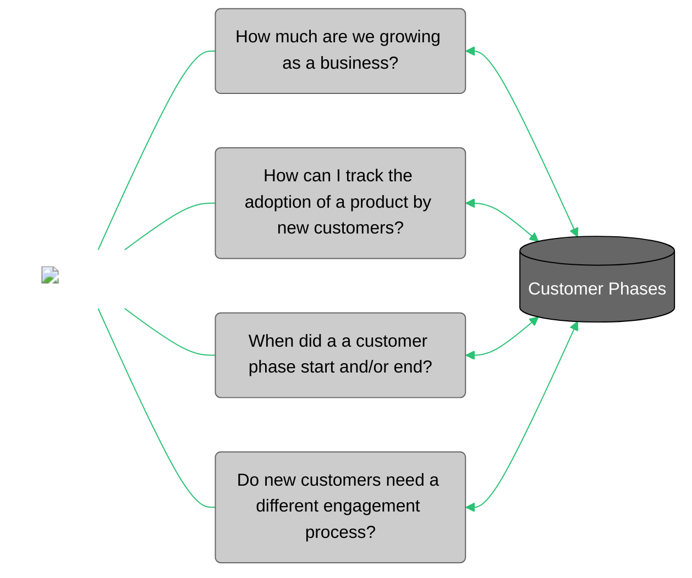

# Customer Phases

<div id="conceptual-guide-info-main">
  <ul>
    <li><strong>Subject Matter Expert:</strong> <a target="_blank" href="https://aware.autodesk.com/ameya.dattanand.kambli">Ameya Dattanand Kambli</a></li>
    <li><strong>Product Owner:</strong> <a href="https://aware.autodesk.com/ola.sadowska">Ola Sadowska</a></li>
    <li class="doc-status"><strong>Status:</strong> <span class="doc-ok">Published</span></li> 
   <!-- <li><strong class="doc-status">Status:</strong> <span class="doc-wip">In Progress</span></li>  -->
  </ul>
</div>


## :material-book:{ .red-icon-heading } Introduction

<h3>Definition</h3>

**Customer Phases is a concept that is used to understand the behaviour of customers in different stages during their process of acquiring an Autodesk license**.

It is represented on a table by categorizing each customer phase into a dimension (GEO, industry, customer size, etcetera) that can then be connected to other tables.

*Customer Phases* is also typically referred to as *Customer Purchase Phases*, and it was also known as *New Customer* in the past.

<figure markdown>
  { width="1280px" }
  <figcaption></figcaption>
</figure>

<!-- 
     *Required: Define the concept in one sentence with a bold font style.
     Optional: Add extra sentences, a list and/or an introductory paragraph to clarify what the concept is about or how it is represented.
     Optional: Include an image or a mermaid graph that provides a greater understanding.
-->

<h3>Purpose</h3>

The purpose of Customer Phases is to enable the Enterprise Data & Analytics (EDA) team to develop a segment for customers based on their purchase behaviour of recurring contracts in order to provide insights to the business.

!!! note
    - The term **Customer** refers to Parent Account CSN (Customer Service Number) mapped to their respective Surviving Account CSN that does recurring revenue generating business with Autodesk. 

## :material-connection:{ .green-icon-heading } Business Use Cases



Customer Phases provides clarification not only about the number of new customers that are achieved in a certain period, but also about their subscription status over time. Dividing customers into specific phases since the first time that they adopt an Autodesk product is a key strategy to detect areas of improvement within the business.

## :material-book-search:{ .purple-icon-heading } Background

<!-- Descriptive explanation about the concept -->

To start with, the project has two **phases** available, **Net New** and **New Again**, although there are a few other phases in the pipeline (*Lapsed*, *Re-engaged*, and *Retained*).

1. **Net New Customer:** In the context of this project, *Net New* customer at Autodesk is a commercial organization with a new recurring revenue transaction that have never had an AOV (Annual Order Value) before according to Finmart. The status of being a New Customer is defined at the level of the Parent Account CSN, and it should also apply to any child accounts. A Customer is considered 'Net New' for a period of 1 year.

2. **New Again Customer:** In the context of this project, it is said that a customer is *New Again* when they start their contract with recurring revenue (AOV) after a gap of over three years since their previous contract ended. The status of being a New Again is defined at the level of the Parent Account CSN, and it should also apply to any child accounts. A Customer is considered *New Again* for a period of one year.


### Workshop

<div class="iframe-wrapper">
  <iframe src="https://myshare.autodesk.com/personal/jasson_ji_autodesk_com/_layouts/15/embed.aspx?UniqueId=bd1e2b71-5924-4ee3-84e8-979f4c0d7d5a&embed=%7B%22ust%22%3Atrue%7D&referrer=StreamWebApp&referrerScenario=EmbedDialog.Create" width="853" height="480" frameborder="0" scrolling="no" allowfullscreen title="Customer Phase Workshop.mp4"></iframe>
</div>

!!! note
    - The term **contract** refers to contracts that are recurring in nature, or in other words have an AOV. As there are over 900+ SKUs (Stock Keeping Unit) that do not have AOVs, such as Fixed consulting, FEE: ACAD OEM ROYALTIES, Fixed fee consulting, Autocad Architecture Royalties, and more, it is possible for a Customer to have positive billings during a time period with no active contract having an AOV. These contracts are not taken into account when counting the *gap* between the new and old contracts.


## :material-database-settings:{ .yellow-icon-heading } How to Use the Data

Using this workflow, a Customer purchase phase table is generated at the Surviving Parent CSN + Start Date level. Only Surviving Parent CSNs that are visible in SFDC and non-individuals in the Account CED are included in this table. Customer purchase phases are identified along with the timeline of the phases.

!!! note
    Customer purchase phase is inherited by child level accounts from their parent account.

Before we learn to use the data, let's take a close look at how the dataset is created and what the different caveats are.

| FINAL_SURVIVING_PARENT_CSN | SETTLEMENT_START_DT | SETTLEMENT_END_DT | PREVIOUS_END_DATE | GAP (DAYS) | GAP(YEARS) | SETTLEMENT_START_DT_RANK | GAP RANK |
| :------------------------- | :------------------ | :---------------- | :---------------- | :--------- | :--------- | :----------------------- | :------- |
| 5100964972                 | 1/7/2016            | 1/6/2017          |                   |            |            | 1                        | 1        |
| 5100964972                 | 2/2/2020            | 2/2/2021          | 1/6/2017          | 1122       | 3.07       | 3                        | 2        |
| 5100964972                 | 4/27/2020           | 9/7/2021          | 1/6/2017          | 1207       | 3.67       | 4                        | 3        |

As you can see, the granularity of the table is at the Parent CSN level. We can also see several settlement start and end dates. These dates belongs to the children of the Parent CSN. `settlement_start_dt_rank` identifies the minimum date which is later referred to as start date of a Parent CSN, meaning the date on which they started a transaction of recurring nature with Autodesk.

Furthermore, the `gap` column counts the days between end date of pervious contract and start of next contract. If the gap is greater than 3 years then on the day of next contract start date, a customer becomes 'new again'.

If you take a closer look at the table, after the first contract ended, the next contract started on 2/2/2020 and 4/27/2020 (which is over our threshold of 3 years with no active AOV).The earliest start date (2/2/2020) is chosen in such a scenario since all subsequent start date (4/27/2020) in reality started when contract (2/2/2020) is already active.

To summarize, Customers are identified as *Net New* when `settlement_start_dt_rank = 1` (i.e., the start date of their first contract with active AOV), or *New Again* when the years gap is greater than 3 from the first contract + the gap rank is equal to 1 (due to no active AOV in the last three years).

All `settlement_end_dt` include 30 days of grace period in this dataset.

### Applications

#### 1. To count customers Active or Acquired through specific time Period

- **Active new customers:** These are customers who are in the **Net New** or **'New Again'** phase for at least 1 day in a quarter. To calculate this, you need to track the start and end dates of the "New customer" phase for each customer. If a customer's "New customer" phase falls within the quarter and lasts for at least 1 day, they are considered an active new customer for that quarter.

- **Acquired in quarter:** These are **'Net New'** or **'New Again'** who have their contract start date within the quarter. You need to track the contract start dates for each customer and determine if they fall within the specified quarter.


##### Application Example

??? example "Calculate New Customers at the granularity of quarter (FY24-Q1)"
    ###### Example 1

    For example, let's calculate New customers at the granularity of quarter (FY24-Q1). We can apply similar logic to calculate the between a custom date range, month, year.

    | Parent CSN | Customer Phase Start Date | Customer Phase End Date | Target Quarter Start Date | Target Quarter End Date | Active New Customer? | Acquired in Quarter? |
    | ---------- | ------------------------- | ----------------------- | ------------------------- | ----------------------- | -------------------- | -------------------- |
    | 5100964972 | 2023-01-15                | 2024-01-15              | 2023-04-01                | 2023-06-30              | Yes                  | No                   |
    | 9100964973 | 2022-11-01                | 2023-11-01              | 2023-04-01                | 2023-06-30              | Yes                  | No                   |
    | 6100922922 | 2023-05-01                | 2024-05-01              | 2023-04-01                | 2023-06-30              | Yes                  | Yes                  |

    **^^Sample code:^^**

    ``` sql linenums="1"
    WITH raw_data AS
          (SELECT DISTINCT parent_csn,
                          customer_phase_start_date,
                          customer_phase_end_date,
                          customer_phase
          FROM   eio_publish.customer_shared.customer_phases
          WHERE  1=1
          AND customer_phase IN ( 'Net New', 'New Again' )
          )
    --- target customer phase
    ,
      target_quarter AS
          (SELECT *,
                  '2023-02-01' AS target_quarter_start_date ,
                  '2023-04-30' AS target_quarter_end_date
          FROM   raw_data
          )
    SELECT target_quarter.*,
        CASE
          WHEN customer_phase_end_date >= target_quarter_start_date THEN 'TRUE'
          ELSE 'FALSE'
        END AS active_new_customer_flag,
        CASE
          WHEN customer_phase_start_date BETWEEN
                target_quarter_start_date AND target_quarter_end_date THEN 'TRUE'
          ELSE 'FALSE'
        END AS acquired_in_quarter_flag
    FROM   target_quarter
    WHERE  customer_phase_start_date <= target_quarter_end_date;
    ```


### Data Sources

#### Source Systems

##### Snowflake

| Schema/Database                                 | View/Table                          | Basic Filters                                                                                                                               |
| ---------------------------------------------- | :---------------------------------- | :------------------------------------------------------------------------------------------------------------------------------------------ |
| EDM_PUBLISH.EDM_PUBLIC                          | VICTIM_SURVIVOR_MAPPING             | |
| ADP_WORKSPACES.CUSTOMER_SUCCESS_FINANCE_PRIVATE | SUBS_BILLED_SEATS_FINMART           | BILLED_USD_AMT >0 & NET3_AOV_CC> 0 ---We want the first >0 transaction that lead to recurring revenue & SETTLEMENT_START_DT<=current_date() |
| ADP_PUBLISH.ACCOUNT_OPTIMIZED                   | ACCOUNT_EDP_OPTIMIZED               | IS_VISIBLE_IN_SFDC = TRUE & SITE_INDIVIDUAL_FLAG= FALSE                                                                                     |
| ADP_PUBLISH.ACCOUNT_OPTIMIZED                   | TRANSACTIONAL_CSN_MAPPING_OPTIMIZED |
| ADP_PUBLISH.COMMON_REFERENCE_DATA_OPTIMIZED     | DATE_TIME_HIERARCHY                 |

### Output Tables

| Schema/Database | Table/View | Roles with Access | Notes |
| --------------- | ---------- | ----------------- | ----- |
| EIO_PUBLISH.CUSTOMER_SHARED | [`CUSTOMER_PHASES`](https://autodesk.atlan.com/assets/8ce20999-1cf0-42ab-b66d-507a52818401/overview) | ADP_PUB_RO_GROUP | |


### Access pattern

- Snowflake access to ADP_PUB_RO_GROUP is required. Please go to the [Access ADP Snowflake](../../onboarding/How-Tos/how-to-test/access-adp-snowflake.md)

### Data Dictionary

- [Data Catalog Reference](https://autodesk.atlan.com/assets/8ce20999-1cf0-42ab-b66d-507a52818401/overview)

### Load Frequency

- Daily


### Use Cases with Sample Queries

??? abstract "1. Find start and end date of a customer phase"
    #### Sample query 1

    ``` sql linenums="1"
    SELECT parent_csn
    , customer_phase
    , customer_phase_start_date
    , customer_phase_end_date
    FROM
    eio_publish.customer_shared.customer_phases
    WHERE customer_phase ='net new'
    ```

??? abstract "2. Find total Net New customer per quarter"
    #### Sample query 2

    ``` sql linenums="1"
    SELECT
    start_fiscal_year_quarter
    ,count(DISTINCT parent_csn)
    FROM
    eio_publish.customer_shared.customer_phases
    GROUP BY start_fiscal_year_quarter
    ```

??? abstract "3. Find details about customer's phase as"
    #### Sample query 3

    ``` sql linenums="1"
    WITH FILTER AS (SELECT
    parent_csn, count(customer_phase)
    GROUP BY parent_csn
    HAVING count(customer_phase) >1)
    SELECT * FROM
    eio_publish.customer_shared.customer_phases
    WHERE parent_csn IN (SELECT parent_csn FROM FILTER)
    ```

??? abstract "4. Check all customers in net new phase on May 31st 2020"
    #### Sample query 4

    ``` sql linenums="1"
    SELECT parent_csn
    , customer_phase
    , customer_phase_start_date
    , customer_phase_end_date
    FROM
    eio_publish.customer_shared.customer_phases
    WHERE 1=1
    AND customer_phase ='New Again'
    AND '2020-05-31' BETWEEN customer_phase_start_date AND customer_phase_end_date
    ```


### Caveats & Clarifications

!!! note "Specifications"

    - **Customer Purchase Phase: Net New.** As Finmart has data 2016 and onwards, the customers identified as 'net new' in 2016, 2017 and 2018 could be an existing customer before 2016.  
    - **Parent-Child Hierarchy.** The accuracy of phases of customers depends heavily on how well the enrichment services can identify the relationships between CSNs. Not only could a customer have been identified as new because of their first transaction, but also because they had never been properly parented.
    - **Non-recurring Billings Transaction.** Transactions of non-recurring nature are out of scope.
    - **Customer Purchase Phase.** Customer can be 'Net New' only once, but it can be 'New Again' several times.
    - **Contract/settlement End Date.** The element of 30 days of grace period is added to all the contract/settlement end date in this dataset.
    - **Table Refresh.** We don't perform incremental load, the, entire table is refreshed daily to ensure the we capture the latest merges and update the dataset accordingly.

!!! warning "Known issues"

    No known issues.
