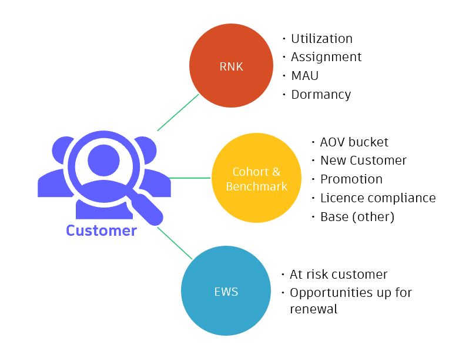
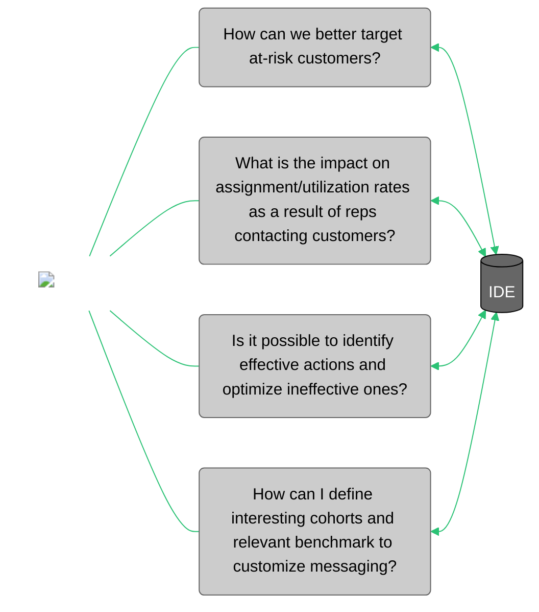

# Insights Driven Engagement (IDE)

<div id="conceptual-guide-info-main">
  <ul>
    <li><strong>Subject Matter Expert:</strong> <a target="_blank" href="https://aware.autodesk.com/chen.chen">Chen Chen</a></li>
    <li><strong>Product Owner:</strong> <a target="_blank" href="https://aware.autodesk.com/justin.wong">Justin Wong</a></li>
    <li class="doc-status"><strong>Status:</strong> <span class="doc-ok">Published</span></li>
    <!-- <li><strong class="doc-status">Status:</strong> <span class="doc-wip">In Progress</span></li> -->
  </ul>
</div>

## :material-book:{ .red-icon-heading } Introduction

<h3>Definition</h3>

**Insights Driven Engagement is a new generation of customer success and digital engagements that​ provides better targeting, more context, and a foundation to ​measure performance of those actions.**

It is represented on a table that brings together data from 3 different programs into one solution:

1. Early Warning System (EWS)
  > Filter out healthy customers, leaving only ​at-risk opportunities for CCS to focus on
2. Reps New KPI (RNK) 
  > Provides performance metrics​ (assignment/usage) for each customer 
3. Customer cohort & benchmark information
  > Provide the context to interpret a customer's performance metric - "too low" or "too high" 

<figure markdown>
  { width="500px" }
  <figcaption>IDE source overview</figcaption>
</figure>


<h3>Purpose</h3>

The purpose of IDE is to empower Customer Success reps with a more robust framework for managing CS actions and digital engagements. It aims to create specialized predictive actions, across various cohorts to proactively engage and target at-risk customers. By leveraging 10+ unique actionable reasons (3 max per customer) CS reps can have more meaningful conversations and address retention risks.

!!! note
    - IDE actions are triggered at child account level. Depending on customer behavior, you may receive multiple IDE actions per parent account level. 

## :material-connection:{ .green-icon-heading } Business Use Cases



For example, a business situation where IDE could help would be the following one: customer ABC is new to Autodesk and has been identified to have low assignment (40% as oppose to 60%) and low number of active users (30% as opposed to 50%) as concerns.


## :material-book-search:{ .purple-icon-heading } Background

<!-- Descriptive explanation about the concept -->

Previously, there was an initiative being led by the Growth Strategy & Insights Team in partnership with Step Function (3rd party tool) called **Predictive Insights**. A pilot ran in late 2022 with encouraging pilot participant feedback.

Currently we have pieces in place that we believe can mimic the same outcome. Ultimately the project is looking to improve the existing CS Action framework by: 

1. Providing system to develop highly targeted actions meant to improve specific low performing metrics for customers who need it most. These actions can be both Human and Digital interactions. 
2. Providing framework for measuring the effectiveness of CS actions so that CS leadership can make investment decisions on which plays to prioritize. 
3. Extension of #1 and #2; target specific at-risk cohorts with specialized messaging/actions that can later be measured to understand if we are improving the renewal state within that population.

By providing this new framework for creating actions, we can look to replace the existing SF/Predictive Insights initiative.


<!-- Note for template: Add optional standard visual elements (mermaid graph, image, video, etc -->

!!! note
    There are some thoughts on whether we can surface this as an interface within SFDC. Although this is something we can collaborate on; this PRD won't specifically call this out as it isn't necessarily required to complete our goals (and keep parity with SF).


### Workshop

<div class="iframe-wrapper">
  <iframe src="https://share.autodesk.com/sites/CSDataAnalytics/_layouts/15/embed.aspx?UniqueId=19496300-b9a3-4091-9c21-36408e6a83d4&embed=%7B%22ust%22%3Atrue%2C%22hv%22%3A%22CopyEmbedCode%22%7D&referrer=StreamWebApp&referrerScenario=EmbedDialog.Create" width="853" height="480" frameborder="0" scrolling="no" allowfullscreen title="IDE-overview-EAXallHands2023.05.mp4"></iframe>
</div>


## :material-database-settings:{ .yellow-icon-heading } How to Use the Data

Before we learn to use the data, let's take a close look at how the dataset is created and what the different caveats are.

Below is the general step in how actions will be built:

1. Identify the list of at-risk customers (Opportunities) that are up for renewal from EWS.   
2. For each at-risk customer:
   >-  2.a Look up if the at-risk customer belongs to any specific ADSK Cohort interest groups.  
   >-  2.b Check the customer metric (typically usage and assignment) on RNK.  Compare that against the Benchmarks  for the customer's Cohort segment. Flag all indicators of low performance
3. Create a new table or view that contains the output of 2a and 2b for convenience of analysis and JOE action creation.
4. Based on the output for 3; create very specific targeted actions that have clear goals:
Example: Customer ABC is new to ADSK and has been identified to have low assignment (40% as oppose to 60%) and low number of active users (30% as oppose to 50%) as concerns. 


!!! note
    The next step is then create a series of easily (and hopefully automated) generated reports that show the before and after results of CCS executing on IDE actions.

    | Name | LifeCycle | Key |
    | :--- | :-------- | :-- |
    | IDE - Low Assignment & Dormancy - Promo - Adopt | Adopt | IDE-LowAssignment&Dormancy-Promo-Adopt |
    | IDE - Dormancy - FYC & Promo - Extend | Renew | IDE-Dormancy-FYC&Promo-Extend |


### Applications 

#### 1. Enrich IDE table with opportunity and account CED tables.
 
##### Application Example

??? example "Pulling opportunities with low assignment rate and low utilisation rate for sales reps to generate actions"        

    ###### Sample table

    |ORIGINAL_ACCOUNT_CSN|SURVIVING_ACCOUNT_CSN|SITE_GEO|ORIGINAL_ACCOUNT_NAMED_ACCOUNT_GROUP|OPPORTUNITY_ID|OPPORTUNITY_CREATED_DATE|OPPORTUNITY_CLOSE_DATE|SNAPSHOT_YEAR|SNAPSHOT_MONTH|SNAPSHOT_DATE|CONTRACT_ID|TENANT_ID|PRODUCT_OFFERING|OFFERING_PRODUCT_LINE_CODE|SEATS_PURCHASED|SEATS_ASSIGNED|MAU|ASSIGNMENT_RATE|USAGE_RATE|UTILISATION_RATE|CUSTOMER_EWS_PREDICTION|CUSTOMER_ACTIVE_AOV_NET3|CUSTOMER_AOV_BAND|OPPORTUNITY_LC_FLAG|OPPORTUNITY_PROMO_FLAG|PARENT_ACCOUNT_NEW_CUSTOMER_FLAG|BASE_FLAG|SEAT_BUCKET|DORMANCY_FLAG|ASSIGNMENT_BENCHMARK_USE_PHASE|ASSIGNMENT_BENCHMARK_EXTEND_PHASE|ASSIGNMENT_BENCHMARK_USE_PHASE_DIFF|ASSIGNMENT_BENCHMARK_EXTEND_PHASE_DIFF|USE_PHASE_LOW_UTILISATION|EXTEND_PHASE_LOW_UTILISATION|OWNERID|P4PIGS__C|INDUSTRY_GROUP__C|CCS_SEGMENT__C|ACV_USD__C|OPPORTUNITY_AMOUNT__C|OPPORTUNITY_NUMBER__C|COUNTRY__C|STATE_PROVINCE__C|ZIP_ABBREVIATION__C|DAYS_INTO_TERM__C|
    |:----|:----|:----|:----|:----|:----|:----|:----|:----|:----|:----|:----|:----|:----|:----|:----|:----|:----|:----|:----|:----|:----|:----|:----|:----|:----|:----|:----|:----|:----|:----|:----|:----|:----|:----|:----|:----|:----|:----|:----|:----|:----|:----|:----|:----|:----|
    |5110331093|5110331093|EMEA|Territory|0063g00000GS57vAAD|2023-03-24|2026-03-23|2,023|5|2023-05-31|110004330087|9183448|NINCAD|PDCOLL|8|6|1|75|17|13| |23,909.6395446607|AOV: $10k+|TRUE|FALSE|FALSE|FALSE|8 Seat|FALSE|87.5|87.5|-12.5|-12.5|FALSE|FALSE|0053A00000EMt8WQAT|MFG|AEC|Supported|8,092.21|23,062.8|A-20091529|Czech Republic|vysočina|582|82|
    |5129356206|5129356206|APAC|Territory|0063g00000EqJvqAAF|2022-09-28|2023-10-11|2,023|5|2023-05-31|110004141592|32211102|AECCOL|AECCOL|1|1|0|100|0|0|0.1929136664|7,449.3641551|AOV: $5-10k|TRUE|FALSE|FALSE|FALSE|1 Seat|TRUE|100|100|0|0|FALSE|FALSE|0053A00000EMt8WQAT|AEC|AEC|Supported|2,958.78|396,476.9|A-18584449|Japan|山口県|753|179|
    |5122872347|5122872347|APAC|Territory|0063g00000C4K5PAAV|2021-12-03|2024-12-06|2,023|5|2023-05-31|110003818077|20771340|ACD|AECCOL|17|13|3|76.5|23|18| |17,669.61233037|AOV: $10k+|TRUE|FALSE|FALSE|FALSE|11+ Seat|FALSE|85|87.5|-8.5|-11|TRUE|TRUE|0053A00000EMt8WQAT|Unknown|EDU|Supported|17,459|52,377|A-15951354|China|Anhui|231|554|


    ###### Sample code

    ``` sql linenums="1"
    WITH max_offering_use AS(
    -- check utilisation across entire offering
    SELECT 
        opportunity_id
        ,offering_product_line_code
        ,contract_id
        ,tenant_id

        ,CASE WHEN MAX(utilisation_benchmark_use_phase_diff) < 0 THEN TRUE ELSE FALSE END AS use_phase_low_utilisation 
        ,CASE WHEN MAX(utilisation_benchmark_extend_phase_diff) < 0 THEN TRUE ELSE FALSE END AS extend_phase_low_utilisation 
        FROM eio_publish.engagement_shared.ide_cohort_benchmark_monthly --pending final table name
        GROUP BY
        opportunity_id, offering_product_line_code, contract_id, tenant_id
      )

        ,filter_opps AS(
        -- get opps which are flagged by at least one action
        SELECT DISTINCT 
          b.original_account_csn
          ,b.surviving_account_csn
          ,b.site_geo
          ,b.original_account_named_account_group
          ,b.opportunity_id
          ,b.opportunity_created_date
          ,b.opportunity_close_date
          ,b.snapshot_year
          ,b.snapshot_month
          ,b.snapshot_date
          ,b.contract_id
          ,b.tenant_id
          ,b.product_offering
          ,b.offering_product_line_code
          ,b.seats_purchased
          ,b.seats_assigned
          ,b.mau
          ,b.assignment_rate
          ,b.usage_rate
          ,b.utilisation_rate
          ,b.customer_ews_prediction
          ,b.customer_active_aov_net3
          ,b.customer_aov_band
          ,b.opportunity_lc_flag
          ,b.opportunity_promo_flag
          ,b.parent_account_new_customer_flag
          ,b.base_flag
          ,b.seat_bucket
          ,b.dormancy_flag
          ,b.assignment_benchmark_use_phase
          ,b.assignment_benchmark_extend_phase
          ,b.assignment_benchmark_use_phase_diff
          ,b.assignment_benchmark_extend_phase_diff

          ,mou.use_phase_low_utilisation
          ,mou.extend_phase_low_utilisation
          ,a.ownerid
          ,a.P4PIGS__c
          ,a.Industry_Group__c
          ,a.CCS_Segment__c
          ,o.acv_usd__c
          ,o.opportunity_amount__c
          ,o.opportunity_number__c
          ,a.Country__c
          ,a.State_Province__c
          ,a.Zip_Abbreviation__c
          ,o.days_into_term__c
        FROM eio_publish.engagement_shared.ide_cohort_benchmark_monthly b  --pending final table name
          LEFT JOIN max_offering_use mou
              ON mou.opportunity_id=b.opportunity_id
                  AND mou.offering_product_line_code=b.offering_product_line_code 
                  AND mou.contract_id=b.contract_id 
                  AND mou.tenant_id=b.tenant_id 
          LEFT JOIN bsd_publish.sfdc_shared.opportunity o
              ON b.opportunity_id=o.id
          LEFT JOIN bsd_publish.sfdc_shared.account a
              ON o.accountid = a.id
          LEFT JOIN BSD_PUBLISH.SFDC_SHARED.SERVICECONTRACT sc
              ON o.service_contract__c=sc.id
          LEFT JOIN BSD_PUBLISH.SFDC_SHARED.contractlineitem l
              ON sc.id = l.servicecontractid
        WHERE
        --customer_ews_prediction < 0.3
        --AND customer_ews_prediction IS NOT NULL
          CUSTOMER_AOV_BAND IN ('AOV: $5-10k', 'AOV: $10k+')
          AND opportunity_close_date > '2023-06-22'::date
          AND snapshot_date = '2023-05-31'
          AND LOWER(ORIGINAL_ACCOUNT_NAMED_ACCOUNT_GROUP) IN ('territory', 'individual', 'unknown', 'strategic territory mature', 'strategic territory emerging','midmarket','midmarket federal','emerging strategic account')
          AND LOWER(b.offering_product_line_code) NOT IN ('premsub','collrp','bimcoll','tflex','eflex','mflex')
          AND IS_RENEWAL_OPPORTUNITY__C = TRUE 
          AND o.term__c IN ('Annual', '3-Year') 
          AND o.territory_account_tier__c IN ('Tier 1', 'Tier 2', 'Tier 3', 'Supported', 'Digital Only')
          AND ispartner__c = FALSE
          AND (dormancy_flag = 1
              OR assignment_benchmark_extend_phase_diff < 0
              OR extend_phase_low_utilisation < 0
              OR assignment_benchmark_use_phase_diff < 0
              OR use_phase_low_utilisation < 0)
      )

      ,max_opp as(
      -- get opp with max ACV per account
          SELECT 
              a.ORIGINAL_ACCOUNT_CSN
              ,MAX(a.acv_usd__c) as max_aov
          FROM filter_opps a
              left join filter_opps b
                  on (a.ORIGINAL_ACCOUNT_CSN=b.ORIGINAL_ACCOUNT_CSN)
          GROUP BY
              a.ORIGINAL_ACCOUNT_CSN
      )

      ,tie_back_to_opp AS (
      -- 
          SELECT 
              a.ORIGINAL_ACCOUNT_CSN
              ,MAX(a.opportunity_id) as opportunity_id
          FROM filter_opps a
              LEFT JOIN max_opp b
                  ON (a.ORIGINAL_ACCOUNT_CSN=b.ORIGINAL_ACCOUNT_CSN AND b.max_aov=a.acv_usd__c)
          GROUP BY
              a.ORIGINAL_ACCOUNT_CSN
      )

      SELECT b.*
      FROM tie_back_to_opp a
          INNER JOIN filter_opps b
              ON a.ORIGINAL_ACCOUNT_CSN=b.ORIGINAL_ACCOUNT_CSN AND a.opportunity_id=b.opportunity_id
    ```

### Data Sources

#### Source Systems

#####  Snowflake

| Schema/Database  | View/Table | Basic Filters |
| :----------------| :----------| :---------------- |
| eio_publish.engagement_shared | [ide_cohort_benchmark_monthly](https://autodesk.atlan.com/assets/eb5a21c0-72f7-4eea-a678-8a7132b58bb0/overview) |   |  

#### Load Frequency  
- Monthly, following RNK refresh.

#### Table preview

|ORIGINAL_ACCOUNT_CSN|SURVIVING_ACCOUNT_CSN|OPPORTUNITY_ID|SNAPSHOT_DATE|TENANT_ID|PRODUCT_OFFERING|OFFERING_PRODUCT_LINE_CODE|CONTRACT_ID|SITE_GEO|ORIGINAL_ACCOUNT_NAMED_ACCOUNT_GROUP|OPPORTUNITY_CREATED_DATE|OPPORTUNITY_CLOSE_DATE|SNAPSHOT_YEAR|SNAPSHOT_MONTH|SEATS_PURCHASED|SEATS_ASSIGNED|MAU|ASSIGNMENT_RATE|USAGE_RATE|UTILISATION_RATE|CUSTOMER_EWS_PREDICTION|CUSTOMER_ACTIVE_AOV_NET3|CUSTOMER_AOV_BAND|OPPORTUNITY_LC_FLAG|OPPORTUNITY_PROMO_FLAG|PARENT_ACCOUNT_NEW_CUSTOMER_FLAG|BASE_FLAG|SEAT_BUCKET|DORMANCY_FLAG|ASSIGNMENT_BENCHMARK_USE_PHASE|ASSIGNMENT_BENCHMARK_EXTEND_PHASE|ASSIGNMENT_BENCHMARK_USE_PHASE_DIFF|ASSIGNMENT_BENCHMARK_EXTEND_PHASE_DIFF|UTILISATION_BENCHMARK_USE_PHASE|UTILISATION_BENCHMARK_EXTEND_PHASE|UTILISATION_BENCHMARK_USE_PHASE_DIFF|UTILISATION_BENCHMARK_EXTEND_PHASE_DIFF|COHORT_BENCHMARK_USED|INSERT_DT|UPDATE_DT|
|:----|:----|:----|:----|:----|:----|:----|:----|:----|:----|:----|:----|:----|:----|:----|:----|:----|:----|:----|:----|:----|:----|:----|:----|:----|:----|:----|:----|:----|:----|:----|:----|:----|:----|:----|:----|:----|:----|:----|:----|
|5130161532|5130161532|0063A0000172wxTQAQ|2022-02-28|6883003|ACD|ACDIST|110002560548|APAC|Emerging Strategic Account|2019-03-26|2022-03-23|2,022|2|30|20|4|66.7|20|13|0.30110613|291,242.1087909402|AOV: $10k+|FALSE|FALSE|FALSE|TRUE|11+ Seat|FALSE|81.8|82.4|-15.1|-15.7|50|50|-37|-37|Default|2023-06-29|2023-06-29|
|5130175114|5130175114|0063g00000ELjcaAAD|2022-12-31|12684285|ACD|AECCOL|110003288006|AMER|Midmarket|2022-10-18|2023-10-20|2,022|12|25|25|20|100|76|76|0.7124630213|74,988.55|AOV: $10k+|FALSE|FALSE|FALSE|TRUE|11+ Seat|FALSE|81.8|82.4|18.2|17.6|50|50|26|26|Default|2023-06-29|2023-06-29|

### Access pattern

- Snowflake access to ADP_PUB_RO_GROUP is required. Please raise access request through [ADP request form](https://autodesk.service-now.com/helphub?id=evg_sc_cat_item&sys_id=0523ce01dbc9bc503bb20825ca9619d1)
- [Data Catalog Reference](https://autodesk.atlan.com/assets/eb5a21c0-72f7-4eea-a678-8a7132b58bb0/overview)
- GitRepo: [https://git.autodesk.com/gro-eda/eda-eax-analytics/tree/master/IDE/ide_base](https://git.autodesk.com/gro-eda/eda-eax-analytics/tree/master/IDE/ide_base)

### Use Cases with Sample Queries

??? abstract "1. Find out all opportunities associated with low utilization rate during 'use' and 'extend' phase for month of May 2023"
    #### Sample query 1

    ``` sql linenums="1"
    SELECT 
      opportunity_id
      ,offering_product_line_code
      ,contract_id
      ,tenant_id
      ,CASE WHEN MAX(utilisation_benchmark_use_phase_diff) < 0 THEN TRUE ELSE FALSE END AS use_phase_low_utilisation 
      ,CASE WHEN MAX(utilisation_benchmark_extend_phase_diff) < 0 THEN TRUE ELSE FALSE END AS extend_phase_low_utilisation 
    FROM eio_publish.engagement_shared.ide_cohort_benchmark_monthly 
    WHERE snapshot_date = '2023-05-31'
    GROUP BY
      opportunity_id, offering_product_line_code, contract_id, tenant_id
      HAVING MAX(utilisation_benchmark_use_phase_diff) < 0 AND MAX(utilisation_benchmark_extend_phase_diff) < 0

    ```

??? abstract "2. To find out all opportunities associated with low assignment rate during 'extend' phase but normal assignment rate during 'use' phase for month of May"
    #### Sample query 2

    ``` sql linenums="1"
    SELECT 
    opportunity_id
    ,offering_product_line_code
    ,contract_id
    ,tenant_id

    ,CASE WHEN MAX(assignment_benchmark_use_phase_diff) < 0 THEN TRUE ELSE FALSE END AS use_phase_low_assignment
    ,CASE WHEN MAX(assignment_benchmark_extend_phase_diff) < 0 THEN TRUE ELSE FALSE END AS extend_phase_low_assignment
    FROM eio_publish.engagement_shared.ide_cohort_benchmark_monthly
    WHERE snapshot_date = '2023-05-31'
    GROUP BY
        opportunity_id, offering_product_line_code, contract_id, tenant_id
        having MAX(assignment_benchmark_use_phase_diff) >= 0 and MAX(assignment_benchmark_extend_phase_diff) < 0

    ```

??? abstract "3. Find opportunities in AMER that are dormant for May 2023"
    #### Sample query 3

    ``` sql linenums="1"
    SELECT 
    opportunity_id
    ,offering_product_line_code
    ,product_offering
    ,contract_id
    ,tenant_id
    ,mau
    ,seats_assigned
    ,seats_purchased
    ,dormancy_flag
    FROM eio_publish.engagement_shared.ide_cohort_benchmark_monthly 
    WHERE snapshot_date = '2023-05-31'
    AND dormancy_flag = TRUE
    AND site_geo = 'AMER'
    ```

### Caveats & Clarifications

!!! note "Specifications"
    1. EWS Availability: EWS scores are generated starting one(1) year from the expiration of an AIR opportunity, so for example, if an opportunity has an open period of three(3) years, it will still be tracked in the table as long as it is open, but might not have EWS score associated with it for the first two years.
    2. Opportunity Join RNK on the offering `productline_code`: We still not able to associate exact product usage with specific opportunity, instead we join opportunity's product code with RNK's offering product line code.

!!! warning "Known issues"

    No known issues.


## :material-link:{ .grey-icon-heading } Related Links

- [Insights Driven Engagement (IDE) Actions FAQ](https://one.autodesk.com/WWFO-GR/articles/3551207547732dd068e90c45f16d43c1)
- [Early Warning System (EWS)](https://wiki.autodesk.com/pages/viewpage.action?pageId=1037285453)
- [Reps New KPI (RNK)](https://wiki.autodesk.com/pages/viewpage.action?pageId=1502578701)
- [Cohort Creation Methodology](https://wiki.autodesk.com/display/EAX/Cohort+Creation+Methodology)
- [Benchmarking Methodology](https://wiki.autodesk.com/display/EAX/Benchmarking+Methedology)
- [IDE Prototype - DE hand-off](https://wiki.autodesk.com/pages/viewpage.action?pageId=1737201160)
- [IDE Pilot Launch](https://wiki.autodesk.com/display/GROEDA/16.+IDE+Pilot+Launch)
- [EEP Documentation](https://wiki.autodesk.com/display/DPED/Insights+Driven+Engagement)
