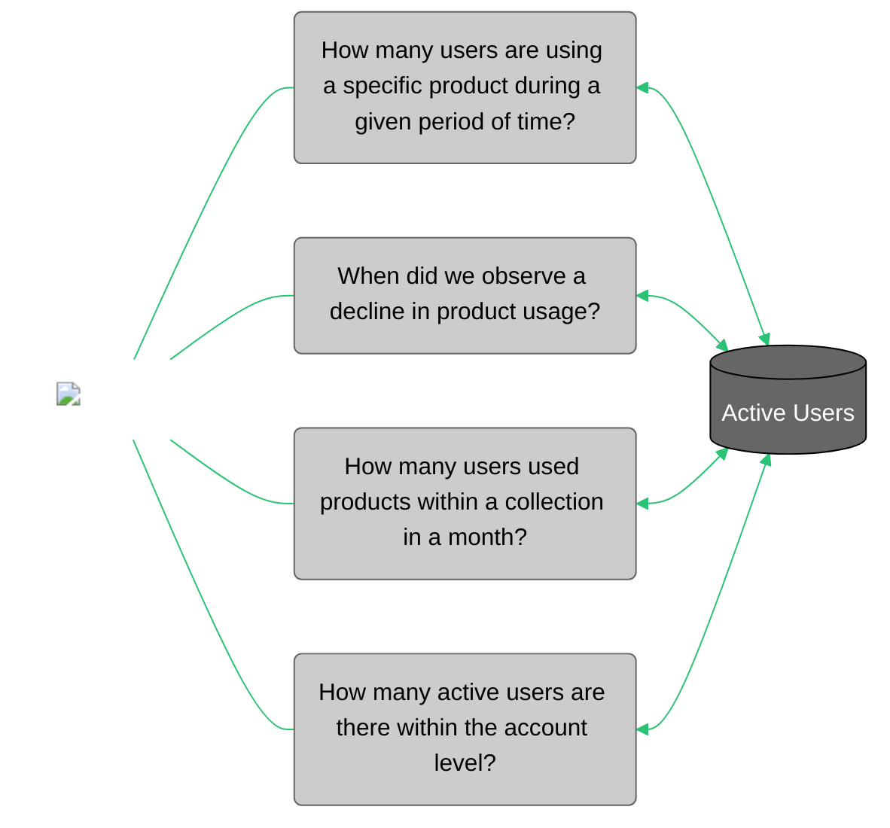

<div id="metric-template-info-main">
  <ul>
    <li><strong>Subject Matter Expert:</strong> <span id="metric-sme">
      <a target="_blank" href="https://aware.autodesk.com/eveline.surbakti">Eveline Surbakti</a>
    </span></li>
    <li><strong>Product Owner:</strong> <span id="metric-po">
      <a target="_blank" href="https://aware.autodesk.com/ola.sadowska">Ola Sadowska</a>
    </li>
    <li class="doc-status"><strong>Status:</strong> <span class="doc-ok">Published<span></li>
    <!-- <li><strong class="doc-status">Status:</strong> <span class="doc-wip">In Progress</span>.</li> -->
  </ul>
</div>


## :material-chart-bar:{.red-icon-heading} Introduction

Active Users indicates the number of users per product that have used ADSK (Autodesk) products at least once in a given time period.

The purpose of this metric is to provide software product managers and federated analysts with a standard measure of customer activity to enable analysis and informed decisions about customer growth, engagement outcomes and behavioral patterns.

!!! note "Notes"

    - This metric is built from the [Product Usage dataset](https://eda-data-docs.autodesk.com/customer-domain/usage/product-usage).
    - Active Users was previously known as Monthly Active Users (MAU).
    

## :material-connection:{ .green-icon-heading } Business use cases



The Active Users metric helps us understand how useful or common an Autodesk product is based on the number of users that are using it in a specific period of time. Besides calculating at a product level, it can also take into account a product collection or offering level, as well as whether usage is allocated to a parent or child account taking the tenant model and subscription relation into consideration.


## :material-database-settings:{ .purple-icon-heading } Metric details


### Overview
    
#### What does this metric measure?

Active Users measures the number of users (`oxygen_id`) that have authorized and/or used ADSK products at least once in a given time period. Time periods can be defined based on the requirement of the business question at hand. Repeat active users are users who have used the products in both the current period and the period immediately prior.


##### What counts as an active user?

An "active" user has authorized and/or used the product at least once in a given time period (based on the unique event timestamp date). Coverage depends on the product's ability to send data back to Autodesk.

There are some limitations that the data could not cover yet such as offline usage as well as for products like Autodesk Construction Solutions or usually called as ACS products. Oxygen ID is used as the closest proxy to count people since it is meant to represent a distinct user.


##### Can users opt out of the usage tracking?

Based on the combined telemetry pipeline description, the user cannot opt out of sending usage to Autodesk. Users can not opt out of license data (for example, Authorization CLic (Cloud Licensing)).

However, the user **can block** the port that transmits CLic usage or operate in a dark site where the users won't be sent. Also, the user **can remove** tracking software dependencies so it won't send data. Users must authorize before using ADSK products, meaning they must send auth events back (with the exception of binary tampering). Usage tracking opt-out is not an option exposed/revealed to customers, instead, it is mainly used by the client team to troubleshoot issues on customer machines. So there are actual opt-outs of usage tracking only during troubleshooting and are **not expected** to be set by customers.


##### What kind of research have we done?

Further background, product list, tables relationships and the entitlement model during the initial discovery process about the metrics: [Active Users: Discovery](https://wiki.autodesk.com/display/EAX/Active+Users%3A+Discovery)


### Calculation

- MAU: The monthly distinct count of unique users (`oxygen_id`) that have accessed ADSK products at least once in a given month.
- QAU: The quarterly average of monthly unique users (`oxygen_id`) that have accessed ADSK products at least once in a given month.

#### Metric granularity

Active Users has the same metric granularity as the [Product Usage dataset](https://eda-data-docs.autodesk.com/customer-domain/usage/product-usage).

#### Dimensions (Segments/Filters/Slicers)

??? info "Dimensions"

    - Products (3DSMAX, RVT, etc).
    - Collections to indicate if the product is part of a collection or not. For example, a user can use an AutoCAD (ACD) seat assigned to them on an AEC Collection (AECCOL).
    - Country (country code and country name)
    - Market (territory, strategic, mid-market - `site_named_account_group_static`)
    - Industry (`site_industry_segment` and `site_industry_group`)
    - Geo (`site_geo`)
    - Sub-geo (north Europe, south etc. - `site_sales_region`)


### Caveats & clarifications

??? info "Specifications"
    #### 1. This metric counts the `oxygen_id`
    It does not use `device_id` because the metric is created for COO organizations so they can make a decision about how to approach their customers. That being said, customer-based unique identification (like `oxygen_id`) gives more information about our customers. Furthermore, other Active Users metrics, for example in [PHD](https://phd.autodesk.com/product-usage/mau/AutoCAD), are created for the product manager who cares more about the development of products before customers.

    #### 2. Don't take sum or averages as usage calculations or MAUs are rolled up to different levels of aggregation
    Make sure `subscription_src` is used accordingly, by defining the business purposes or business questions that want to be achieved or answered and be consistent.

    #### 3. Don't use this table for entitlement models other than single-user subscriptions and commercials usage type (Version 1.0)

    #### 4. Don't use this for older products' usage tracking
    The metrics count of the active users based on the oxygen_id which is not available for the older products. Furthermore, [PHD](https://phd.autodesk.com/product-usage/mau/AutoCAD) could give more information about that. 

    #### 5. Do use this for newer product usage tracking
    The metric is designed to cover more recent products that send the information about oxygen_id to the ADP. That said, we will have missing products if they do not send the oxygen_id information to ADP.
    
    #### 6. It is not recommended to compare the accuracy of usage metrics from multiple different sources
    It is true that the trend of the usage can be similar across different sources over time, but since they are sourced from different sources there is no expectation that they will give the exact number. That said, comparing the accuracy of metrics is irrelevant.

??? info "Usage allocation using the `subscription_src` column"
    #### 1. `subscription_src` identifies if the subscription ID was captured directly in CLic or if the subscription has inferred usage from being of the same offering on the same team.

    One of two values:

    1. `clic_subscription` → subscription ID was captured in CLic
    2. `aum_subscription` → subscription ID was not captured directly in CLic but is also on the same offering and team in AUM.

    Make sure `subscription_src` is used accordingly, by defining the business purposes or business questions that want to be achieved or answered and be consistent.

    - Option 1: Allocate usage to the account based on the subscription ID captured in CLic. By adding the filter: where `subscription_src` = `clic_subscription`.  
    - Option 2: Allocate usage to the account based on all product subscription IDs on the team. This calculation is done by default without any filters.


!!! warning "Known issues"
    - **Dirty Pools:** this situation happens when the system picks the product based on the subscription model and the earliest expiry date of the subscription in order. Sometimes, ADP did not get the information of used products and decided to fill in the product information with that logic. 
    - For non-commercial usage products, the single authorization in the CLic Usage dataset could last more than a day. However, after further verification for commercial usage, the single authorization id in CLic Usage only lasts for a day. That said when counting active users for commercial purposes, CLic Authorization could give sufficient coverage.


### Data tables

#### Snowflake

| Schema/Database | View/Table | Basic Filters |
| --------------- | ---------- | ------------- |
| EIO_PUBLISH.USAGE_SHARED | [USAGE_SUS_DAILY](https://autodesk.atlan.com/assets/cdf46c92-add3-4282-9684-b8619eb6a6e9/overview) | |


##### Access

- Request access via [ADP Access Management](https://access.adp.autodesk.com/data-access/snowflake). 
- For more information, please refer to [ADP Access Management User Guide](https://wiki.autodesk.com/pages/viewpage.action?spaceKey=CPDDPS&title=ADP+Access+Management+User+Guide), or contact the team on their slack channel [#adp-access-support](https://autodesk.enterprise.slack.com/archives/C05JFCCB0FK).
    

### Sample queries
    
??? abstract "1. Calculate the MAU based on product level"
    #### Sample query 1

    This query is producing the calculation of MAU on product level. It answers the question: how many users of AutoCAD in June 23?

    ``` sql linenums="1"
    with temp as
    (select 
            feature_name,
            MONTH(usage_date) as month,
            YEAR(usage_date) as year,
            oxygen_id
    from eio_publish.usage_shared.usage_sus_daily
    -- use the subscription_src filter if you only want the data sourced from CLic table which is based on the subscription id,
    -- if you also want to consider the active users within the same team (tenant id and pool id) the subscription_src filter is not required.
    where subscription_src = 'clic_subscription'
    and usage_date >= '2023-06-01'
    and usage_date <= '2023-06-30'
    and feature_name = 'AutoCAD'
    )

    select
            feature_name,
            month,
            year,
            count(distinct oxygen_id) as MAU
    from temp
    group by
            feature_name,
            month,
            year
            order by month, year
    ```

??? abstract "2. Calculate the MAU based on product collection or offering level"
    #### Sample query 2

    This query is producing the calculation of MAU on collection or offering level. It answers the question: how many users of PDCOLL in June 23?

    ``` sql linenums="1"
    with temp as
    (select  offering_name,
            MONTH(usage_date) as month,
            YEAR(usage_date) as year,
            oxygen_id
    from eio_publish.usage_shared.usage_sus_daily
    -- use the subscription_src filter if you only want the data sourced from CLic table which is based on the subscription id,
    -- if you also want to consider the active users within the same team (tenant id and pool id) the subscription_src filter is not required.
    where subscription_src = 'clic_subscription'
    and usage_date >= '2023-06-01'
    and usage_date <= '2023-06-30'
    and offering_name = 'Product Design & Manufacturing Collection'
    )

    select
            offering_name,
            month,
            year,
            count(distinct oxygen_id) as MAU
    from temp
    group by
            offering_name,
            month,
            year
            order by month, year
    ```

??? abstract "3. Calculate the MAU based on Parent Account or Child Account level"
    #### Sample query 3

    This query is producing the calculation of MAU on account level. It answers the question: how many active users AECOM GLOBAL INC. (with account CSN: 5070253078) have?

    !!! note "How to use the UDFs in Snowflake"
        There are a few parameters needed

        - `start_dt` and `end_dt` (the time frame or duration for the calculation date format: YYYY-MM-DD)
        - `period_type_input` input options (string): Monthly, Weekly, Daily
        - `sub_type` input options (array):
          1 - Only include subscriptions captured in CLic.
          2 - Includes both subscriptions captured in CLic as subscriptions used of the same offering on the same team.

    ##### How to use the UDFs (Only in Snowflake)

    ``` sql linenums="1"
    -- Parent account level
    -- Format:
    select * from table(eio_publish.usage_shared.parent_account_csn_mau('start_dt ', 'end_dt', 'period_type_input', sub_type))
    
    -- Example:
    select *
    from table(eio_publish.usage_shared.parent_account_csn_mau('2023-04-01', '2023-05-31', 'Monthly', 1))
    where corporate_parent_account_csn = '5134922383'
    
    
    -- Child account level
    -- Format:
    select * from table(eio_publish.usage_shared.child_account_csn_mau('start_dt ', 'end_dt', 'period_type_input', sub_type))
    
    -- Example:
    select *
    from table(eio_publish.usage_shared.child_account_csn_mau('2023-04-01', '2023-05-31', 'Monthly', 2))
    where account_csn = '5151915499'
    ```

    ###### Link to Query in GitHub

    [https://git.autodesk.com/dpe/adp-astro-cso-analytics/tree/master/dags/dbt/usage/usage_single_user_subscription/macros/udfs](https://git.autodesk.com/dpe/adp-astro-cso-analytics/tree/master/dags/dbt/usage/usage_single_user_subscription/macros/udfs)


### Monitoring

#### Report / Data for reconciliation

For Active Users there is no report for data reconciliation.

#### Data quality checks & reports

!!! warning "Known data quality issues"

    1. For dates prior to March 9, 2021, instead of using the point-in-time partition, the account CSN is brought into the data using the earliest available partition from the entitlement CED with the `end_customer_acct_csn` column populated (2021-03-09). This results in a (98% coverage for subscriptions). The two methods are required due to the entitlement CED only introducing the `end_customer_acct_column` (`account_csn`) on March 9, 2021.

    2. Overall data in the table should be a rolling three years for example if the current date is May 24, 2023, then the period captured in the data should be May 23, 2020 - May 23, 2023. Depending on when historic data is run, the historic time period captured should account for the rolling three years. Note the one-day delay is reflecting the one-day delay in the source tables.


### Downstream reports

[EMEA Sales Execution](https://app.powerbi.com/groups/me/apps/83940af0-2cf5-430f-bb76-791b86fc48dc?ctid=67bff79e-7f91-4433-a8e5-c9252d2ddc1d){ .md-button .md-button--primary }

[Executive Dashboard :simple-powerbi:](https://app.powerbi.com/groups/me/reports/800d01ff-769a-437f-9631-d7e3db9c4322/ReportSectionea58ceb88980e41b86de?experience=power-bi&bookmarkGuid=Bookmark0894206f1e6513e77406){ .md-button .md-button--primary }


## :material-link:{.yellow-icon-heading} Related links

- [Customer analytics standardisation (wiki)](https://wiki.autodesk.com/display/EAX/Customer+analytics+standardisation)
- [Product Usage: Prototype (wiki)](https://wiki.autodesk.com/display/EAX/Product+Usage%3A+Prototype)
