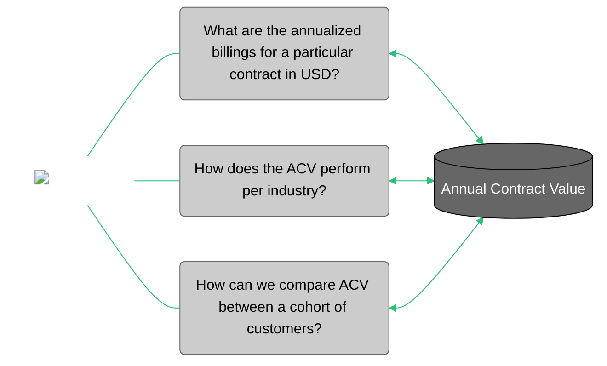

<div id="metric-template-info-main">
  <ul>
    <li><strong>Subject Matter Expert:</strong> <span id="metric-sme"><a target="_blank" href="https://aware.autodesk.com/hans.huller">Hans Hüller</a></span></li>
    <li><strong>Product Owner:</strong> <span id="metric-po"><a target="_blank" href="https://aware.autodesk.com/ola.sadowska">Ola Sadowska</a></li>
    <li class="doc-status"><strong>Status:</strong> <span class="doc-ok">Published</span></li>
    <!-- <li><strong class="doc-status">Status:</strong> <span class="doc-wip">In Progress</span>.</li> -->
  </ul>
</div>

## :material-chart-bar:{.red-icon-heading} Introduction

ACV (Annual Contract Value) represents the annualized contract value of billing transactions based on settlement start and end dates, ranging from Net 0 to Net 4.

The purpose of this metric is to provide a normalized view of the contract value to a single year and is especially useful in comparing contracts with different term lengths (an annual vs. 3-year contract, for example). The breakdown from "Net 0" to "Net 4" indicates which promotions and discounts are included in the particular ACV calculation, and enables discussions of price realization throughout the selected period.

## :material-connection:{ .green-icon-heading } Business use cases



The Annual Contract Value metric can be used to obtain information about the performance of a yearly price strategy by taking into account different contract billings, discounts, geographical locations, and date ranges. It is also possible to filter the data by industry and to compare the result between customers in order to receive a more accurate report.


## :material-database-settings:{ .purple-icon-heading } Metric details

### Overview
    
#### What does this metric measure?

ACV measures the annualized contract value and contains 3 main components: **Contract Value**, **Annualization** and **Currency Conversion**, using the logic as following:

1. **Contract Value** 
Based on `Net{n}` billings from Finmart, where `n` ranges from 0 to 4 to consider the below pricing waterfall:

    - Net 0 ACV measures represent variations of the 'SRP Billed'.
    - Net 1 ACV measures represent variations of the 'SRP billed less Promo/Bundle'.
    - Net 2 ACV measures represent variations of the 'Discounted SRP'
    - Net 3 ACV measures represent variations of the 'Total Billed'.
    - Net 4 ACV measures represent variations of the 'Total Billed After Backend Discount'.

2. **Annualization** 
This allows us to normalize the total value of the contract to a single year and is especially useful in comparing contracts with different term lengths (an annual vs. 3-year contract, for example)
Conceptually, what we're trying to do through annualization is take a multi-year contract and divide the contract value across each of those years. For example, if a 3-year contract has a Net 3 contract value of $3000, then the Net 3 ACV would be $3000 / 3 years = $1000.

3. **Currency Conversion** 
The last step in constructing the ACV within `FinMart` is to convert the ACV from the foreign currency into USD in order to minimize the effect of exchange rate fluctuations over the course of the year. To do this, FinMart uses constant currencies (denoted by `cc` in FinMart fields). Autodesk sets a single exchange rate once per year for each currency.

### Calculation

Sum of a `CC_FBM_TOTAL_ACV_NET0_USD` field (with `NET0` used as an example) in a particular transaction date.

#### Metric granularity

ACV is available at a **date** and **transaction** level (or `src_id` in `CVC_FINMART`). It can be rolled up to the order number (`sales_order_number`) and order line item (`sales_order_line_nbr`) level. It can also be easily rolled up to any dimension available in Finmart, including child and parent account CSN.


### Caveats & clarifications

??? info "Specifications"
    #### 1. Data availability

    - Data is limited to products pushed into Finmart so some acquisition data may not be included (e.g., Innovyze).
    - The `cvc_finmart` table only contains transactional data while Barcelona Dashboard also contains manual entries such as SAP Journal Entries, which are adjustments made by the Revenue Accounting team, these could be billings from acquired companies that were not yet incorporated into our systems, and MDS Interface which are adjustments to transactions that were made incorrectly and could not be corrected due to occasions such as a quarter end, so the adjustments are made via such data entries.

    #### 2. Currency Standardization

    - Autodesk has a variety of billing types corresponding to various discounts included in the price (Net0-Net4). AOV is typically counted at the Net3 or Net4 level - it's important to be clear which level the metric is calculated at when presenting analysis. 
    - Similarly, Finmart lists billings in both Constant Currency (CC) and US Dollars (USD). Curated Finmart provides AOV using the CC ACV values, but it is equally valid to calculate using USD - be sure to clarify which is being used when calculating this KPI.


!!! warning "Known Issues"
    - No known issues.


### Data tables

#### Snowflake

| Schema/Database | View/Table | Basic Filters | Usage | 
| --------------- | ---------- | ------------- | ----- |
| BSD_PUBLISH.FINMART_PRIVATE | [CVC_FINMART](https://autodesk.atlan.com/assets/95f1294a-9e49-4639-af06-05087297a6d0/overview) | RECORD_TYPE = 'BILLING' | Used to capture ACV for all quarters |
| BSD_PUBLISH.FINMART_SHARED | [CVC_FINMART](https://autodesk.atlan.com/assets/0a4909f8-3f19-4d9c-b6ea-fd4b3a2e5128/overview)| RECORD_TYPE = 'BILLING' | Used to capture ACV for previous quarters |

- Finmart data dictionary: [here](https://app.powerbi.com/groups/me/reports/d082a066-394f-45da-b04c-eb95d6a4577c/ReportSection19fd7dc8a3df9c36ed71?experience=power-bi)

##### Access 
- Request access via [ADP Access Management](https://access.adp.autodesk.com/data-access/snowflake). 
- For more information, please refer to [ADP Access Management User Guide](https://wiki.autodesk.com/pages/viewpage.action?spaceKey=CPDDPS&title=ADP+Access+Management+User+Guide), or contact the team on their slack channel [#adp-access-support](https://autodesk.enterprise.slack.com/archives/C05JFCCB0FK).

### Monitoring

#### Report / data for reconciliation

| Report / Process Title | Report / Process Description | Link to More Details | Consumers |
| ---------------------- | ---------------------------- | -------------------- | --------- |
| Barcelona Dashboard | | [link](https://bi.qv.autodesk.com/QvAJAXZfc/opendoc.htm?document=access%20point%20finance%5Cap_finance%5Cbarcelona%202.0.qvw&lang=en-US&host=Finance_QVS) | Finance Team |

#### Data quality checks & reports

!!! warning "Known Issues"

    1. Data Quality Checks
    The fields representing ACV NET2 USD, ACV NET3 USD and ACV NET4 USD from CVC_FINMART were checked against Barcelona Dashboard and the variance identified is below 0.001% for every quarter since FY2020.

    2. To achieve the same numbers the Barcelona Dashboard had to be filtered to select only "Invoices" from Document Category dimension.

### Downstream reports

[Executive Dashboard :simple-powerbi:](https://app.powerbi.com/groups/me/reports/800d01ff-769a-437f-9631-d7e3db9c4322/ReportSectionea58ceb88980e41b86de?experience=power-bi&bookmarkGuid=Bookmark0894206f1e6513e77406){ .md-button .md-button--primary }

## Sample queries

??? abstract "1. ACV summarized by Fiscal Quarter"
    #### Sample query 1

    This query is producing the calculation of ACV on fiscal quarter level. It answers the question: what was the ACV by fiscal quarter?

    ``` sql linenums="1"
    SELECT
        fy_and_fq_name ,
        SUM(cc_fbm_total_acv_net0_usd) AS cc_fbm_total_acv_net0_usd ,
        SUM(cc_fbm_total_acv_net1_usd) AS cc_fbm_total_acv_net1_usd ,
        SUM(cc_fbm_total_acv_net2_usd) AS cc_fbm_total_acv_net2_usd ,
        SUM(cc_fbm_total_acv_net3_usd) AS cc_fbm_total_acv_net3_usd ,
        SUM(CC_FBM_TOTAL_ACV_NET4_USD) AS CC_FBM_TOTAL_ACV_NET4_USD
    FROM bsd_publish.finmart_private.cvc_finmart
    WHERE UPPER(record_type) = 'BILLING'
            AND transaction_dt >= '2019-02-01'
    GROUP BY fy_and_fq_name
    ORDER BY fy_and_fq_name

    ```

??? abstract "2. Quarterly ACV by transaction" 
    #### Sample query 2

    This query is producing the calculation of ACV by transaction. It answers the question: what was the ACV by transaction by fiscal quarter?

    ``` sql linenums="1"
    SELECT
        fy_and_fq_name ,
        src_id ,
        SUM(cc_fbm_total_acv_net0_usd) AS cc_fbm_total_acv_net0_usd ,
        SUM(cc_fbm_total_acv_net1_usd) AS cc_fbm_total_acv_net1_usd ,
        SUM(cc_fbm_total_acv_net2_usd) AS cc_fbm_total_acv_net2_usd ,
        SUM(cc_fbm_total_acv_net3_usd) AS cc_fbm_total_acv_net3_usd ,
        SUM(CC_FBM_TOTAL_ACV_NET4_USD) AS CC_FBM_TOTAL_ACV_NET4_USD
    FROM bsd_publish.finmart_private.cvc_finmart
    WHERE UPPER(record_type) = 'BILLING'
            AND transaction_dt >= '2019-02-01'
    GROUP BY fy_and_fq_name,
                src_id
    ORDER BY fy_and_fq_name

    ```

??? abstract "3. ACV Extraction Function. Used for more granular reporting cadences (daily, weekly, monthly)"
    #### Sample query 3

    ``` sql linenums="1"
    -- Pulls ACV for all dates between 1/1/2022 and 2/1/2022
    -- Function accepts 'Daily', 'Weekly', 'Monthly', and 'Quarterly' to provide all snapshot dates for the end of each day/week/month/quarter between the start and end dates provided
    -- Returns at the src_id level and can be joined back to finmart for rollups using src_id from both tables
    -- select * from table(ADP_WORKSPACES.CUSTOMER_SUCCESS_FINANCE_PRIVATE.generate_acv_usd('2022-01-01', '2022-02-01', 'Daily')) 

    -- For an extraction of the full list of dimensions presented on this documentation please try the following script:
    WITH
        acv_table AS (
            SELECT *
            FROM
                TABLE(
                    "adp_workspaces"."customer_success_finance_private"."genereate_acv_usd"(
                        '2023-01-01', '2023-01-31', 'Daily'
                    )
                )
        ),
        cvc_finmart AS (SELECT * FROM "bsd_publish"."finmart_private"."cvc_finmart"),
        lc_orders AS (
            SELECT DISTINCT fqfy, sap_order_number
            FROM "adp_workspaces"."customer_success_finance_private"."barcelona_lc_orders"
        ),
        entitlement_models AS (
            WITH
                sub_entitlement_models AS (
                    SELECT subscription_id, MAX(entitlement_model) AS entitlement_model
                    FROM "adp_publish"."entitlement_optimized"."entitlement_edp_optimized"
                    GROUP BY 1
                ),
                curated_orders AS (
                    SELECT src_id, MAX(subscription_id) AS subscription_id
                    FROM "adp_workspaces"."financial_analytics_limited"."curated_orders_all"
                    GROUP BY src_id
                )
            SELECT src_id, o.subscription_id AS enriched_subscription_id, entitlement_model
            FROM curated_orders o
            JOIN sub_entitlement_models s ON o.subscription_id = s.subscription_id
            WHERE entitlement_model IS NOT NULL
        ),
        entitlement_offering AS (
            SELECT offering_product_line_code, MIN(offering_name) AS offering_name
            FROM "ADP_PUBLISH"."ENTITLEMENT_OPTIMIZED"."ENTITLEMENT_OFFERING"
            GROUP BY 1
        ),
        account_optimized AS (
            SELECT t_map.account_csn, a.partner_site_type
            FROM "adp_publish"."account_optimized"."account_edp_optimized" a
            INNER JOIN
                "adp_publish"."account_optimized"."transactional_csn_mapping_OPTIMIZED" t_map
                ON t_map.site_uuid_csn = a.site_uuid_csn
        ),
        partner_tiers AS (
            SELECT DISTINCT account_csn__c, partner_tier__c
            FROM "bsd_publish"."sfdc_shared"."contract__c"
            WHERE upper(status__c) = 'ACTIVE' AND partner_tier__c IS NOT NULL
        )
    
    SELECT
        acv.*,
        f.cc_fbd_wws_account_type,
        f.cc_fbd_bil_term_grp,
        f.cc_fbd_bsm_sales_ch,
        f.corporate_country_nm,
        e.entitlement_model,
        f.cc_fbd_sf_wws_geo,
        f.corporate_hier_industry_group_summary_nm,
        f.corporate_hier_industry_segment_nm,
        iff(
            lc.sap_order_number IS NOT NULL
            and f.product_class NOT IN ('Autodesk Build 550', 'Autodesk Build 5000')
            and f.offer_type_group NOT IN ('PS Renew'),
            TRUE,
            FALSE
        ) AS lc_flag,
        f.corporate_parent_named_account_group_nm,
        f.offer_type_group,
        f.offer_type_nm,
        f.offer_type_subgroup,
        f.offering_desc,
        c.partner_tier__c AS partner_tier,
        a.partner_site_type AS partner_type,
        iff(
            (UPPER(f.offer_type_summary) LIKE '%PREMIUM%'), 'Premium Customer', NULL
        ) AS premium_flag,
        CASE
            WHEN (UPPER(f.product_subgroup) LIKE '%ACAD%')
            THEN 'ACAD Family'
            WHEN (UPPER(f.product_subgroup) LIKE 'IC/SUITES%')
            THEN 'Collections'
            WHEN (UPPER(f.product_subgroup) LIKE 'LT FAMILY%')
            THEN 'LT Family'
            ELSE 'Other'
        END AS product_group,
        f.sap_product_line,
        eo.offering_name AS product_line_name,
        CASE
            WHEN (upper(f.promo_type_desc) LIKE '%GFP%')
            THEN 'GFP'
            WHEN (upper(f.promo_type_desc) NOT LIKE '*')
            THEN 'Other Promo'
            ELSE 'NO PROMO'
        END AS fpa_promo_type,
        f.settlement_end_dt,
        f.sales_region_nm,
        f.sales_sub_region_nm,
        f.settlement_start_dt,
        f.solution_division,
        f.switch_category,
        f.cc_fbd_bsm_switch_ind,
        iff((upper(f.offer_type_subgroup) like '%TTN%'), 'TTN Customer', NULL) AS ttn_flag
    
    FROM acv_table acv
    
    -- This JOIN will allow you to add extra transactional data available in CVC_FINMART
    -- many JOINs will depend on grabbing extra fields from this table
    -- i.e. dealer_csn and sales_order_nbr
    JOIN cvc_finmart f
        ON acv.src_id = f.src_id
    
    -- This JOIN is used to identify the LC Orders
    LEFT JOIN
        lc_orders lc
        ON (f.sales_order_nbr = lc.sap_order_number and f.fy_and_fq_name = lc.fqfy)
    
    -- This JOIN is used to identify the Partner Type
    LEFT JOIN account_optimized a
        ON f.dealer_csn = a.account_csn  -- COUNT = 743,715
    
    -- This JOIN is used to identify the Partner Tier
    LEFT JOIN partner_tiers c
        ON f.dealer_csn = c.account_csn__c
    
    -- This JOIN is used to identify the Entitlement Model
    LEFT JOIN entitlement_models e
        ON acv.src_id = e.src_id
    
    -- This JOIN is used to identify the Product Line Name
    LEFT JOIN entitlement_offering eo
        ON f.sap_product_line = eo.offering_product_line_code

    ```

## :material-link:{ .yellow-icon-heading } Related links

- [Customer analytics standardization (wiki)](https://wiki.autodesk.com/display/EAX/Customer+analytics+standardisation)
- [Defining ACV by EDA (wiki)](https://wiki.autodesk.com/pages/viewpage.action?spaceKey=GROEDA&title=ACV#ACV-ContractValue)
- [Introduction to FinMart by EDA (wiki)](https://wiki.autodesk.com/display/GROEDA/FinMart)
- [ACV Net 0-4 and Currency by Finance team (wiki)](https://wiki.autodesk.com/pages/viewpage.action?pageId=915639289)
- [Curated Finmart + BMT Replication Pipeline: Prototype (wiki)](https://wiki.autodesk.com/pages/viewpage.action?pageId=1629463136)