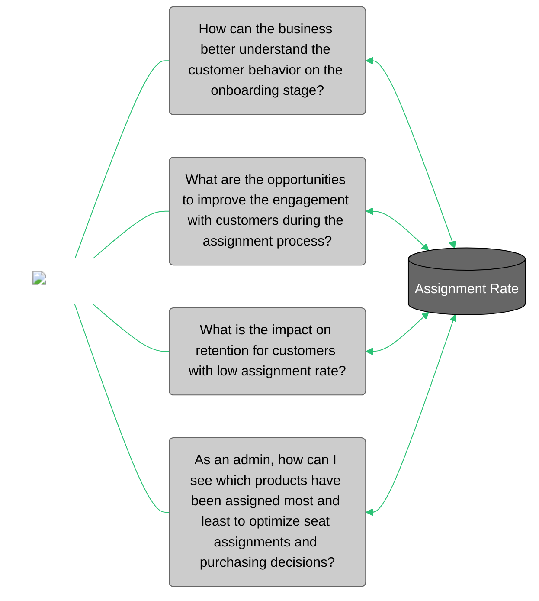

<div id="metric-template-info-main">
  <ul>
    <li><strong>Subject Matter Expert:</strong> <span id="metric-sme"><a target="_blank" href="https://aware.autodesk.com/jayme.kielo">Jayme Kielo </a></span></li>
    <li><strong>Program Manager:</strong> <span id="metric-po"><a target="_blank" href="https://aware.autodesk.com/ola.sadowska">Ola Sadowska</a></li>
    <li class="doc-status"><strong>Status:</strong> <span class="doc-ok">Published</span></li>
    <!-- <li><strong class="doc-status">Status:</strong> <span class="doc-wip">In Progress</span>.</li> -->
  </ul>
</div>


## :material-chart-bar:{.red-icon-heading} Introduction
	
Assignment rate measures the percent of active purchased seats that are assigned to a named user.

To be able to use an ADSK product, users entitled to a Single User Subscription (SUS) must be assigned to a seat by an admin for single-user access. The benefit of monitoring assignment rate for the customer is that they have visibility into how many seats are available for their end users, and can effectively manage their subscriptions. For ADSK internal, the benefit is to have insights into if customers are effectively utilizing their subscriptions and if perhaps they have onboarding issues. Low assignment rate is seen as a potential risk for churn.
 
The purpose of this metric is to provide visibility on the performance of contracts with regards to the first steps of the user's journey, which is part of the onboarding phase.

!!! note

    - This metric is built from the [Assignment dataset](https://eda-data-docs.autodesk.com/customer-domain/access/assignment/).
    

## :material-connection:{ .green-icon-heading } Business use cases



The Assignment Rate metric helps the business to understand how Autodesk is performing on the onboarding phase of the customer journey, and how account managers can optimize seat assignments and purchasing decisions.


## :material-database-settings:{ .purple-icon-heading } Metric details

### Overview
    
#### What does this metric measure?

Assignment Rate measures the number of assigned seats out of the number of purchased seats for active, commercial, single user subscriptions (SUS). It is one of the widely tracked metrics for customer overall health, as it can also be a signal showing that a customer is likely to churn. By providing early signs to the support/CSM team, the churn risk can be mitigated.

#### What is not included in this metric?

Entitlements other than active commercial SUS. Subscriptions with unlimited assignments are not included.

Most Autodesk products are available for starting with version 2016. The list for SUS Reporting and Premium Eligibility can he found [here](https://wiki.autodesk.com/display/CPDDPS/PLC+Lists+for+SUS+Reporting+and+Premium+Eligibility).

### Calculation

Sum of assigned seats at a given level divided by the sum of purchased seats at the equivalent level of aggregation. Generally the level of calculation is within a tenant and pool or at the account csn. 

??? example 

    Example: Let's say you want to calculate Assignment Rate at the Tenant Level. That is pretty straight forward: 

    | Account CSN | Tenant ID | Seats Purchased | Seats Assigned | Assignment Rate | 
    |------------ | --------- | --------------- | -------------- | --------------- |
    | 5152456567 | 17930008 | 4 | 2 | (2 / 4) * 100 = 50% |
    | 5152456567 | 8257298 | 5 | 5 | (5 / 5) * 100 = 100% |

    ``Assignment Rate = Seats Assigned / Seats Purchased``

    Now imagine that you want to calculate it at the CSN level. As you can see, both `tenant_id` belong to the same account CSN. You should then re-sum:

    | Account CSN | Seats Purchased | Seats Assigned | Assignment Rate | 
    |------------ | --------- | --------------- | -------------- | 
    | 5152456567 |  (4 + 5) = 9 | (2 + 5) = 7 | (7 / 9) * 100 = 77.8% |

    ``Assignment Rate = SUM ( Seats Assigned ) / SUM ( Seats Purchased ) ``


#### Metric granularity

Assignment Rate is calculated at the tenant and pool combination level as the lowest granularity, then rolled up at team level (tenant), as well as the child account CSN level. 

#### Dimensions (Segments/Filters/Slicers)

More granular slices for this data are possible by product offering, or seat based slices such as number of purchased seats in a tenant and pool combo (2-5 purchased seats, 5-10 purchased seats etc.). As this metric rolls up to the child account CSN it can a segmented similarly  as account (site_geo, industry, etc.).

### Caveats & clarifications

??? info "Specifications"
    
    - **Don't use this for entitlement models other than single user subscriptions**: Assignment rate calculation is limited to  "Single User Subscription" business model, because it needs to be calculated based on seats assigned or seats purchased. 

    - **Don't use this for product offerings which do not follow standard configuration within AUM.** More details on the specific product list can be found [here](https://wiki.autodesk.com/display/CPDDPS/PLC+Lists+for+SUS+Reporting+and+Premium+Eligibility).

    - **Don't take averages as assignment rates are rolled up are down to different levels of aggregation.** As the level of aggregation changes seats purchased and seats assigned need to be re-summed before divided.

    - **It is possible for a tenant and pools assignment rate to be greater than 100%.** 
         - As part of Autodesk's current policy if a subscription within a tenant and pool expires but another active subscription remains in the same tenant and pool (the same product), then users are not unassigned seats. 
    ??? question "Example/Recommendation"

        #### Example 1

        - For example consider the following scenario:
            - Tenant 123 and Pool XYZ has the following two subscriptions of AutoCAD for a total of 6 purchased seats:
                - Subscription 444 with 2 purchased seats of AutoCAD expiring February 1st, 2022
                - Subscription 777 with 4 purchase seats of AutoCAD expiring March 1, 2022
            - As of January 31, 2022 all 6 seats of AutoCAD in the tenant and pool are assigned so the Assignment Rate is 100% (6 seats assigned / 6 seats purchased)
            - As of February 1st, Subscription 444 expires however no users are unassigned since another AutoCAD subscription (Subscription 777) is still active and so the current assignment rate 150% (6 seats assigned / 4 seats purchased)  

        - IMPORTANT: Depending on the use of assignment rate for analysis it may be necessary to cap assignment rates at 100%.


!!! warning "Known issues"
    1. **Dirty Pools** - Dirty pools are a result of seat assigned at the tenant pool level rather than at the subscription level. This can lead to ambiguity when trying to do analysis at the subscription ID level. When there are multiple subscriptions in a pool it becomes impossible to tie an assigned user to a single subscription. This can also be tied to issues with assignment rates that exceed 100%. For example in the scenario listed in [specifications](#example-1), the users can not be unassigned when Subscription 444 expires because it is not known which of the 6 users were assigned to the 2 seats on Subscription 444 which expired.
    
    2. **Dirty Teams** - Dirty teams are a result of dirty pools. Subscriptions tie to a child account CSN and it is possible for two subscriptions tying to different account CSNs to exist in the same tenant and pool. This is often a result of account hierarchy for example the two CSNs are generally of the same parent organization. In these scenarios the assignment rate for the tenant and pool gets allocated to both CSNs which tie back to the same tenant and pool.

    3. **From September 2021 until September 2022** - In September 2021 group assignments were brought into AUM datasets and this introduced data inaccuracies for the 'seats_assigned' column in ENTITLEMENT_PUBLIC.ENTITLEMENT_POOL_AUM. This issue was resolved in September 2022 when changes made for Apollo fixed the issue, however the fix did not update historic partitions. This means then 'seats_assigned' column in ENTITLEMENT_PUBLIC.ENTITLEMENT_POOL_AUM should not be used between this time period, instead the alternative data model as seen on the Logic tab should be used. 

    4. For non-commercial usage products, the single authorization in the CLic Usage dataset could last more than a day. However, after further verification for commercial usage, the single authorization id in CLic Usage only lasts for a day. That said when counting active users for commercial purposes, CLic Authorization could give sufficient coverage.

### Data tables

#### Snowflake

| Data Warehouse | Schema/Database | View/Table      | Notes |
| -------------- | --------------- | --------------- | ----- |
| `eio_publish`    | `access_shared`   | `assignment_monthly` |     |

!!! note

    - Request access via [ADP Access Management](https://access.adp.autodesk.com/data-access/snowflake?id=76J63sBIsf2CL9uqtKjLtQ).. 
    - For more information, please refer to [ADP Access Management User Guide](https://wiki.autodesk.com/pages/viewpage.action?spaceKey=CPDDPS&title=ADP+Access+Management+User+Guide), or contact the team on their slack channel [#adp-access-support](https://autodesk.enterprise.slack.com/archives/C05JFCCB0FK).

### Monitoring

#### Report / Data for reconciliation

Reconciliation against Customer Connected Data pipeline showed 100% match rate. There were records missing from CCD but were correctly captured in Assignment Rate for Rep's New KPIs.

### Downstream reports

- N/A

## :material-file-code:{ .grey-icon-heading } Sample queries

??? abstract "1. Calculate assignment rate at the team and pool level"
    #### Sample query 1

    This query calculates assignment rate at the team and pool level which is the lowest level of granularity to accurately measure this metric. 

    ``` sql linenums="1"
    WITH distinct_tp_assignment AS(
        SELECT DISTINCT
            by_month
            ,tenant_id
            ,pool_id
            ,offering_external_key
            ,seats_assigned
            ,seats_purchased
        FROM eio_publish.access_shared.assignment_monthly
        WHERE seats_purchased <> 0
    )
    
    SELECT
        by_month
        ,tenant_id
        ,pool_id
        ,ROUND(seats_assigned/seats_purchased,4) * 100 AS assignment_rate
    FROM distinct_tp_assignment
    ```

??? abstract "2. Calculate assignment rate at the child account CSN level"
    #### Sample query 2

    This query calculates assignment rate at the account CSN level. Purchased seats and seats assigned will get allocated to all CSNs associated to the team and pool. 

    ``` sql linenums="1"
    WITH distinct_tp_assignment AS(
    SELECT DISTINCT
         by_month
        ,account_csn
        ,tenant_id
        ,pool_id
        ,offering_external_key        
        ,seats_assigned
        ,seats_purchased
    FROM eio_publish.access_shared.assignment_monthly
    ),
    
    account_csn_aggregated AS(
        SELECT
            by_month
            ,account_csn
            ,SUM(seats_assigned) AS seats_assigned
            ,SUM(seats_purchased) AS seats_purchased
        FROM eio_publish.access_shared.assignment_monthly
        GROUP BY by_month, account_csn
    )
    
    SELECT
        by_month
        ,account_csn
        ,ROUND(seats_assigned/seats_purchased,4) * 100 AS assignment_rate
    FROM account_csn_aggregated
    ```
??? abstract "3. Flag dirty teams (see caveats & clarification for more details on dirty teams) and impacted child account CSN"
    #### Sample query 3

    This query Identifies if a team and pool are a dirty team, meaning more than one account CSN has subscription on the team in the pool and flags these accounts.. 

    ``` sql linenums="1"
    WITH dirty_team AS(
    SELECT DISTINCT
        BY_MONTH
        ,TENANT_ID
        ,POOL_ID
    FROM EIO_PUBLISH.ACCESS_SHARED.ASSIGNMENT_MONTHLY
    GROUP BY
        BY_MONTH
        ,TENANT_ID
        ,POOL_ID
    HAVING COUNT(DISTINCT ACCOUNT_CSN) > 1
    )
    
    SELECT
        a.ACCOUNT_CSN
        ,a.TENANT_ID
        ,a.POOL_ID
        ,a.BY_MONTH
    FROM EIO_PUBLISH.ACCESS_SHARED.ASSIGNMENT_MONTHLY a
        INNER JOIN dirty_team b
            ON (a.BY_MONTH=b.BY_MONTH AND a.tenant_id=b.tenant_id AND a.pool_id=b.pool_id)
    ```
??? abstract "4. Calculate assignment rate at the child account CSN level considering victim-survivor CSNs (how to)"
    #### Sample query 4

    This query requires access to `EDM_PUBLISH.EDM_PUBLIC.VICTIM_SURVIVOR_MAPPING`

    ``` sql linenums="1"
    WITH distinct_tp_assignment AS(
    SELECT DISTINCT
        BY_MONTH
        ,CASE WHEN B.FINAL_MERGE_STATUS = 'COMPLETED' THEN SURVIVING_ACCOUNT_CSN ELSE ACCOUNT_CSN END AS SURVIVING_ACCT_CSN
        ,TENANT_ID
        ,POOL_ID
        ,OFFERING_EXTERNAL_KEY
        ,SEATS_ASSIGNED
        ,SEATS_PURCHASED
    FROM EIO_PUBLISH.ACCESS_SHARED.ASSIGNMENT_MONTHLY A
        LEFT JOIN EDM_PUBLISH.EDM_PUBLIC.VICTIM_SURVIVOR_MAPPING B
            ON (A.ACCOUNT_CSN = B.VICTIM_ACCOUNT_CSN)
    ),
    
    account_csn_aggregated AS(
        SELECT
            BY_MONTH
            ,SURVIVING_ACCT_CSN
            ,SUM(SEATS_ASSIGNED) AS SEATS_ASSIGNED
            ,SUM(SEATS_PURCHASED) AS SEATS_PURCHASED
        FROM distinct_tp_assignment
        GROUP BY
            BY_MONTH
            ,SURVIVING_ACCT_CSN
    )
    
    SELECT
        BY_MONTH
        ,SURVIVING_ACCT_CSN
        ,ROUND(SEATS_ASSIGNED/SEATS_PURCHASED,4) * 100 AS ASSIGNMENT_RATE
    FROM account_csn_aggregated

    ```    

## :material-link:{.grey-icon-heading} Related links

- [Assignment Rate PSET team (wiki)](https://wiki.autodesk.com/display/PSETAnalytics/Assignment+Rate)
