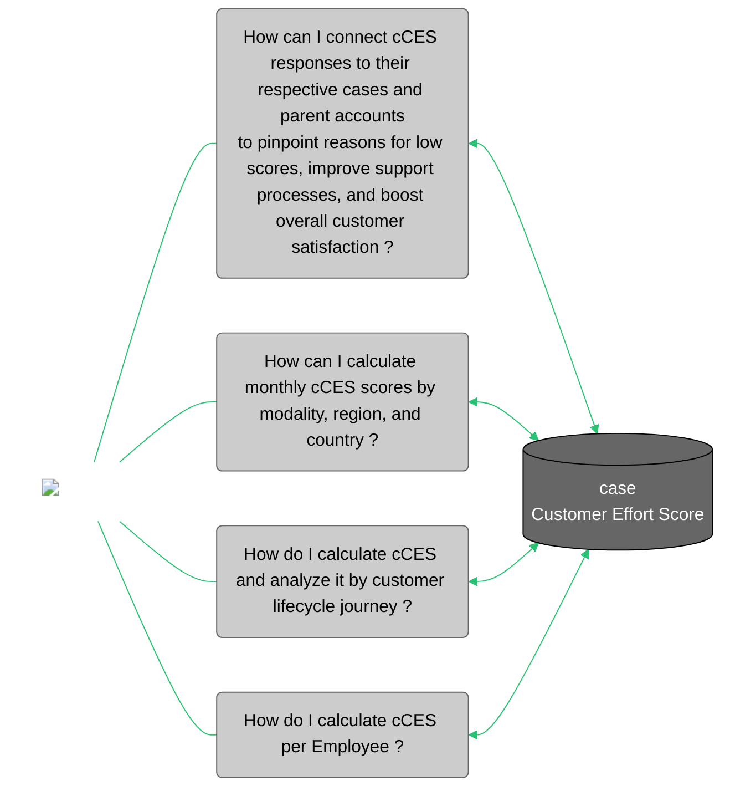

<div id="metric-template-info-main">
  <ul>
    <li><strong>Subject Matter Expert:</strong> <span id="metric-sme"><a target="_blank" href="https://aware.autodesk.com/ketan.deshpande">Ketan Deshpande</a></span></li>
    <li><strong>Program Manager:</strong> <span id="metric-po"><a target="_blank" href="https://aware.autodesk.com/ola.sadowska">Ola Sadowska</a></li>
    <li class="doc-status"><strong>Status:</strong> <span class="doc-ok">Published</span></li>
    <!-- <li><strong class="doc-status">Status:</strong> <span class="doc-wip">In Progress</span>.</li> -->
  </ul>
</div>

## :material-chart-bar:{.red-icon-heading} Introduction

Case Customer Effort Score (cCES) is a global, corporate-level metric that measures our customers’ perception of the Autodesk experience. 

The survey measures customer effort at interaction points across the customer journey. Customers rank their experience on a scale of 1 – 7; the higher the score, the easier they found the experience. In this instance we are specifically going to refer to cCES which is a metric based on a survey sent out to customers after a case is closed (case CES). There is another instance called dCES (digital) that is sent out in a different stage of a customer journey and which we won't be addressing in this document.

!!! note "Notes"

    - This metric is built from the [Surveys dataset](../customer-domain/engagement/survey.md)
 

## :material-connection:{ .green-icon-heading } Business use cases



What value are we trying to drive by enabling an accurate and consistent dataset/KPI?

1. **Proactive issue resolution**: With an accurate and consistent dataset, the organization can proactively identify and address friction points in the customer journey. This leads to faster issue resolution and a smoother customer experience.

2. **Enhanced customer loyalty**: Improving the Customer Effort Score can help in understanding customer loyalty. By addressing pain points, you're enhancing customer satisfaction, which in turn could boost loyalty and reduce the likelihood of customers seeking alternatives.

3. **Strategic decision-making**: An accurate and consistent dataset provides valuable insights into customer preferences and challenges. This information can be used for strategic decision-making, such as product improvements, service enhancements, and overall business strategy.


## :material-database-settings:{ .purple-icon-heading } Metric details

### Overview
    
#### What does this metric measure?

Customer Effort Score (case) is a customer satisfaction metric which measures the ease of an experience with a company by asking customers, on a seven-point scale of "Very Difficult" to "Very Easy" 

##### Survey question
Customers are asked a specific question related to the effort required for a particular interaction. For example: "Overall, how easy was it to get the help you needed?"

##### Scale definition
The 7-point scale usually ranges from `1` to `7` with clear definitions at each point. Here's a general breakdown:

1. Very difficult
2. Difficult
3. Somewhat difficult
4. Neutral
5. Somewhat easy
6. Easy
7. Very easy

##### Response collection
Customers choose a number on the 7-point scale that best represents their perception of the effort involved. Each response corresponds to a point on the scale.

### Calculation
The cCES is typically calculated by counting the total number of survey response with scores 5 or higher and dividing it by the total number of survey responses.​
??? example 

    Example: Let's say you collect CES responses from five customers (considering a survey was sent after the case was closed)

    | Customer       | Score                | Score Scale                            |   
    |----------------|----------------------|----------------------------------------|
    | Customer 1     | 6                    | Easy                                   |
    | Customer 2     | 5                    | Somewhat easy                          |
    | Customer 3     | 7                    | Very easy                              |
    | ==Customer 4== | ==3==                | ==Somewhat difficult==                 |
    | Customer 5     | 6                    | Easy                                   |

    Customer 4 is highlighted to indicate that the score is not taken into account because the score provided is lower than 5.

    Therefore, the calculation is:
    **cCES** = (4/5)*100 = 80%

This score represents the collective perception of the ease of completing the task. Generally, a higher CES indicates a lower perceived effort and a better customer experience. Autodesk can use this metric to identify areas where customers may be experiencing difficulties and take targeted actions to reduce friction points, thereby improving the overall customer experience.

#### Metric granularity

cCES metric has the same granularity as the [Surveys dataset](../customer-domain/engagement/survey.md): `response_id`.

This is also known as the qualtrics_id which indicates a single response received for the survey which was sent out to the customer. Each response in itself holds unique information related to the survey question.

#### Dimensions (Segments/Filters/Slicers)

There are 5 main reporting objects with their respective attributes:

??? info "Surveys"
    ##### Join Key: `response_id`
    - Modality
    - Finished
    - Progress
    - Key Drivers
    - Survey Date
    - Survey Comments

??? info "Case"
    ##### Join Key: `case_number`
    - Case Owner
    - Case Status
    - Case Topic
    - Case Type
    - Case Closed Date
    - Case Open Date
    - Case Language
    - Case Origin
    - Case Sub Origin
    - Case Owner Team
    - Case Product Feature
    - Case Resolution Days

??? info "Account"
    ##### Join Key: `account_csn`
    - Geo
    - Country / Country Code
    - Sales Region
    - Account Type

??? info "Employee"
    ##### Join Key: `worker_id`
    - Employee Name
    - Employee Geo
    - Employee Manager
    - Work Email
    - Supervisory Org Name
    - Currently Active

??? info "Person"
    ##### Join Key: `person_mdm_id`
    - Customer Name
    - Customer Email (Email Address)
    - Customer Country (Profile Country Name)


### Caveats & clarifications

??? info "Specifications"
    #### 1. Data availability

    - Survey data for cCES is available only since: 29-04-2021 (dd-mm-yyyy)
    - Each survey response is unique.
    - Finished and Progress Fields:
      These are two pieces of information used to figure out if a survey response is complete. `finished` being set to 1 means the survey is finished.
        `progress` being set to 100 means the respondent has completed the entire survey. Reflection in Salesforce. Only responses that meet both conditions (`finished = 1 and progress = 100`) are shown or considered in Salesforce.
    - Importance of Considering All Responses: Even though only the finished and fully completed responses are shown in Salesforce, it's important to look at all responses to accurately calculate the response rate metric. This is because response rate calculations involve the total number of responses received, not just the completed ones. In summary, Salesforce primarily shows responses that are both marked as finished and have a progress of 100, but for calculating response rates, it's important to consider all responses, regardless of whether they meet these specific conditions.   

    #### 2. Person CED
    - Depending upon the use-case, information related to the contact of the survey can be hashed or un-hashed. You may use the appropriate tables mentioned above as per use.

    #### 3. Case CED
    - Based on the specific use-case, the case data can be segmented to display information tailored to individual business units. For instance, filtering the dataset using the `case_topic` and `case_type` fields allows one to focus on cases related to 'Customer Technical Support (CTS)'.
    - A case can be closed by one or more than one owners over a period of time.  However, the Customer Case CED always looks at the most recent owner associated with the case. There is no current way of looking at the historical case owner associated with the case. Example: 
        - *Initial Case Handling:* The customer case (CA-100) is initially assigned to Alice (Case Owner 1).
        - *Issue Resolution and Survey:* Alice successfully resolves the issue, leading to the closure of the case (CA-100). Subsequently, a satisfaction survey (SR-100) is triggered to gather feedback.
        - *Reopening and Reassignment:* However, the case (CA-100) encounters a need for further attention and is reopened. This time, it is reassigned to Ketan (Case Owner 2).
        - *Subsequent Issue Resolution and New Survey:* Ketan addresses the reopened case and successfully resolves the issue, resulting in the closure of the case (CA-100). Another satisfaction survey (SR-200) is triggered for the latest closure event.
        - *Customer Case CED Approach:* The Customer Case CED consistently considers the most recent snapshot of the case. In this specific scenario, it looks at CA-100 with Ketan as the case owner.
        - *Historical Information Challenge:* The challenge arises when attempting to pull historical information about the case owner from the Customer Case CED table using the owner ID. As the focus is on the latest snapshot, pulling information from the Employee table will always reflect the current case owner (Ketan), not the historical owners (Alice in the initial phase).
        - *Summary:* The Customer Case CED process prioritizes the most recent state of the case for evaluation and survey purposes. However, this approach poses a challenge when seeking historical information about case owners, as the system pulls information from the Employee table based on the current owner ID, providing details only for the latest case owner (Ketan).

        - Actual Example for Explanation:

        | Case No   | No of Survey Responses | No of Actual Case Owners in Salesforce | No of Case Owners in Customer Case CED |
        |-----------|------------------------|----------------------------------------|----------------------------------------|
        | 20245505  | 8                      | 2                                      | 1                                      |
        | 19293258  | 15                     | 2                                      | 1                                      |


!!! warning "Known Issues"
    - No known issues.


### Data tables

#### Snowflake

| Schema/Database                          | View/Table                                   | Basic Filters                           | Notes          |
|------------------------------------------|----------------------------------------------|-----------------------------------------|----------------|
| EIO_PUBLISH.ENGAGEMENT_PRIVATE           | [SURVEY_QUESTION_OPTION](https://autodesk.atlan.com/assets/b30a4be6-02a6-4f4c-bb81-b3d9b891792e/overview) | survey_id = 'SV_aWd9zzdU4we7QTr'<br>question_id = 'QID6'<br>question_id = 'QID21'<br>question_id = 'QID22' | <br>CES Question<br>CES Drivers<br>CES Comments               |
| EIO_PUBLISH.ENGAGEMENT_PRIVATE           | [SURVEY_QUESTION_RESPONSE](https://autodesk.atlan.com/assets/1694328e-5a12-4b47-a5fb-accfd048ece0/overview) | survey_id = 'SV_aWd9zzdU4we7QTr'<br>progress = '100'<br>finished = '1'<br>question_id = 'QID6'<br>question_id = 'QID21'<br>question_id = 'QID22' | <br><br><br> CES Question<br>CES Drivers<br>CES Comments              | 
| EIO_PUBLISH.ENGAGEMENT_PRIVATE           | [SURVEY_EMBEDDED_DATA](https://autodesk.atlan.com/assets/376cf975-0ef2-498e-95b7-e7234cbc5065) | survey_id = 'SV_aWd9zzdU4we7QTr'<br>question_id = 'QID6'<br>question_id = 'QID21'<br>question_id = 'QID22' | <br>CES Question<br>CES Drivers<br>CES Comments               |
| ADP_PUBLISH.ACCOUNT_OPTIMIZED            | [ACCOUNT_EDP_OPTIMIZED](https://autodesk.atlan.com/assets/39323831-808d-4799-8731-93f571972032/overview) |                                         |                |
| ADP_WORKSPACES.CORE_ENTERPRISE_DATA_SHARED | [PERSON](https://autodesk.atlan.com/assets/50c4876b-e5f0-409e-9b67-098d41d8d260/overview) |                                   | Hashed               |
| ADP_WORKSPACES.CORE_ENTERPRISE_DATA_SHARED | [PERSON_MAPPING](https://autodesk.atlan.com/assets/76f75bff-e210-4ba6-8df5-64a3173465f1/overview) |                                   | Hashed               |
| ADP_WORKSPACES.CORE_ENTERPRISE_DATA_LIMITED| [PERSON](https://autodesk.atlan.com/assets/50c4876b-e5f0-409e-9b67-098d41d8d260) |                                 | Unhashed               |
| ADP_WORKSPACES.CORE_ENTERPRISE_DATA_LIMITED| [PERSON_MAPPING](https://autodesk.atlan.com/assets/13bd671c-e3f8-44e5-9cf2-8f8f9a9080e9/overview) |                                 |Unhashed                |
| ADP_PUBLISH.SUPPORT_OPTIMIZED            | [CUSTOM_CASE](https://autodesk.atlan.com/assets/754301ba-0728-47b4-9e85-b072a8ec916b) |                                         |                |
| ADP_WORKSPACES.CUSTOMER_SUCCESS_SHARED   | [WORKDAY_EMPLOYEE_UNIQUE_DIM](https://autodesk.atlan.com/assets/9e4c6f24-dd73-4e18-a923-a722e1a15c8e) |                                         |                |


##### Access

- Request access via [ADP Access Management](https://access.adp.autodesk.com/data-access/snowflake). 
- For more information, please refer to [ADP Access Management User Guide](https://wiki.autodesk.com/pages/viewpage.action?spaceKey=CPDDPS&title=ADP+Access+Management+User+Guide), or contact the team on their slack channel [#adp-access-support](https://autodesk.enterprise.slack.com/archives/C05JFCCB0FK).


### Monitoring

#### Report / Data for reconciliation

[CTS Dashboard :simple-powerbi:](https://app.powerbi.com/groups/4a576fc3-b0da-4f2e-b6a8-3d13a27fe6f5/reports/3801584f-2466-43e5-adc7-7c5ae9c70e73/ReportSectiond817e8b8456f3a012a88?experience=power-bi){ .md-button .md-button--primary }

[Client Services Dashboard :simple-powerbi:](https://app.powerbi.com/groups/cd75b404-a33c-4013-bf26-55de3657ed93/reports/88339c06-ef4c-423b-8c79-23d83853af30/ReportSectione892add47c3f07779b9d?experience=power-bi){ .md-button .md-button--primary }

#### Data quality checks & reports

!!! warning "Known Data Quality Issues"

    1. No known issues


### Downstream reports

| Report / Process Title | Report / Process Description | Link to More Details | Consumers |
| ---------------------- | ---------------------------- | -------------------- | --------- |
| Client Services Dashboard | | [Link Here](https://app.powerbi.com/groups/cd75b404-a33c-4013-bf26-55de3657ed93/reports/88339c06-ef4c-423b-8c79-23d83853af30/ReportSectione892add47c3f07779b9d?experience=power-bi) | Client Services Team |
| Customer Technical Support Dashboard | | [Link Here](https://app.powerbi.com/groups/4a576fc3-b0da-4f2e-b6a8-3d13a27fe6f5/reports/3801584f-2466-43e5-adc7-7c5ae9c70e73/ReportSectiond817e8b8456f3a012a88?experience=power-bi) | CTS Team |
| Insights Dashboard | | [Link Here](https://app.powerbi.com/groups/4a576fc3-b0da-4f2e-b6a8-3d13a27fe6f5/reports/15c8b5f0-c47b-4df3-b9a1-a88e46aa49f5/ReportSectiond817e8b8456f3a012a88?experience=power-bi) | CTS Team |

## Sample queries

??? abstract "1. cCES Metric Definition Query" 
    #### Sample query 1
    This reference model basically brings all the relevant tables for the CES metric

    ``` sql linenums="1"
        WITH survey_response AS (
            -- Select relevant survey responses
            SELECT    
                response_id,
                recorded_date,
                question_id,
                question_text,
                option_value,
                value_text,
                finished,
                progress,
                status,
                additional_value
            FROM eio_publish.engagement_private.survey_question_response
            WHERE survey_id = 'SV_aWd9zzdU4we7QTr' -- this is the survey id associated with CES survey in general i.e. the GCSO_Improvement_Survey_PRD_-_07282020 survey
            AND question_id = 'QID6' -- this is the question id associated with 'How easy was it to get the help needed ?'
        ),

        survey_embedded AS (
            -- Find relevant additional fields by joining with embedded data
            SELECT
                s.response_id                              AS response_id,
                s.accountname                              AS accountname,
                s.additional_value:sfOwnerId::string       AS owner_id,
                s.additional_value:sfStatus::string        AS case_status,
                s.additional_value:sfEmail__c::string      AS sfEmail__c,
                s.additional_value:sfContactId::string     AS sfContactId,
                s.additional_value:modality::string        AS modality,
                s.additional_value:employeeGeo::string     AS employee_geo,
                s.additional_value:offeringType::string    AS offeringType,
                s.additional_value:salesRegion::string     AS salesRegion,
                s.additional_value
            FROM eio_publish.engagement_private.survey_embedded_data s
            INNER JOIN survey_response r ON s.response_id = r.response_id
        ),

        final AS (
            -- Combine survey response and embedded data
            SELECT
                r.response_id                              AS response_id,
                r.finished                                 AS finished,
                r.progress                                 AS progress,
                r.status                                   AS status,
                IFF(s.additional_value:sfCaseNumber::string = '', NULL, s.additional_value:sfCaseNumber::string) AS case_number,
                r.option_value                             AS cces,
                TO_DATE(r.recorded_date)                   AS survey_date,
                s.employee_geo                             AS employee_geo, 
                s.offeringType                             AS offeringType,
                s.salesRegion                              AS salesRegion, 
                s.sfContactId,
                s.owner_id,
                s.modality,
                s.case_status,
                SUM(CASE WHEN cces >= 5 THEN 1 ELSE 0 END) OVER (PARTITION BY s.case_status) AS total_high_ces_responsess, -- Depending on the use case, use the PARTITION BY function
                COUNT(*) OVER (PARTITION BY s.case_status) AS total_responses, -- Depending on the use case, use the PARTITION BY function
                DIV0(total_high_ces_responsess, total_responses) AS cces_rate
            FROM survey_response r 
            LEFT JOIN survey_embedded s ON r.response_id = s.response_id
        )

        SELECT
            case_number,
            modality,
            response_id,
            survey_date,
            employee_geo,
            offeringType,
            salesRegion,
            finished,
            progress,
            owner_id,
            sfContactId,
            case_status,
            cces,
            total_high_ces_responsess,
            total_responses,
            cces_rate
        FROM final where finished = 1 and progress = 100  -- finished flag and progress = 100 should be included, as only these surveys are reflected in Salesforce


    ```


??? abstract "2. Join Case CED with Surveys Data" 
    #### Sample query 2
    Sample query to connect Case information with Survey.

    ``` sql linenums="1"
    WITH  __dbt__cte__ces_metric_definition as (


    
    -- This reference model basically brings all the relevant tables for the cCES metric.
     
    WITH survey_response AS (
        -- Select relevant survey responses
        SELECT   
            response_id,
            recorded_date,
            question_id,
            question_text,
            option_value,
            value_text,
            finished,
            progress,
            status,
            additional_value
        FROM eio_publish.engagement_private.survey_question_response
        WHERE survey_id = 'SV_aWd9zzdU4we7QTr' -- this is the survey id associated with CES survey in general i.e. the GCSO_Improvement_Survey_PRD_-_07282020 survey
        AND question_id = 'QID6' -- this is the question id associated with 'How easy was it to get the help needed ?'
    ),
     
    survey_embedded AS (
        -- Find relevant additional fields by joining with embedded data
        SELECT
            s.response_id                              AS response_id,
            s.accountname                              AS accountname,
            s.additional_value:sfOwnerId::string       AS owner_id,
            s.additional_value:sfStatus::string        AS case_status,
            s.additional_value:sfEmail__c::string      AS sfEmail__c,
            s.additional_value:sfContactId::string     AS sfContactId,
            s.additional_value:modality::string        AS modality,
            s.additional_value:employeeGeo::string     AS employee_geo,
            s.additional_value:offeringType::string    AS offeringType,
            s.additional_value:salesRegion::string     AS salesRegion,
            s.additional_value:numberOfOwnerChanges::string as nos,
            s.additional_value:SAT_score::string        AS sat,
            s.additional_value
        FROM eio_publish.engagement_private.survey_embedded_data s
        INNER JOIN survey_response r ON s.response_id = r.response_id
        ),
     
     
        final AS (
        -- Combine survey response and embedded data
        SELECT
            r.response_id                              AS response_id,
            r.finished                                 AS finished,
            r.progress                                 AS progress,
            r.status                                   AS status,
            IFF(s.additional_value:sfCaseNumber::string = '', NULL, s.additional_value:sfCaseNumber::string) AS case_number,
            r.option_value                             AS cces,
            TO_DATE(r.recorded_date)                   AS survey_date,
            s.employee_geo                             AS employee_geo,
            s.offeringType                             AS offeringType,
            s.salesRegion                              AS salesRegion,
            s.sfContactId,
            s.owner_id,
            s.modality,
            s.case_status,
            s.sat as sat,
            s.nos as nos,
            SUM(CASE WHEN cces >= 5 THEN 1 ELSE 0 END) OVER (PARTITION BY s.case_status) AS total_high_ces_responsess, -- Depending on the use case, use the PARTITION BY function
            COUNT(*) OVER (PARTITION BY s.case_status) AS total_responses, -- Depending on the use case, use the PARTITION BY function
            DIV0(total_high_ces_responsess, total_responses) AS cces_rate
            FROM survey_response r
            LEFT JOIN survey_embedded s ON r.response_id = s.response_id
         
        )
     
        SELECT
        
        case_number,
        sat,
        nos,
        modality,
        response_id,
        survey_date,
        employee_geo,
        offeringType,
        salesRegion,
        finished,
        progress,
        owner_id,
        sfContactId,
        case_status,
        cces,
        total_high_ces_responsess,
        total_responses,
        cces_rate
        FROM final where finished = 1 and progress = 100  -- finished flag and progress = 100 should be included, as only these surveys are reflected in Salesforce
        ), surveys AS (
        SELECT *
        FROM __dbt__cte__ces_metric_definition
        ),
 
        survey_case_data AS (
        SELECT
        svs.response_id             AS response_id,
        svs.sfContactId             AS sfContactId,
        svs.survey_date             AS survey_date,
        svs.owner_id                AS svs_owner_id,
        cases.case_number           AS ced_case_number,
        cases.owner_employee_id     AS owner_employee_id,
        cases.case_owner_team       AS ced_case_owner_team,
        cases.case_topic            AS ced_case_topic,
        cases.customer_contact_csn  AS ced_contact_csn,
        total_high_ces_responsess,
        total_responses,
        cces_rate
        FROM surveys svs
        LEFT JOIN adp_publish.support_optimized.custom_case cases
        ON svs.case_number = cases.case_number
        )
 
        -- Now you can use the CTE in your main query
        SELECT * FROM survey_case_data
    ```

??? abstract "3. cCES by Employee"
    #### Sample query 3
    This query helps to calculate the cCES metric by Employee

    ``` sql linenums="1"
    WITH  __dbt__cte__ces_metric_definition as (
        -- This reference model basically brings all the relevant tables for the CES metric.

        WITH survey_response AS (
            -- Select relevant survey responses
            SELECT    
                response_id,
                recorded_date,
                question_id,
                question_text,
                option_value,
                value_text,
                finished,
                progress,
                status,
                additional_value
            FROM eio_publish.engagement_private.survey_question_response
            WHERE survey_id = 'SV_aWd9zzdU4we7QTr' -- this is the survey id associated with CES survey in general i.e. the GCSO_Improvement_Survey_PRD_-_07282020 survey
            AND question_id = 'QID6' -- this is the question id associated with 'How easy was it to get the help needed ?'
        ),

        survey_embedded AS (
            -- Find relevant additional fields by joining with embedded data
            SELECT
                s.response_id                              AS response_id,
                s.accountname                              AS accountname,
                s.additional_value:sfOwnerId::string       AS owner_id,
                s.additional_value:sfStatus::string        AS case_status,
                s.additional_value:sfEmail__c::string      AS sfEmail__c,
                s.additional_value:sfContactId::string     AS sfContactId,
                s.additional_value:modality::string        AS modality,
                s.additional_value:employeeGeo::string     AS employee_geo,
                s.additional_value:offeringType::string    AS offeringType,
                s.additional_value:salesRegion::string     AS salesRegion,
                s.additional_value
            FROM eio_publish.engagement_private.survey_embedded_data s
            INNER JOIN survey_response r ON s.response_id = r.response_id
        ),


        final AS (
            -- Combine survey response and embedded data
            SELECT
                r.response_id                              AS response_id,
                r.finished                                 AS finished,
                r.progress                                 AS progress,
                r.status                                   AS status,
                IFF(s.additional_value:sfCaseNumber::string = '', NULL, s.additional_value:sfCaseNumber::string) AS case_number,
                r.option_value                             AS cces,
                TO_DATE(r.recorded_date)                   AS survey_date,
                s.employee_geo                             AS employee_geo, 
                s.offeringType                             AS offeringType,
                s.salesRegion                              AS salesRegion, 
                s.sfContactId,
                s.owner_id,
                s.modality,
                s.case_status,
                SUM(CASE WHEN cces >= 5 THEN 1 ELSE 0 END) OVER (PARTITION BY s.case_status) AS total_high_ces_responsess, -- Depending on the use case, use the PARTITION BY function
                COUNT(*) OVER (PARTITION BY s.case_status) AS total_responses, -- Depending on the use case, use the PARTITION BY function
                DIV0(total_high_ces_responsess, total_responses) AS cces_rate
            FROM survey_response r 
            LEFT JOIN survey_embedded s ON r.response_id = s.response_id

        )

        SELECT

            case_number,
            modality,
            response_id,
            survey_date,
            employee_geo,
            offeringType,
            salesRegion
            finished,
            progress,
            owner_id,
            sfContactId,
            case_status,
            cces,
            total_high_ces_responsess,
            total_responses,
            cces_rate
        FROM final where finished = 1 and progress = 100  -- finished flag and progress = 100 should be included, as only these surveys are reflected in Salesforce
        ), surveys AS (
        SELECT *
        FROM __dbt__cte__ces_metric_definition
        ),


        employees AS (
        SELECT 

        employee.SALESFORCE_USER_ID,
        employee.preferred_first_name,
        employee.preferred_last_name,
        svs.*
        FROM surveys svs
        LEFT JOIN adp_workspaces.customer_success_shared.workday_employee_unique_dim employee

        --ADP_WORKSPACES.CUSTOMER_SUCCESS_SHARED.WORKDAY_EMPLOYEE_UNIQUE_DIM employee
        ON svs.owner_id = employee.SALESFORCE_USER_ID
    )
    SELECT *
    FROM employees where preferred_first_name = 'Aayushmaan' and survey_date = '2023-07-10'

    ```

## :material-link:{ .yellow-icon-heading } Related links

- [Customer analytics standardisation (wiki)](https://wiki.autodesk.com/display/EAX/Customer+analytics+standardisation)
- [Custom Case CED (wiki)](https://wiki.autodesk.com/display/DR/Custom+Case)
- [Account CED (wiki)](https://wiki.autodesk.com/display/DR/Account+CED)
- [Person CED (wiki)](https://wiki.autodesk.com/display/DR/Person+CED)
