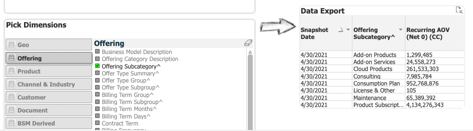

# BMT AOV Function 

The BMT AOV function is one of two *utility* functions that can currently be found into the following schema:

- ADP_WORKSPACES.CUSTOMER_SUCCESS_FINANCE_PRIVATE

The function is is called:

- BMT_ACTIVE_ROLLED_UP()

Details of the function can be found [here](https://eda-data-docs.autodesk.com/#!/macro/macro.adp_territory.generate_aov_function){:target="_blank"}

The other function sin the schema is:

- GENERATE_ACV_USD() 

and this works in a very similar way.


## Purpose
The purpose of the function is to generate a **snapshot** in time that returns all transactional order data that is **Active** on the specified snapshot date.    For example, by choosing the date 2022-01-31 a snapshot of all transactions that we active at the end for Fiscal Year 2022 (FY22) can be determined.

### Key Finance Terms

- Annualized Contract Value (ACV) - the $$$ amount billed on the contract, **standardized** to one yar
- Annualized Order Value (AOV) - the sum of ACV that is **Active** as of a given snapshot date based on the contract start and end dates.
- Pricing Waterfalls - Net 0 to Net 4 billed amounts
- Recurring Revenue - amount of billings that are related to recurring subscriptions.  

!!! note
    The main use case for AOV only uses recurring revenue and does not include non-recurring revenue portions


### Access

The BMT dataset (and the curated Snowflake data and utility functions maintained by EDA) contains billing and revenue data.

!!! warning
    Dataset access is limited and restricted to users on the **Restricted Trading Window List**
 


### Why is this important ?
As Autodesk moves forward with its business, a gradual shift is occurring on how the overall success of the business is being measured.   Rather than looking at how many $$$ are being billed for a transaction within a month or a quarter, or at how much revenue is being recognised over a period of time, the measure Annualized Order Value (AOV) is being used to compare moments in time and then looking at what the difference between the two snapshots.


{width=75%}


## Simple Example

!!! question
    What is the Net 0 AOV for Q1 FY22 ?

The snapshot date to use is the last day of the quarter, which is April 30th, 2021.

In the BMT Dashboard, the following filters are set:

{width=75%}

and in detail:


## The 'BMT_ACTIVE_ROLLED_UP' function

The function is located in the ADP_WORKSPACES tenant and the CUSTOMER_SUCCESS_FINANCE_PRIVATE schema.   A detailed description of the syntax can be found [here](https://eda-data-docs.autodesk.com/#!/macro/macro.adp_territory.generate_aov_function){:target="_blank"}


The following is a short version of the syntax:

``` sql
    BMT_ACTIVE_ROLLED_UP(
        varchar <start_date>, 
        varchar <end_date>, 
        varchar snapshot_period [Quarterly | Monthly | Weekly | Daily])
```

The function returns a memory table that can iterated in a Snowflake SQL with the ```TABLE()``` function.

## Using the Function

Replicating the use case above with the function:

``` sql
    -- Set the database and schema for clarity
    USE DATABASE adp_workspaces;
    USE SCHEMA customer_success_finance_private;

    -- Select and sum the AOV
    SELECT
        bmt.snapshot_dt, 
        ROUND(SUM(bmt.net0_aov_cc)) as aov_net0
    FROM TABLE(BMT_ACTIVE_ROLLED_UP('2021-04-30', '2021-04-30', 'Daily')) bmt
    GROUP BY bmt.snapshot_dt
```

will return:


## Using the function/table with other objects
Since the function returns a table, it is possible to integrate this table into a SQL statement and join the table to other datasets.    It will be noted that the table is narrow, which means it only contains facts (in this case Seats and AOV data), two dimensions, the snapshot dates, and the key (SRC_ID) of records in *FINMART*.    

The FINMART table is therefore a gateway object that allows other dimensions to be included to either group data, or further join onto other objects, for example Account.  Refer to the following diagram.    

NOTE: the database and schema identifiers have been excluded from the diagram for brevity.


The function can be used in conjunction with CVC_FINMART to access dimensions that are on the the CVC_FINMART table or other tables that can be related to CVC_FINMART.   Let's say we would like to add **Offering Subcategory** (which is one of the CVC_FINMART/BMT) dimensions.   Using the BMT dashboard the following can be reported.    



In order to access this category, we need to join the results of the table generated by the function onto the CVC_FINMART table, and then group by the **offering subcategory** field.

``` sql
    SELECT
        bmt.snapshot_dt
        , fin.offering_subcategory
        , ROUND(SUM(bmt.net0_aov_cc)) as aov_net0
    FROM TABLE(BMT_ACTIVE_ROLLED_UP('2021-04-30', '2021-04-30', 'Daily')) bmt
        LEFT JOIN bsd_publish.finmart_private.cvc_finmart fin on (fin.src_id = bmt.src_id)
    GROUP BY 
        bmt.snapshot_dt
        , fin.offering_subcategory

```

will return:


Let's add some complexity using the data model above.    Let's say we would like to do something like segment all accounts by *GEO* based on the GEO of the Corporate Parent account.  This is where things get a little more complex.   CVC_FINMART does have GEO information within it, but the details are correct at the time of the transaction.   If we are looking back in time, those CSNs (and their associated dimensions) may have been merged by the account deduplication process.   Further more, we will probably want to understand how the business is evolving based on what is visible in our operational systems today.

``` sql

WITH BMT_QUERY AS (
    SELECT
        SUM(bmt.net0_aov_cc) as net0_aov
        , fin.corporate_csn
    FROM TABLE(adp_workspaces.customer_success_finance_private.bmt_active_rolled_up('2021-04-30','2021-04-30','Daily')) bmt
        LEFT JOIN bsd_publish.finmart_private.cvc_finmart fin ON bmt.src_id = fin.src_id
    GROUP BY
        fin.corporate_csn
),

MERGE_AOV_WITH_PARENT as (
    SELECT
        a.final_parent_account_csn
        , a.corporate_geo
        , LISTAGG(distinct a.site_account_csn,',') as site_csns
        , SUM(COALESCE(aov_site.net0_aov,0)) as aov_for_sites
        
    FROM account_and_parent a 
        LEFT JOIN BMT_QUERY aov_site ON a.site_account_csn = aov_site.corporate_csn
    WHERE
        a.is_visible_in_sfdc = TRUE
    GROUP BY
        a.final_parent_account_csn
        , a.corporate_geo
)

-- Final query
SELECT 
    corporate_geo
    , sum(aov_for_sites) 
FROM MERGE_AOV_WITH_PARENT
GROUP BY 
    corporate_geo


```


