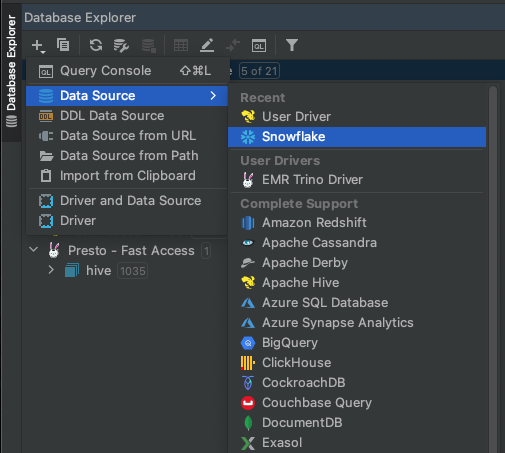

# Introduction
In this quickstart guide, you'll learn how to use JetBrains DataGrip with the Autodesk ADP Snowflake production instance.   It will show you how to:

    - Download Jetbrains DataGrip
    - Connect to Snowflake
    - Execute a simple query
    - Browse Schemas

## Download Jetbrains DataGrip

1. Make sure you are on the Autodesk VPN or are connected directly to the Autodesk network in an Autodesk Office
1. Download and install DataGroup from the [Jetbrains Website](https://www.jetbrains.com/datagrip/?source=google&medium=cpc&campaign=15034927882&ter%5b%E2%80%A6%5d4H6cRsS8HBztZ30kJXKeaLEnvqIdBrAXIXq7RXVzc14yEAhoC2e0QAvD_BwE) and follow the prompts for installation.
1. When prompted for a license, enter [https://Jetbrains.autodesk.com] for the server address and click Activate.

1. Once your license has been activated, click on the **New Project** button.  Your project can be named appropriately.

## Connect to Snowflake

1. DataGrip is packaged with a large number of database drivers, one of which is a driver for Snowflake. 

    From the **Database Explorer** the **+** icon and then Datasource->Snowflake.

    

1. Complete the **Data Sources and Drivers** form as follows:
    - Host:  autodesk.us-east-1.snowflakecomputing.com
    - Authentication: Set to Authenticator
    - Authenticator: Set to **externalbrowser**
    - User: <Your User Name>
    - Password: Leave as <hidden>
    - Role: Set to EIO_ANALYST_GROUP  
    - Database: Set to EIO_PUBLISH
    - Warehouse: Set to ADP_PUBLISH

!!! note
    You may have to click the 'More Options' on the right side of the form to see the **Role** field


3.  Test the connection.   
    
    All being well you will get a success

    

<br>
<br>

## Execute a simple query

1.  From the **Database Explorer** click the **+** icon and then New->Query Console

    

    <br>
    <br>

1.  Write some SQL code, for example:

    ``` sql

        -- Simple query against the ACCOUNT_CED table.
        SELECT SITE_NAME FROM ADP_PUBLISH.ACCOUNT_OPTIMIZED.ACCOUNT_EDP_OPTIMIZED
        WHERE IS_VISIBLE_IN_SFDC = TRUE     -- Only show data that is visible in SFDC
            AND SITE_INDIVIDUAL = FALSE     -- Only show data that is not marked as an individual person account
        LIMIT 10

    ```

    <br>
    <br>

1.  Execute the code by selecting the **run** icon

    

    <br>
    <br>

1.  The following output should be generated.

    

