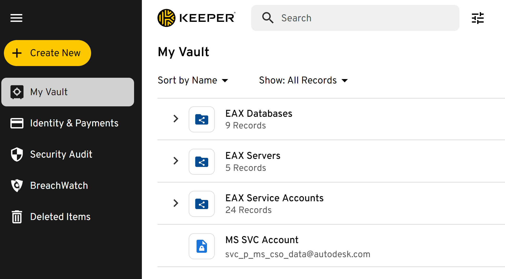

## :material-list-box-outline:{ .red-icon-heading } Introduction

<h3>Objective</h3>
The following document outlines the steps for connecting the datasets in Snowflake Database to Power BI, using the in-built Power BI Snowflake connector.

<h3>Purpose</h3>

Using Snowflake as a data source with Power BI enables teams to better understand data and leverage important capabilities. These are a few of the solutions that it offers:

- Data analysis from multiple sources within a single platform
- Creation and distribution of dashboards and reports
- Assistance to make reliable data-driven strategic decisions

## :material-circle-outline:{ .green-icon-heading } Scope

The instructions on this document are limited to the connecting Power BI to Snowflake using 2 methods mentioned below:

- Method 1: Using Service Account
- Method 2: Using SSO (Single Sign-On)

## :material-format-list-checks:{ .purple-icon-heading } Prerequisites

1. Power BI Desktop. If you don't have the app yet, [install Power BI Desktop using Company Portal](companyportal:ApplicationId=adf42e92-63e6-4cbd-ad24-71423fb67ec8).
2. Connection to the Autodesk VPN.
3. If you are a member of the GRO EDA EAX team who will be using a Service Account, you will need access to the [Keeper](https://govcloud.keepersecurity.us/vault/) folder, where the common Service Account login credentials are stored.

## :material-step-forward:{ .yellow-icon-heading } Procedure
### Flowchart

### 1. Choose a method

1. **Using a Service Account**: Continue to [Step 2: Create Service Account and credentials](#2-create-service-account-and-credentials).
2. **Using SSO**: Skip Step 2. Move directly to [Step 3: Connect Power BI to Snowflake](#3-connect-power-bi-to-snowflake).

### 2. Create Service Account and credentials

??? abstract "Create the Service Account"
    #### Step 2.1

    To request the creation of a Service Account, you can use the [Service Account Management](https://employeehub.autodesk.com/apps/account-management/) form or raise a request on the [#ese-directory-support](https://autodesk.enterprise.slack.com/archives/C66PDNMM3) Slack channel.

    !!! warning
        **Must read**: Please go through the Security Policy for Service Accounts — [Service Account Security](https://wiki.autodesk.com/display/ADS/Service+Account+Security)

??? abstract "Identify tables/datasets"
    #### Step 2.2

    1. Identify the tables/datasets in the Snowflake database for which you would need access. You may use the [Autodesk Data Catalog on Atlan](https://autodesk.atlan.com/) for this.
    2. Request access via [ADP Access Management](https://access.adp.autodesk.com/data-access/snowflake). For more information, please refer to [ADP Access Management User Guide](https://wiki.autodesk.com/pages/viewpage.action?spaceKey=CPDDPS&title=ADP+Access+Management+User+Guide), or contact the team on their slack channel [#adp-access-support](https://autodesk.enterprise.slack.com/archives/C05JFCCB0FK).

??? abstract "Set up the credentials to connect PowerBI to Snowflake"
    #### Step 2.3

    !!! warning
        Make sure that you are logged on to the VPN.

    ##### 2.3.1. GRO EDA EAX Team

    Ensure that you have access to the Keeper folder, where the common Service Account login credentials are stored, and use those credentials. See the screenshot below.

    <figure markdown>
      { width="600px" }
    </figure>

    !!! note "Note for GRO-EDA EAX Team Members"
        - `svc_p_ms_cso_data` is now the same account used for Snowflake connection to avoid PowerBI Microsoft license issue when dashboard is published.
        - The usernames are the same for both MS SVC Account and Snowflake ADP, however the passwords are different. Ensure that you're using the relevant password for each.

    ##### 2.3.2. Outside of GRO-EDA Team

    Please use the Service Account credentials you've received after completing the creation of the Service Account ([Step 2.1](#step-21)).

    !!! note
        Access to Keeper folder would be available to you only if you are a part of GRO-EDA EAX team. If not, please follow Step 2.1 and Step 2.2 and then use your own Service Account credentials to connect to Snowflake.

!!! success
    If the Service Account is set up successfully and the new credentials are available, please follow the steps explained in the next section below: [Connect Power BI to Snowflake](#3-connect-power-bi-to-snowflake)

### 3. Connect Power BI to Snowflake

??? abstract "Get data"
    #### Step 3.1

    1. Open Power BI Desktop.
    2. Click 'Get data'
    2. Click 'More'

    <figure markdown>
      { width="600px" }
    </figure>

??? abstract "Choose the Snowflake Database"
    #### Step 3.2

    1. In the pop-up window, left navigation pane, click 'Database'
    2. On the left pane which should change view to 'Database', scroll to find 'Snowflake'
    3. Click 'Connect'

    !!! note
        You can also simply type in 'Snowflake' in the search field on the left pane, upper portion.

    <figure markdown>
      { width="600px" }
    </figure>

??? abstract "Indicate Server and Warehouse Details"
    #### Step 3.3

    ##### OPTION 1: USING IMPORT QUERY

    1. Input Server: `autodesk.us-east-1.snowflakecomputing.com`
    2. Input Warehouse: Add the relevant warehouse here. For example, `ADP_PUBLISH`.
    3. Verify that Data Connectivity Mode is set to 'Import'
    4. Click 'OK'

    <figure markdown>
      { width="600px" }
    </figure>

    <figure markdown>
      { width="600px" }
    </figure>

    ##### OPTION 2: USING DIRECT QUERY

    Snowflake connector in Power BI now supports custom queries, so you are able to write your own queries when bringing in your dataset. However, it does require you to enter the database name and use the fully qualified name while writing your queries.
    For example: `SELECT * FROM DBNAME.SCHEMA.TABLE`

    If you would like to use direct SQL query, which is available now for the latest version of Power BI, click on the "Advanced options"

    <figure markdown>
      { width="600px" }
    </figure>

    !!! warning
        Even if the 'Database' section is marked as optional, if not provided, the query will have an error.

??? abstract "Provide Snowflake Login Details"
    #### Step 3.4

    === "Using Service Account"

        ##### If you belong to GRO-EDA EAX Team:

        1. Use service account for Snowflake `svc_p_ms_cso_data`.
        2. Enter the password which is shared in Keeper under database section and then click 'Connect' (Make sure you are connected to VPN).

        ##### If you belong to a team outside of GRO-EDA EAX:

        1. Use your own Service Account credentials you created in [Step 2.1](#step-21) above.

        <figure markdown>
          { width="600px" }
        </figure>

    === "Using SSO"

        1. Make sure you are logged in using your personal account credential.
        2. Choose to connect using 'Microsoft Account'. This step basically ensures that you use your personal credentials (which are valid for SSO).
        3. Click on the 'Sign in' button.
        4. Once you click 'Sign in' a pop-up window would appear. Enter your personal Autodesk sign in credentials and click 'Connect'

        <figure markdown>
          { width="600px" }
        </figure>

        <figure markdown>
          { width="600px" }
        </figure>

        <figure markdown>
          { width="600px" }
        </figure>

??? abstract "Choose Table"
    #### Step 3.5

    If you did not opt to use direct SQL query in [Step 3.3](#step-33), you can choose an entire table/view.

    ##### 3.5.1
    In the Navigator pop-up window, left pane: drill down within `autodesk.us-east-1.snowflakecomputing.com` > `ADP_PUBLISH`, choose the domain (ex. `ACCOUNT_OPTIMIZED`, `CUSTOMER_SUCCESS_OPTIMIZED`, `CUSTOMER_SUCCESS_PUBLIC`, etc.) then the table you'd like to bring in.

    !!! note
        Search may not work well in the navigator window (per BI observation) so you may need to scroll down to find the table to choose it.

    ##### 3.5.2
    Click 'Load' or 'Transform'

    <figure markdown>
      { width="600px" }
    </figure>

    Once you click on the 'Load' option, the data gets imported in Power BI and you can start working with the data.

## :material-map-marker-path:{ .grey-icon-heading } Exception handling

None.

## :material-head-question:{ .grey-icon-heading } Clarifications

### Troubleshooting

None.

### FAQs

??? question "What is a Service Account?"
    #### FAQ 1

    Service Accounts are normally different from your usual ADSK accounts. Service Accounts are a special type of non-human privileged account used to execute applications and run automated services, virtual machine instances, and other processes. Service Accounts can be privileged local or domain accounts, and in some cases, they may have domain administrative privileges. In Autodesk, normally service accounts follow the format: `svc_p_xxxxxxx`.

??? question "What is SSO?"
    #### FAQ 2

    Single sign-on (SSO) is an authentication scheme that allows a user to log in with a single ID to any of several related, yet independent, software tools or systems. True single sign-on allows the user to log in once and access services without re-entering authentication factors.

    For example, if your name is John Doe, then you would essentially use john.doe@autodesk.com to connect to relevant services instead of using a separate service account.

## :material-link:{ .grey-icon-heading } Related links

- [Form to create a Service Account](https://autodesk.service-now.com/helphub?id=evg_sc_cat_item&sys_id=5973e1b6c0344a0087da1d9d5b48a36d)
- [Page to register and manage ownership for the Service Account](https://employeehub.autodesk.com/apps/cms/service-account-ownership-form/)
- [All the Service Accounts are managed here](https://employeehub.autodesk.com/apps/cms/service-account-ownership-form/)
- [Service Account passwords can be changed here](https://employeehub.autodesk.com/apps/service-account-password-reset/) 

